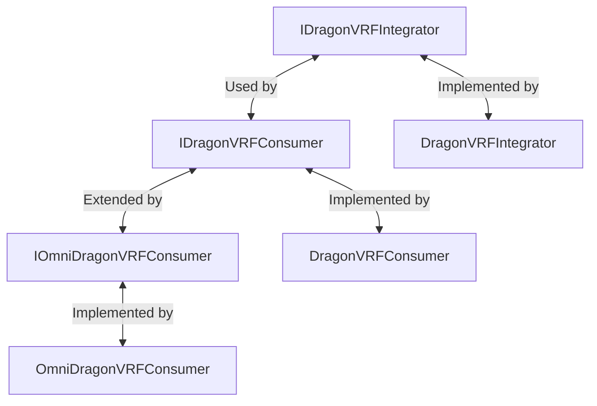

# VRF Interfaces

This page documents the Verifiable Random Function (VRF) interfaces used in the OmniDragon protocol, specifically for dRAND integration.

## Overview

OmniDragon implements a robust verifiable randomness system based on the dRAND network. These interfaces define the contract interactions for randomness functionality.

## Core Interfaces

### IDragonVRFIntegrator

This interface defines how contracts interact with the dRAND network integrator:

```solidity
interface IDragonVRFIntegrator {
    /**
     * @dev Returns the latest randomness value
     * @return random The randomness value
     * @return round The round number
     */
    function getLatestRandomness() external view returns (uint256 random, uint256 round);
    
    /**
     * @dev Fulfills a randomness request
     * @param _requestId The request ID to fulfill
     */
    function fulfillRandomness(uint256 _requestId) external;
}
```

### IDragonVRFConsumer

This interface defines how consumer contracts receive randomness:

```solidity
interface IDragonVRFConsumer {
    /**
     * @dev Fulfills a randomness request
     * @param _requestId The request ID
     * @param _randomness The randomness value
     * @param _round The round number
     */
    function fulfillRandomness(
        uint256 _requestId,
        uint256 _randomness,
        uint256 _round
    ) external;
    
    /**
     * @dev Gets the randomness for a specific request
     * @param _requestId The request ID
     */
    function getRequestRandomness(
        uint256 _requestId
    ) external view returns (uint256 randomness, bool fulfilled, uint256 round);
}
```

### IOmniDragonVRFConsumer

This interface defines the advanced multi-source randomness consumer:

```solidity
interface IOmniDragonVRFConsumer {
    /**
     * @dev Adds a new dRAND network
     * @param _networkId The network identifier
     * @param _integrator The integrator contract address
     * @param _weight The weight for this network
     */
    function addNetwork(
        bytes32 _networkId,
        address _integrator,
        uint256 _weight
    ) external;
    
    /**
     * @dev Updates a network
     * @param _networkId The network identifier
     * @param _integrator The integrator contract address
     * @param _weight The weight for this network
     * @param _active Whether the network is active
     */
    function updateNetwork(
        bytes32 _networkId,
        address _integrator,
        uint256 _weight,
        bool _active
    ) external;
    
    /**
     * @dev Removes a network
     * @param _networkId The network identifier
     */
    function removeNetwork(bytes32 _networkId) external;
    
    /**
     * @dev Aggregates randomness from all networks
     */
    function aggregateRandomness() external;
    
    /**
     * @dev Fulfills randomness for a consumer
     * @param _consumer The consumer address
     * @param _requestId The request ID
     */
    function fulfillRandomness(address _consumer, uint256 _requestId) external;
    
    /**
     * @dev Sets authorization for a consumer
     * @param _consumer The consumer address
     * @param _authorized Whether the consumer is authorized
     */
    function setAuthorizedConsumer(address _consumer, bool _authorized) external;
}
```

## Implementation Notes

These interfaces are designed with the following considerations:

1. **Security**: Strict access control for randomness fulfillment
2. **Flexibility**: Support for different randomness sources
3. **Reliability**: Multiple fallback mechanisms
4. **Gas Efficiency**: Optimized for gas usage

## dRAND Networks

OmniDragon integrates with several dRAND networks:

### League of Entropy Mainnet
- **Period**: 30 seconds
- **Use Case**: Primary randomness source for jackpot drawings

### Quicknet
- **Period**: 3 seconds
- **Use Case**: Time-sensitive operations requiring fast randomness

### EVMnet
- **Period**: 3 seconds
- **Features**: Optimized for EVM chains, lower gas costs for verification
- **Use Case**: On-chain verification when needed

## Integration Example

Here's a simple example of implementing these interfaces:

```solidity
// Create a consumer contract
contract MyConsumer is DragonVRFConsumer {
    constructor(address _integrator) DragonVRFConsumer(_integrator) {}
    
    function _fulfillRandomness(uint256 _requestId, uint256 _randomness) internal override {
        // Use randomness
    }
}

// Request randomness from OmniDragonVRFConsumer
function requestRandomnessFromAggregate(IOmniDragonVRFConsumer _consumer) external {
    uint256 requestId = requestRandomness();
    _consumer.fulfillRandomness(address(this), requestId);
}
```

## Interface Inheritance Hierarchy



## Events

Contracts implementing these interfaces should emit appropriate events:

```solidity
// IDragonVRFIntegrator Events
event RandomnessUpdated(uint256 round, uint256 value);
event ConsumerAuthorized(address consumer, bool authorized);

// IDragonVRFConsumer Events
event RandomnessRequested(uint256 indexed requestId);
event RandomnessFulfilled(uint256 indexed requestId, uint256 randomness, uint256 round);
event VRFIntegratorUpdated(address oldIntegrator, address newIntegrator);

// IOmniDragonVRFConsumer Events
event NetworkAdded(bytes32 indexed networkId, address integrator, uint256 weight);
event NetworkUpdated(bytes32 indexed networkId, address integrator, uint256 weight, bool active);
event NetworkRemoved(bytes32 indexed networkId);
event RandomnessAggregated(uint256 timestamp, uint256 value);
```

## Related Resources

- [dRAND Integration Overview](/docs/ecosystem/drand-network)
- [DragonVRFConsumer Documentation](/docs/contracts/oracles/vrf-consumer)
- [DragonVRFIntegrator Documentation](/docs/contracts/oracles/vrf-integrator) 