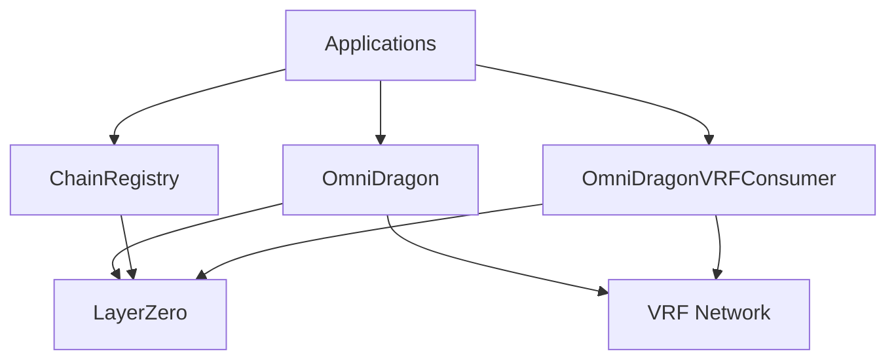

# Smart Contracts Overview

OmniDragon's smart contract system is built on LayerZero, providing a robust foundation for cross-chain operations and verifiable randomness.

## System Architecture



## Core Contracts

### OmniDragon

The main token contract that implements the ERC-20 standard with LayerZero compatibility. Key features include:

- Cross-chain token transfers
- Secure minting and burning mechanisms
- Access control for administrative functions
- Integration with VRF providers for randomness
- Built-in jackpot mechanics and fee structure

#### Key Functions
```solidity
// Cross-chain transfer
function sendToChain(
    uint16 _dstChainId,
    bytes calldata _toAddress,
    uint256 _amount,
    address payable _refundAddress,
    address _zroPaymentAddress,
    bytes calldata _adapterParams
) external payable;

// Minting (restricted)
function mint(address to, uint256 amount) external onlyOwner;

// Burning
function burn(uint256 amount) external;
```

### ChainRegistry & ChainSpecificEndpoint

Handles cross-chain messaging and token bridging operations:

- LayerZero message passing
- Bridge security and validation
- Cross-chain state synchronization
- Gas optimization for cross-chain operations

#### Key Functions
```solidity
// Register a new chain
function registerChain(
    uint16 _chainId, 
    bytes calldata _endpoint,
    bool _isActive
) external onlyOwner;

// Get chain endpoint
function getChainEndpoint(uint16 _chainId) external view returns (bytes memory);
```

### OmniDragonVRFConsumer

Manages the integration with verifiable randomness providers:

- Multiple VRF source integration
- Randomness verification
- Request and callback mechanisms
- Fallback randomness sources

#### Key Functions
```solidity
// Aggregate randomness from multiple sources
function aggregateRandomness() public;

// Get latest random value
function getLatestRandomness() external view returns (uint256);

// Fulfill randomness request
function fulfillRandomness(address _consumer, uint256 _requestId) external;
```

## Security Features

Our contracts implement several security measures:

- Role-based access control (RBAC)
- Multi-signature requirements for critical operations
- Rate limiting and circuit breakers
- Comprehensive event logging
- Regular security audits

### Access Control
```solidity
// Role-based access through Ownable pattern
modifier onlyOwner() {
    require(owner() == msg.sender, "Caller is not the owner");
    _;
}

// Authorization for consumers
function setAuthorizedConsumer(address _consumer, bool _authorized) external onlyOwner;
```

## Integration Guide

To integrate OmniDragon into your project:

1. **Token Integration**
   ```solidity
   import "@omnidragon/contracts/OmniDragon.sol";
   ```

2. **Chain Registry Integration**
   ```solidity
   import "@omnidragon/contracts/ChainRegistry.sol";
   ```

3. **Randomness Integration**
   ```solidity
   import "@omnidragon/contracts/drand/OmniDragonVRFConsumer.sol";
   ```

## Contract Addresses

### Mainnet
- OmniDragon: `0x...` (Coming Soon)
- ChainRegistry: `0x...` (Coming Soon)
- OmniDragonVRFConsumer: `0x...` (Coming Soon)

### Testnet
- OmniDragon: `0x...` (Coming Soon)
- ChainRegistry: `0x...` (Coming Soon)
- OmniDragonVRFConsumer: `0x...` (Coming Soon)

## Development

For developers looking to contribute or build on OmniDragon:

1. Clone our repository:
   ```bash
   git clone https://github.com/wenakita/omnidragon.git
   ```

2. Install dependencies:
   ```bash
   npm install
   ```

3. Run tests:
   ```bash
   npm test
   ```

## Security

Security is our top priority. Our contracts have undergone multiple audits and are continuously monitored. If you discover any security issues, please report them to security@omnidragon.io.

### Security Best Practices

1. **Access Control**
   - Always use the provided role-based access control
   - Implement multi-signature for critical operations
   - Regularly review and update access permissions

2. **Cross-Chain Operations**
   - Verify message sources
   - Implement replay protection
   - Use appropriate gas limits
   - Monitor bridge operations

3. **Randomness Usage**
   - Verify randomness proofs
   - Implement fallback mechanisms
   - Use appropriate timeouts
   - Monitor VRF network status

## Support

For technical support or questions about contract integration:
- Join our [Discord](https://discord.gg/omnidragon)
- Open an issue on [GitHub](https://github.com/wenakita/omnidragon)
- Contact us at support@omnidragon.io

## Contract Categories

The OmniDragon contracts are organized into the following categories:

### Core
- [OmniDragon.sol](./core/omni-dragon): Main token contract with cross-chain capabilities
- [OmniDragonPeriphery.sol](./core/periphery): Helper contract for managing token integrations
- [ChainRegistry.sol](./core/chain-registry): Manages endpoints across supported chains
- [ChainSpecificEndpoint.sol](./core/chain-endpoint): Chain-specific configurations

### Jackpot
- [DragonJackpotDistributor.sol](./jackpot/distributor): Distributes jackpot winnings to winners
- [DragonJackpotVault.sol](./jackpot/vault): Securely stores jackpot funds
- [OmniDragonSwapTriggerOracle.sol](./jackpot/trigger-oracle): Creates lottery entries from swaps

### Math
- [DragonMathLib.sol](./math/dragon-math-lib): Core mathematical utilities
- [HermesMath.sol](./math/hermes-math): Jackpot distribution mathematics
- [DragonDateTimeLib.sol](./math/date-time-lib): Time-related calculations
- [ve69LPMath.sol](./math/ve69lp-math): veToken staking mathematics
- [VotingPowerCalculator.sol](./math/voting-power): Governance voting power calculations
- [DragonAdaptiveFeeManager.sol](./math/adaptive-fee): Dynamic fee adjustment system
- [MarketConditionOracle.sol](./math/market-oracle): Market condition monitoring for adaptations

### Randomness
- [OmniDragonVRFConsumer.sol](./randomness/vrf-consumer): Main verifiable randomness consumer
- [DragonVRFIntegrator.sol](./randomness/vrf-integrator): External randomness integration
- [DragonVRFConsumer.sol](./randomness/vrf-consumer-base): Base randomness consumer contract

### Governance
- [OmniDragonGovernor.sol](./governance/governor): Governance contract for protocol decisions
- [OmniDragonTimelockController.sol](./governance/timelock): Timelock for governance actions
- [ve69LP.sol](./governance/ve69lp): Vote-escrowed LP token for governance

### Partners
- [DragonPartnerRegistry.sol](./partners/registry): Registry for partner integration
- [DragonPartnerFactory.sol](./partners/factory): Factory for creating partner pools
- [DragonPartnerPool.sol](./partners/pool): Partner-specific pools and incentives 