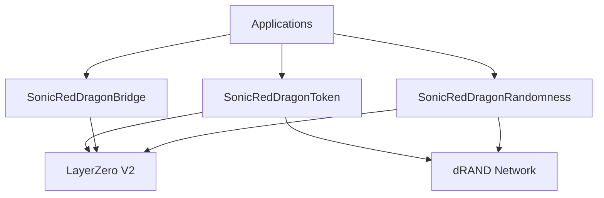

# Smart Contracts Overview

Sonic Red Dragon's smart contract system is built on LayerZero V2, providing a robust foundation for cross-chain operations and verifiable randomness.

## System Architecture



## Core Contracts

### SonicRedDragonToken

The main token contract that implements the ERC-20 standard with LayerZero V2 compatibility. Key features include:

- Cross-chain token transfers
- Secure minting and burning mechanisms
- Access control for administrative functions
- Integration with dRAND for randomness

#### Key Functions
```solidity
// Cross-chain transfer
function sendTokens(
    uint16 _dstChainId,
    bytes calldata _destination,
    uint256 _amount,
    address payable _refundAddress,
    address _zroPaymentAddress,
    bytes calldata _adapterParams
) external payable;

// Minting (restricted)
function mint(address to, uint256 amount) external onlyMinter;

// Burning
function burn(uint256 amount) external;
```

### SonicRedDragonBridge

Handles cross-chain messaging and token bridging operations:

- LayerZero V2 message passing
- Bridge security and validation
- Cross-chain state synchronization
- Gas optimization for cross-chain operations

#### Key Functions
```solidity
// Bridge tokens to another chain
function bridgeTokens(
    uint16 _dstChainId,
    bytes calldata _destination,
    uint256 _amount,
    bytes calldata _payload
) external payable;

// Receive bridged tokens
function receiveTokens(
    uint16 _srcChainId,
    bytes calldata _srcAddress,
    uint64 _nonce,
    bytes calldata _payload
) external;
```

### SonicRedDragonRandomness

Manages the integration with dRAND network for verifiable randomness:

- dRAND beacon integration
- Randomness verification
- Request and callback mechanisms
- Fallback randomness sources

#### Key Functions
```solidity
// Request randomness
function requestRandomness() external returns (uint256);

// Verify randomness
function verifyRandomness(
    uint256 _round,
    bytes calldata _randomness,
    bytes calldata _proof
) external view returns (bool);
```

## Security Features

Our contracts implement several security measures:

- Role-based access control (RBAC)
- Multi-signature requirements for critical operations
- Rate limiting and circuit breakers
- Comprehensive event logging
- Regular security audits

### Access Control
```solidity
// Role definitions
bytes32 public constant MINTER_ROLE = keccak256("MINTER_ROLE");
bytes32 public constant BRIDGE_ROLE = keccak256("BRIDGE_ROLE");
bytes32 public constant ADMIN_ROLE = keccak256("ADMIN_ROLE");

// Role checks
modifier onlyRole(bytes32 role) {
    require(hasRole(role, msg.sender), "Caller does not have role");
    _;
}
```

## Integration Guide

To integrate Sonic Red Dragon into your project:

1. **Token Integration**
   ```solidity
   import "@sonicreddragon/contracts/SonicRedDragonToken.sol";
   ```

2. **Bridge Integration**
   ```solidity
   import "@sonicreddragon/contracts/SonicRedDragonBridge.sol";
   ```

3. **Randomness Integration**
   ```solidity
   import "@sonicreddragon/contracts/SonicRedDragonRandomness.sol";
   ```

## Contract Addresses

### Mainnet
- SonicRedDragonToken: `0x...` (Coming Soon)
- SonicRedDragonBridge: `0x...` (Coming Soon)
- SonicRedDragonRandomness: `0x...` (Coming Soon)

### Testnet
- SonicRedDragonToken: `0x...` (Coming Soon)
- SonicRedDragonBridge: `0x...` (Coming Soon)
- SonicRedDragonRandomness: `0x...` (Coming Soon)

## Development

For developers looking to contribute or build on Sonic Red Dragon:

1. Clone our repository:
   ```bash
   git clone https://github.com/wenakita/omnidragon.git
   ```

2. Install dependencies:
   ```bash
   npm install
   ```

3. Run tests:
   ```bash
   npm test
   ```

## Security

Security is our top priority. Our contracts have undergone multiple audits and are continuously monitored. If you discover any security issues, please report them to security@sonicreddragon.io.

### Security Best Practices

1. **Access Control**
   - Always use the provided role-based access control
   - Implement multi-signature for critical operations
   - Regularly review and update access permissions

2. **Cross-Chain Operations**
   - Verify message sources
   - Implement replay protection
   - Use appropriate gas limits
   - Monitor bridge operations

3. **Randomness Usage**
   - Verify randomness proofs
   - Implement fallback mechanisms
   - Use appropriate timeouts
   - Monitor dRAND network status

## Support

For technical support or questions about contract integration:
- Join our [Discord](https://discord.gg/sonicreddragon)
- Open an issue on [GitHub](https://github.com/wenakita/omnidragon)
- Contact us at support@sonicreddragon.io 