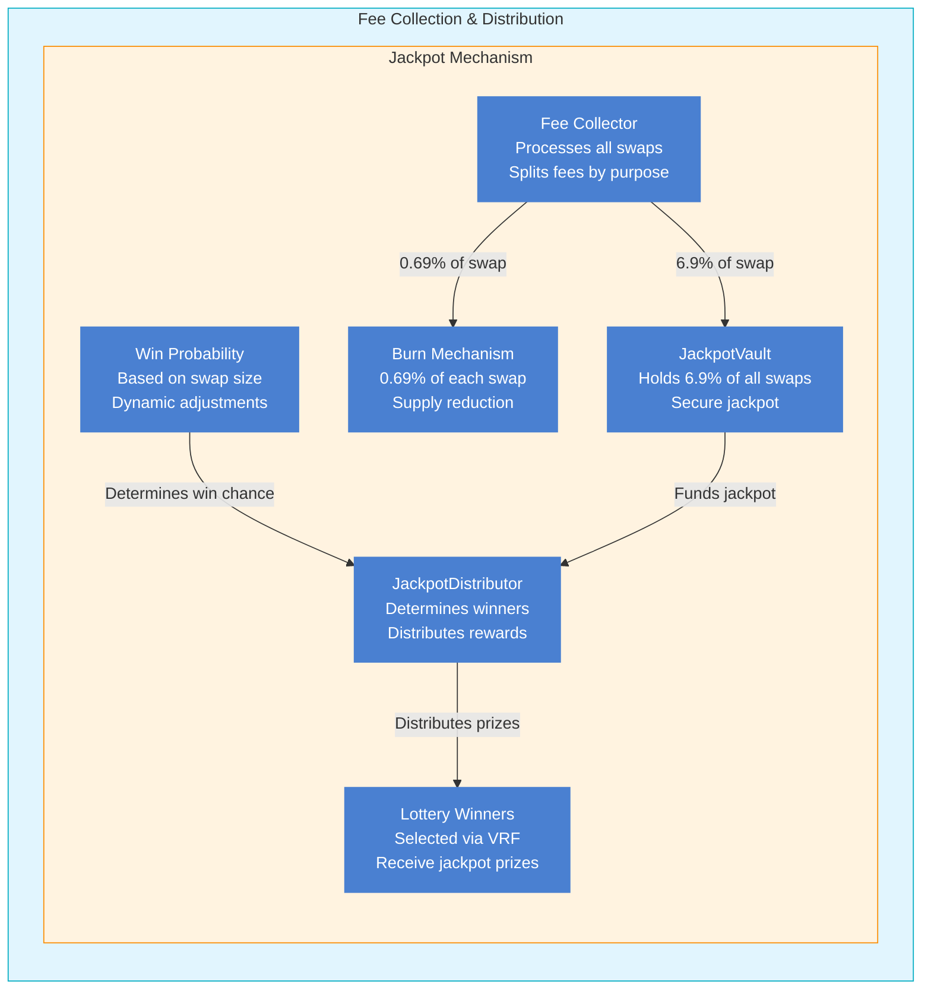
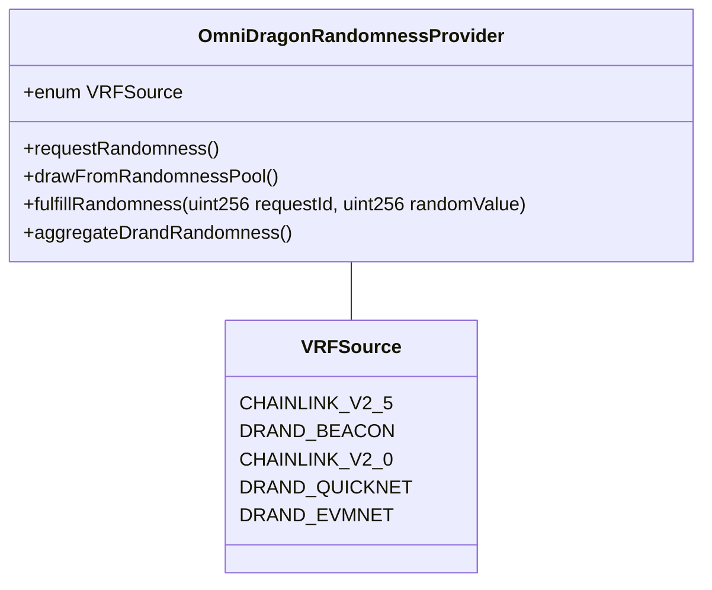

# Smart Contracts Overview

OmniDragon's smart contract system is built on LayerZero, providing a robust foundation for cross-chain operations and verifiable randomness.

## Ecosystem Architecture

The OmniDragon ecosystem consists of several interconnected components that work together to provide a comprehensive DeFi platform.

### Core Protocol & User Journey

```mermaid
flowchart LR
    %% Color classes for different components
    classDef coreSystem fill:#4a80d1,stroke:#4a80d1,stroke-width:2px,color:#ffffff
    classDef tokenSystem fill:#4a80d1,stroke:#4a80d1,stroke-width:2px,color:#ffffff
    classDef userSystem fill:#4a80d1,stroke:#4a80d1,stroke-width:2px,color:#ffffff
    classDef journeyStep fill:#4a80d1,stroke:#4a80d1,stroke-width:2px,color:#ffffff
    classDef externalSystem fill:#4a80d1,stroke:#4a80d1,stroke-width:2px,color:#ffffff
    %% Core Protocol
    subgraph Core["Core Protocol"]
        direction TB
        OmniDragon["OmniDragon Token<br> ERC20 with jackpot<br> Cross-chain capability<br> Fee distribution"]:::coreSystem
        SwapTriggerOracle["SwapTriggerOracle<br> Monitors trading<br> Triggers jackpot draws"]:::coreSystem
        ChainRegistry["ChainRegistry<br> Manages chain IDs<br> Cross-chain config"]:::coreSystem
    subgraph TokensLP["Token Ecosystem"]
        direction TB
        LPToken["69LP Token<br> Liquidity provider token<br> Earns trading fees"]:::tokenSystem
        %% User Journey
    subgraph UserJourney["User Journey"]
        direction TB
        %% Main user
        User["User<br>Entry point"]:::userSystem
        %% Journey steps
        Trading["Trading<br> Buy/Sell OmniDragon<br> Generates fees<br> Lottery entry"]:::journeyStep
        AddLiquidity["Add Liquidity<br> Create 69LP tokens<br> Earn trading fees"]:::journeyStep
        StakeLock["Stake & Lock<br> 69LP  ve69LP<br> Governance rights"]:::journeyStep
        Vote["Vote & Boost<br> Governance proposals<br> Weekly gauge voting"]:::journeyStep
        Collect["Collect Rewards<br> Fee distribution<br> Lottery winnings"]:::journeyStep
        %% External DEXs
    subgraph ExternalDEX["External DEXes"]
        direction LR
        UniswapV2["Uniswap V2"]:::externalSystem
        UniswapV3["Uniswap V3"]:::externalSystem
        Balancer["Balancer"]:::externalSystem
        %% Connect User Journey to System
        User -->|"Starts here"| Trading
        Trading -->|"Next step"| AddLiquidity
        AddLiquidity -->|"Next step"| StakeLock
        StakeLock -->|"Next step"| Vote
        Vote -->|"Final step"| Collect
        Trading -->|"Lottery"| Collect
        Trading -->|"Swap"| ExternalDEX
        ExternalDEX -->|"Provide liquidity"| AddLiquidity
        %% Core Connections
        ChainRegistry -->|"Chain management"| OmniDragon
        OmniDragon -->|"Monitoring"| SwapTriggerOracle
        AddLiquidity -->|"Creates"| LPToken
        %% Style the containers
        style UserJourney fill:#fff9c4,stroke:#ffb300
        style Core fill:#e1f5fe,stroke:#0288d1
        style ExternalDEX fill:#e3f2fd,stroke:#1e88e5
endend
endend
endend
end
```

### Randomness System
```

```mermaid
flowchart LR
    %% Color classes for different components
    classDef randomnessSystem fill:#4a80d1,stroke:#4a80d1,stroke-width:2px,color:#ffffff
    classDef processSystem fill:#4a80d1,stroke:#4a80d1,stroke-width:2px,color:#ffffff
    %% Randomness Sources
    subgraph Sources["External Randomness Sources"]
        direction LR
        DrandDefault["drand Default<br>League of Entropy"]:::randomnessSystem
        DrandEVMNet["drand EVMNet<br>EVM optimized"]:::randomnessSystem
        DrandQuickNet["drand QuickNet<br>Fast verification"]:::randomnessSystem
        ChainlinkVRF["ChainlinkVRF2.5<br>Cross-chain via LayerZero"]:::randomnessSystem
        %% Integrators
    subgraph Integrators["Integrator Layer"]
        direction LR
        DefaultIntegrator["Default Integrator<br> Verifies & formats"]:::randomnessSystem
        EVMNetIntegrator["EVMNet Integrator<br> Low latency"]:::randomnessSystem
        QuickNetIntegrator["QuickNet Integrator<br> Fastest verification"]:::randomnessSystem
        ChainlinkRequester["ChainlinkVRFRequester<br> Request gateway"]:::randomnessSystem
        %% Consumer
        OmniDragonVRFConsumer["OmniDragonVRFConsumer<br> Aggregates all sources<br> Priority-based fallback<br> Caching & redundancy"]:::randomnessSystem
        %% Process Flow
    subgraph Process["Lottery Randomness Flow"]
        direction TB
        Step1["1. Multiple sources<br>provide entropy"]:::processSystem
        Step2["2. Integrators verify<br>& format randomness"]:::processSystem
        Step3["3. VRFConsumer<br>aggregates sources"]:::processSystem
        Step4["4. SwapTrigger receives<br>secure random values"]:::processSystem
        Step5["5. OmniDragon determines<br>jackpot winners"]:::processSystem
        Step1 -->|>|> Step2| Step3| Step4 -->|> Step5
        %% Connect Components
        DrandDefault| DefaultIntegrator
        DrandEVMNet -->|> EVMNetIntegrator
        DrandQuickNet| QuickNetIntegrator
        ChainlinkVRF -->|> ChainlinkRequester
        DefaultIntegrator| OmniDragonVRFConsumer
        EVMNetIntegrator -->|>|> OmniDragonVRFConsumer
        QuickNetIntegrator| OmniDragonVRFConsumer
        ChainlinkRequester| OmniDragonVRFConsumer
        %% Style Containers
        style Sources fill:#e1f5fe,stroke:#1976d2
        style Integrators fill:#e3f2fd,stroke:#1976d2
        style Process fill:#fff8e1,stroke:#ff9800
endend
endend
end
```

### Economic System & Jackpot



<div data-immersive>
```

```mermaidclassDiagram
class OmniDragonLotteryManager {
+address omniDragonToken
    +address jackpotVault
    +address randomnessProvider
    +address priceOracle
    +uint256 BASE_WIN_PROB_BPS
    +uint256 MAX_BOOSTED_WIN_PROB_BPS
    +createLotteryEntry(address user, uint256 amount, uint256 votingPower)
    +fulfillRandomness(uint256 requestId, uint256 randomValue)
    +calculateLotteryProbability(uint256 swapAmount, uint256 votingPower)
    +calculateJackpotPayout(uint256 jackpotSize, uint256 winnerVotingPower)
    }
    class LotteryEntry {
+address user
    +uint256 swapAmountUSD
    +uint256 userVotingPower
    +uint256 probabilityBps
    +uint256 timestamp
    +uint256 randomnessRequestId
    +bool processed
    +bool won
    +uint256 payoutAmount
    }
    OmniDragonLotteryManager -- LotteryEntry : manages
```

</div>

### Governance & Partner Ecosystem

```mermaid
flowchart LR
    %% Color classes for different components
    classDef governanceSystem fill:#4a80d1,stroke:#4a80d1,stroke-width:2px,color:#ffffff
    classDef externalSystem fill:#4a80d1,stroke:#4a80d1,stroke-width:2px,color:#ffffff
    %% ve69LP System
    subgraph VeTokenSystem["ve69LP Governance System"]
        direction TB
        ve69LP["ve69LP Token<br> Locked LP position<br> Time-weighted voting power"]:::governanceSystem
        ve69LPFeeDistributor["ve69LP Fee Distributor<br> Receives 2.41% of swaps<br> Proportional distribution"]:::governanceSystem
        ProposalVoting["Protocol Governance<br> Parameter changes<br> Treasury management"]:::governanceSystem
        %% Weekly Epoch System
    subgraph GaugeSystem["Weekly Gauge & Boost System"]
        direction TB
        EpochReset["Weekly Epoch Reset<br> 7-day voting cycle"]:::governanceSystem
        GaugeVoting["Partner Pool Voting<br> ve69LP holders allocate votes"]:::governanceSystem
        GaugeController["Gauge Controller<br> Tallies all votes<br> Sets boost allocation"]:::governanceSystem
        %% Partners
    subgraph PartnerSystem["Partner Pools & Rewards"]
        direction TB
        PartnerRegistry["Partner Registry<br> Official partner onboarding"]:::externalSystem
        PartnerPools["Partner Liquidity Pools<br> DRAGON + Partner token"]:::externalSystem
        ProbabilityBoost["Probability Boost<br> Increases win chance"]:::externalSystem
        %% Connect Components
        ve69LP -->|"Earns from fees"| ve69LPFeeDistributor
        ve69LP -->|"Grants governance rights"| ProposalVoting
        ve69LP -->|"Enables gauge voting"| GaugeVoting
        GaugeVoting -->|"Vote allocation"| GaugeController
        EpochReset -->|"Weekly reset"| GaugeVoting
        GaugeController -->|"Calculate weights"| ProbabilityBoost
        PartnerRegistry -->|"Register partner"| PartnerPools
        ProbabilityBoost -->|"Increase probability"| PartnerPools
        %% Style Containers
        style VeTokenSystem fill:#e3f2fd,stroke:#1976d2
        style GaugeSystem fill:#e0f7fa,stroke:#00acc1
        style PartnerSystem fill:#fff3e0,stroke:#f57c00
endend
endend
end
```

## Core Contracts

### OmniDragon

The main token contract that implements the ERC-20 standard with LayerZero compatibility. Key features include:

- Cross-chain token transfers
- Secure minting and burning mechanisms
- Access control for administrative functions
- Integration with VRF providers for randomness
- Built-in jackpot mechanics and fee structure

<div data-immersive>
```

```mermaidclassDiagram
class OmniDragon {
+address jackpotVault
    +address revenueDistributor
    +address lzEndpoint
    +address chainRegistry
    +uint256 MAX_SUPPLY
    +uint256 INITIAL_SUPPLY
    +transfer(address to, uint256 amount)
    +processLotteryEntry(address user, uint256 amount)
    +distributeFees(uint256 jackpotAmount, uint256 ve69Amount)
    +sendTokens(uint16 dstChainId, bytes32 toAddress, uint256 amount)
    }
    class ERC20 {
+string name
    +string symbol
    +uint256 totalSupply
    +balanceOf(address account)
    +transfer(address to, uint256 amount)
    +approve(address spender, uint256 amount)
    +transferFrom(address from, address to, uint256 amount)
    }
    class Ownable {
+address owner
    +onlyOwner()
    +transferOwnership(address newOwner)
    }
    class ReentrancyGuard {
+nonReentrant()
    }
    OmniDragon --|> ERC20
    OmniDragon --|> Ownable
    OmniDragon --|> ReentrancyGuard
```

</div>

#### Key Functions
```solidity
// Cross-chain transfer
function sendToChain(
    uint16 _dstChainId,
    bytes calldata _toAddress,
    uint256 _amount,
    address payable _refundAddress,
    address _zroPaymentAddress,
    bytes calldata _adapterParams
) external payable;

// Minting (restricted)
function mint(address to, uint256 amount) external onlyOwner;

// Burning
function burn(uint256 amount) external;
```

### ChainRegistry & ChainSpecificEndpoint

Handles cross-chain messaging and token bridging operations:

- LayerZero message passing
- Bridge security and validation
- Cross-chain state synchronization
- Gas optimization for cross-chain operations

#### Key Functions
```solidity
// Register a new chain
function registerChain(
    uint16 _chainId, 
    bytes calldata _endpoint,
    bool _isActive
) external onlyOwner;

// Get chain endpoint
function getChainEndpoint(uint16 _chainId) external view returns (bytes memory);
```

### OmniDragonVRFConsumer

Manages the integration with verifiable randomness providers:

- Multiple VRF source integration
- Randomness verification
- Request and callback mechanisms
- Fallback randomness sources

<div data-immersive>



</div>

#### Key Functions
```solidity
// Aggregate randomness from multiple sources
function aggregateRandomness() public;

// Get latest random value
function getLatestRandomness() external view returns (uint256);

// Fulfill randomness request
function fulfillRandomness(address _consumer, uint256 _requestId) external;
```

## Security Features

Our contracts implement several security measures:

- Role-based access control (RBAC)
- Multi-signature requirements for critical operations
- Rate limiting and circuit breakers
- Comprehensive event logging
- Regular security audits

### Access Control
```solidity
// Role-based access through Ownable pattern
modifier onlyOwner() {
    require(owner() == msg.sender, "Caller is not the owner");
    _;
}

// Authorization for consumers
function setAuthorizedConsumer(address _consumer, bool _authorized) external onlyOwner;
```

## Integration Guide

To integrate OmniDragon into your project:

1.**Token Integration**```solidity
   import "@OmniDragon/contracts/OmniDragon.sol";
   ```

2.**Chain Registry Integration**```solidity
   import "@OmniDragon/contracts/ChainRegistry.sol";
   ```

3.**Randomness Integration**```solidity
   import "@OmniDragon/contracts/drand/OmniDragonVRFConsumer.sol";
   ```

## Contract Addresses

### Mainnet
- OmniDragon: `0x...` (Coming Soon)
- ChainRegistry: `0x...` (Coming Soon)
- OmniDragonVRFConsumer: `0x...` (Coming Soon)

### Testnet
- OmniDragon: `0x...` (Coming Soon)
- ChainRegistry: `0x...` (Coming Soon)
- OmniDragonVRFConsumer: `0x...` (Coming Soon)

## Development

For developers looking to contribute or build on OmniDragon:

1. Clone our repository:
   ```bash
   git clone https://github.com/wenakita/OmniDragon.git
   ```

2. Install dependencies:
   ```bash
   npm install
   ```

3. Run tests:
   ```bash
   npm test
   ```

## Security

Security is our top priority. Our contracts have undergone multiple audits and are continuously monitored. If you discover any security issues, please report them to security@sonicreddragon.io.

### Security Best Practices

1.**Access Control**- Always use the provided role-based access control
   - Implement multi-signature for critical operations
   - Regularly review and update access permissions

2.**Cross-Chain Operations**- Verify message sources
   - Implement replay protection
   - Use appropriate gas limits
   - Monitor bridge operations

3.**Randomness Usage**- Verify randomness proofs
   - Implement fallback mechanisms
   - Use appropriate timeouts
   - Monitor VRF network status

## Support

For technical support or questions about contract integration:
- Join our [Discord](https://discord.gg/OmniDragon)
- Open an issue on [GitHub](https://github.com/wenakita/sonicreddragon)
- Contact us at support@sonicreddragon.io

## Contract Categories

The OmniDragon contracts are organized into the following categories:

### Core
- [OmniDragon.sol](/core/OmniDragon): Main token contract with cross-chain capabilities
- [OmniDragonPeriphery.sol](/core/periphery): Helper contract for managing token integrations
- [ChainRegistry.sol](/core/chain-registry): Manages endpoints across supported chains
- [ChainSpecificEndpoint.sol](/core/chain-endpoint): Chain-specific configurations

### Jackpot
- [DragonJackpotDistributor.sol](/jackpot/distributor): Distributes jackpot winnings to winners
- [DragonJackpotVault.sol](/jackpot/vault): Securely stores jackpot funds
- [OmniDragonSwapTriggerOracle.sol](/jackpot/trigger-oracle): Creates jackpot entries from swaps

### Math
- [DragonMathLib.sol](/math/DRAGON-math-lib): Core mathematical utilities
- [HermesMath.sol](/math/hermes-math): Jackpot distribution mathematics
- [DragonDateTimeLib.sol](/math/date-time-lib): Time-related calculations
- [ve69LPMath.sol](/math/ve69LP-math): veToken staking mathematics
- [VotingPowerCalculator.sol](/math/voting-power): Governance voting power calculations
- [DragonAdaptiveFeeManager.sol](/math/adaptive-fee): Dynamic fee adjustment system
- [MarketConditionOracle.sol](/math/market-oracle): Market condition monitoring for adaptations

### Randomness
- [OmniDragonVRFConsumer.sol](/randomness/vrf-consumer): Main verifiable randomness consumer
- [DragonVRFIntegrator.sol](/randomness/vrf-integrator): External randomness integration
- [DragonVRFConsumer.sol](/randomness/vrf-consumer-base): Base randomness consumer contract

### Governance
- [OmniDragonGovernor.sol](/governance/governor): Governance contract for protocol decisions
- [OmniDragonTimelockController.sol](/governance/timelock): Timelock for governance actions
- [ve69LP.sol](/governance/ve69LP): Vote-escrowed LP token for governance

### Partners
- [DragonPartnerRegistry.sol](/partners/registry): Registry for partner integration
- [DragonPartnerFactory.sol](/partners/factory): Factory for creating partner pools
- [DragonPartnerPool.sol](/partners/pool): Partner-specific pools and incentives
