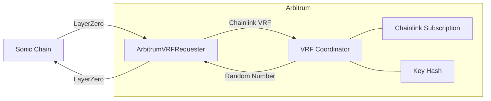
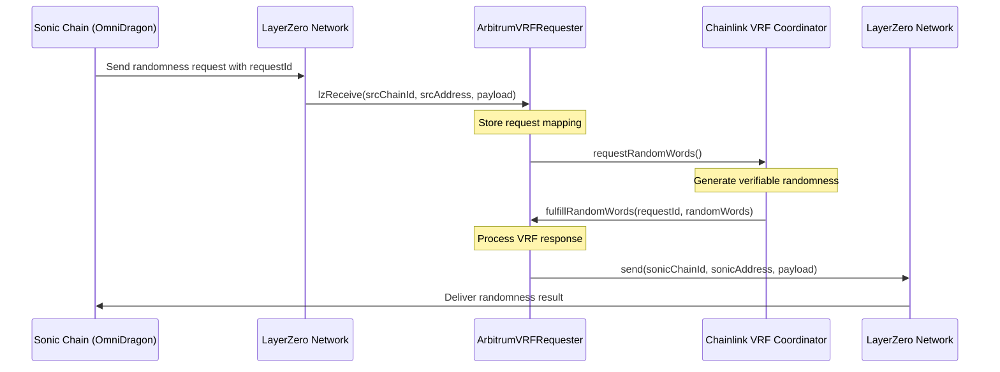

# Arbitrum VRF Requester

The ArbitrumVRFRequester contract serves as the OmniDragon ecosystem's bridge to Chainlink's VRF v2.5 service on Arbitrum, receiving randomness requests from Sonic and returning the results via LayerZero messaging.

## Overview

This contract is deployed on the Arbitrum network and acts as an intermediary between OmniDragon's randomness system on Sonic and Chainlink's VRF service on Arbitrum, enabling secure cross-chain randomness verification.



## Key Features

- **Chainlink VRF v2.5 Integration**: Direct connection to Chainlink's latest VRF service
- **Subscription Management**: Uses Chainlink's subscription model for VRF requests
- **LayerZero Cross-Chain Messaging**: Secure communication with Sonic chain
- **Request Tracking**: Maintains records of all cross-chain randomness requests
- **Configurable Parameters**: Adjustable gas limits and confirmation settings

## Contract Details

**Source:** [`ArbitrumVRFRequester.sol`](https://github.com/wenakita/omnidragon/blob/main/contracts/chainlink/ArbitrumVRFRequester.sol)

### Key Storage Variables

```solidity
// Chainlink VRF settings
VRFCoordinatorV2Interface public immutable coordinator;
uint64 public immutable subscriptionId;
bytes32 public immutable keyHash;
uint32 public callbackGasLimit;
uint16 public requestConfirmations;
uint32 public numWords;

// LayerZero settings
address public lzEndpoint;
uint16 public sonicChainId;
bytes public sonicDragonVRFAddress;

// Request tracking
struct RequestData {
    uint16 srcChainId;
    bytes srcAddress;
    uint256 requestId;
    bool fulfilled;
}

// Mapping from chainlink request ID to user request data
mapping(uint256 => RequestData) public requests;
```

## Main Functions

### Configuration Management

```solidity
// Update VRF request settings
function updateVRFSettings(
    uint32 _callbackGasLimit,
    uint16 _requestConfirmations,
    uint32 _numWords
) external onlyOwner

// Update LayerZero settings
function updateLzSettings(
    address _lzEndpoint,
    uint16 _sonicChainId,
    bytes memory _sonicDragonVRFAddress
) external onlyOwner
```

### Cross-Chain Randomness Operations

```solidity
// Receive a message from LayerZero
function lzReceive(
    uint16 _srcChainId,
    bytes memory _srcAddress,
    uint64 _nonce,
    bytes memory _payload
) external override onlyLzEndpoint

// Chainlink VRF callback function
function fulfillRandomWords(
    uint256 _requestId,
    uint256[] memory _randomWords
) internal override
```

### Fee Estimation

```solidity
// Estimate fees for sending randomness back
function estimateFees(
    uint16 _dstChainId,
    bytes memory _payload
) external view returns (uint256)
```

## Cross-Chain Request Flow

The detailed randomness request process between Sonic and Arbitrum:



## Chainlink VRF Configuration

The ArbitrumVRFRequester is configured with specific Chainlink VRF parameters:

| Parameter | Description | Typical Value |
|-----------|-------------|---------------|
| subscriptionId | Chainlink VRF subscription ID | Specific to deployment |
| keyHash | VRF key hash for the desired gas lane | 0x8af398995b04c28e9951adb9721ef74c74f93e6a478f39e7e0777be13527e7ef |
| callbackGasLimit | Gas limit for VRF callback | 500,000 |
| requestConfirmations | Minimum confirmations before result | 3 |
| numWords | Number of random words to request | 1 |

## Security Considerations

The contract includes several security measures:

- **Source Chain Validation**: Only accepts messages from the authorized Sonic chain address
- **Request Tracking**: Prevents duplicate processing of the same randomness request
- **Immutable Core Configuration**: Critical parameters like subscription ID and key hash are immutable
- **Access Control**: Only owner can update configuration settings
- **Gas Management**: Configurable gas limits for cost optimization

## LayerZero Integration

The contract uses LayerZero's cross-chain messaging protocol for secure communication:

1. **Receiving Requests**: Implements the `lzReceive` function to accept messages from Sonic
2. **Sending Results**: Uses LayerZero's `send` function to transmit randomness back to Sonic
3. **Path Verification**: Validates that messages come from the trusted Sonic contract
4. **Fee Handling**: Includes methods to estimate and handle cross-chain message fees

## Subscription Management

To maintain the Chainlink VRF subscription:

1. **Subscription Creation**: Create a Chainlink VRF subscription on Arbitrum
2. **Fund Subscription**: Ensure the subscription has sufficient LINK tokens
3. **Add Consumer**: Add the ArbitrumVRFRequester contract as an authorized consumer
4. **Monitor Usage**: Regularly check subscription balance and top up as needed

## Deployment Considerations

When deploying this contract:

1. **Chainlink Subscription**: A pre-existing Chainlink VRF subscription is required
2. **Gas Optimization**: Adjust the `callbackGasLimit` based on expected gas costs
3. **LayerZero Configuration**: Configure correct endpoint addresses and chain IDs
4. **ETH Balance**: Maintain sufficient ETH for LayerZero message fees
5. **LINK Balance**: Ensure the Chainlink subscription has sufficient LINK tokens
