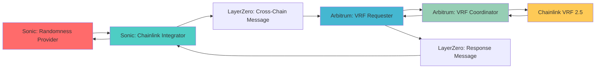

# Chainlink VRF Integration

OmniDragon integrates with Chainlink VRF 2.5 through a sophisticated cross-chain architecture, providing industry-standard verifiable randomness from Arbitrum to Sonic via LayerZero messaging.

## Architecture Overview



## Core Components

### Sonic Mainnet Components

#### ChainlinkVRFIntegrator
```solidity
contract ChainlinkVRFIntegrator {
    // Handles VRF requests from Sonic side
    function requestRandomness(address consumer) external returns (uint256 requestId);
    
    // Receives VRF responses via LayerZero
    function fulfillRandomness(uint256 requestId, uint256 randomness) external;
    
    // LayerZero message handling
    function lzReceive(uint16 _srcChainId, bytes calldata _srcAddress, uint64 _nonce, bytes calldata _payload) external;
}
```

**Key Features:**
- Manages cross-chain VRF requests
- Handles LayerZero messaging
- Maintains request-response mapping
- Provides gas estimation for cross-chain calls

#### ChainlinkVRFRequester (Interface)
```solidity
interface IChainlinkVRFRequester {
    function requestRandomness(address consumer) external returns (uint256 requestId);
}
```

#### ChainlinkVRFUtils
```solidity
library ChainlinkVRFUtils {
    // Utility functions for VRF operations
    function validateVRFResponse(uint256 requestId, uint256 randomness) internal pure returns (bool);
    function calculateGasEstimate(uint16 dstChainId) internal view returns (uint256);
}
```

### Arbitrum Mainnet Components

#### OmniDragonVRFRequester
```solidity
contract OmniDragonVRFRequester is VRFConsumerBaseV2 {
    // VRF Coordinator interface
    VRFCoordinatorV2Interface COORDINATOR;
    
    // Subscription management
    uint64 s_subscriptionId;
    bytes32 keyHash;
    uint32 callbackGasLimit = 2500000;
    uint16 requestConfirmations = 3;
    
    // Request VRF and relay back to Sonic
    function requestRandomWords(address sonicConsumer) external returns (uint256 requestId);
    
    // VRF callback - relays to Sonic via LayerZero
    function fulfillRandomWords(uint256 requestId, uint256[] memory randomWords) internal override;
}
```

**Configuration:**
- **VRF Coordinator**: `0x3C0Ca683b403E37668AE3DC4FB62F4B29B6f7a3e`
- **Key Hash**: `0x68d24f9a037a649944964c2a1ebd0b2918f4a243d2a99701cc22b548cf2daff0`
- **Subscription ID**: Configured per deployment
- **Gas Limit**: 2.5M gas for callback
- **Confirmations**: 3 blocks

## Request Flow

### 1. Request Initiation (Sonic)
```solidity
// User requests randomness
uint256 requestId = randomnessProvider.requestRandomness();

// Randomness provider routes to Chainlink
chainlinkIntegrator.requestRandomness(msg.sender);
```

### 2. Cross-Chain Request (Sonic → Arbitrum)
```solidity
// ChainlinkVRFIntegrator sends LayerZero message
bytes memory payload = abi.encode(requestId, consumer);
lzEndpoint.send{value: msg.value}(
    ARBITRUM_CHAIN_ID,
    trustedRemote,
    payload,
    payable(msg.sender),
    address(0),
    adapterParams
);
```

### 3. VRF Request (Arbitrum)
```solidity
// OmniDragonVRFRequester receives message and requests VRF
uint256 vrfRequestId = COORDINATOR.requestRandomWords(
    keyHash,
    s_subscriptionId,
    requestConfirmations,
    callbackGasLimit,
    1 // numWords
);
```

### 4. VRF Fulfillment (Arbitrum)
```solidity
// Chainlink VRF calls back with randomness
function fulfillRandomWords(uint256 requestId, uint256[] memory randomWords) internal override {
    uint256 randomness = randomWords[0];
    
    // Send response back to Sonic via LayerZero
    bytes memory payload = abi.encode(originalRequestId, randomness);
    lzEndpoint.send(SONIC_CHAIN_ID, trustedRemote, payload, ...);
}
```

### 5. Response Delivery (Arbitrum → Sonic)
```solidity
// ChainlinkVRFIntegrator receives response
function lzReceive(..., bytes calldata _payload) external {
    (uint256 requestId, uint256 randomness) = abi.decode(_payload, (uint256, uint256));
    
    // Deliver to original consumer
    randomnessProvider.fulfillRandomness(requestId, randomness);
}
```

## Configuration

### Subscription Management

#### Create Subscription
```solidity
// On Arbitrum - create and fund VRF subscription
uint64 subId = coordinator.createSubscription();
coordinator.addConsumer(subId, vrfRequesterAddress);

// Fund with LINK tokens
LINK.transferAndCall(
    address(coordinator),
    amount,
    abi.encode(subId)
);
```

#### Monitor Subscription
```solidity
function getSubscriptionDetails() external view returns (
    uint96 balance,
    uint64 reqCount,
    address owner,
    address[] memory consumers
) {
    return coordinator.getSubscription(s_subscriptionId);
}
```

### LayerZero Configuration

#### Set Trusted Remotes
```solidity
// On Sonic integrator
chainlinkIntegrator.setTrustedRemote(
    ARBITRUM_LZ_CHAIN_ID,
    abi.encodePacked(arbitrumVRFRequester, sonicIntegrator)
);

// On Arbitrum requester
vrfRequester.setTrustedRemote(
    SONIC_LZ_CHAIN_ID,
    abi.encodePacked(sonicIntegrator, arbitrumVRFRequester)
);
```

#### Gas Configuration
```solidity
// Set minimum gas for destination
chainlinkIntegrator.setMinDstGas(ARBITRUM_LZ_CHAIN_ID, 0, 200000);
vrfRequester.setMinDstGas(SONIC_LZ_CHAIN_ID, 0, 100000);
```

## Cost Structure

### LayerZero Fees
- **Sonic → Arbitrum**: ~0.01 S (varies with gas prices)
- **Arbitrum → Sonic**: ~0.001 ETH (varies with gas prices)

### VRF Fees
- **Base Fee**: 0.25 LINK per request
- **Gas Fee**: Variable based on callback gas usage
- **Total**: ~0.3-0.5 LINK per request

### Gas Usage
- **Request**: ~200k gas on Sonic
- **Fulfillment**: ~100k gas on Sonic
- **VRF Callback**: ~2.5M gas on Arbitrum

## Security Features

### Request Validation
```solidity
function validateRequest(address consumer, uint256 requestId) internal view {
    require(authorizedConsumers[consumer], "Unauthorized consumer");
    require(pendingRequests[requestId].exists, "Invalid request");
    require(!pendingRequests[requestId].fulfilled, "Already fulfilled");
}
```

### Response Verification
```solidity
function verifyVRFResponse(uint256 requestId, uint256 randomness) internal view {
    require(randomness != 0, "Invalid randomness");
    require(block.timestamp <= requestTime + VRF_TIMEOUT, "Request expired");
}
```

### Access Control
```solidity
modifier onlyRandomnessProvider() {
    require(msg.sender == randomnessProvider, "Only randomness provider");
    _;
}

modifier onlyLayerZero() {
    require(msg.sender == lzEndpoint, "Only LayerZero endpoint");
    _;
}
```

## Monitoring & Maintenance

### Health Checks
```solidity
function getSystemHealth() external view returns (
    bool subscriptionActive,
    uint256 linkBalance,
    uint256 pendingRequests,
    uint256 lastRequestTime
) {
    // Return system health metrics
}
```

### Emergency Functions
```solidity
function emergencyPause() external onlyOwner {
    paused = true;
}

function emergencyWithdraw() external onlyOwner {
    // Withdraw LINK tokens in emergency
}
```

### Automated Monitoring
- **Subscription Balance**: Alert when LINK balance < threshold
- **Request Timeouts**: Monitor for stuck requests
- **LayerZero Connectivity**: Verify cross-chain messaging
- **Gas Price Monitoring**: Adjust gas limits based on network conditions

## Integration Examples

### Basic VRF Request
```solidity
contract MyGame {
    IOmniDragonRandomnessProvider randomnessProvider;
    
    mapping(uint256 => address) public requestToPlayer;
    
    function playGame() external {
        uint256 requestId = randomnessProvider.requestRandomness();
        requestToPlayer[requestId] = msg.sender;
    }
    
    function fulfillRandomness(uint256 requestId, uint256 randomness) external {
        require(msg.sender == address(randomnessProvider), "Unauthorized");
        
        address player = requestToPlayer[requestId];
        uint256 outcome = randomness % 100;
        
        // Process game outcome
        if (outcome < 50) {
            // Player wins
            payouts[player] += betAmount * 2;
        }
        
        delete requestToPlayer[requestId];
    }
}
```

### Gas Estimation
```solidity
function estimateVRFCost() external view returns (uint256 sonicGas, uint256 linkCost) {
    // Estimate LayerZero fees
    (uint256 nativeFee,) = lzEndpoint.estimateFees(
        ARBITRUM_LZ_CHAIN_ID,
        address(this),
        payload,
        false,
        adapterParams
    );
    
    sonicGas = nativeFee;
    linkCost = 0.3 ether; // ~0.3 LINK per request
}
```

## Troubleshooting

### Common Issues

1. **Request Timeout**
   - Check LayerZero connectivity
   - Verify subscription funding
   - Monitor Arbitrum network congestion

2. **Insufficient LINK**
   - Top up VRF subscription
   - Monitor balance alerts
   - Set up automated funding

3. **Gas Estimation Errors**
   - Update gas limits for network conditions
   - Check LayerZero fee calculations
   - Verify adapter parameters

### Debug Functions
```solidity
function debugRequest(uint256 requestId) external view returns (
    bool exists,
    bool fulfilled,
    uint256 timestamp,
    address consumer
) {
    // Return request debug information
}
```

## Best Practices

1. **Always fund VRF subscription** with sufficient LINK
2. **Monitor LayerZero fees** and adjust accordingly
3. **Implement proper timeout handling** for requests
4. **Use appropriate gas limits** for callbacks
5. **Set up monitoring alerts** for system health

## Links

- **[Randomness Provider](/contracts/core/randomness-provider)**: Core randomness contract
- **[VRF Overview](/contracts/randomness/overview)**: System architecture
- **[Drand Integration](/contracts/randomness/drand)**: Alternative randomness source
- **[LayerZero Integration](/integrations/layerzero)**: Cross-chain messaging
