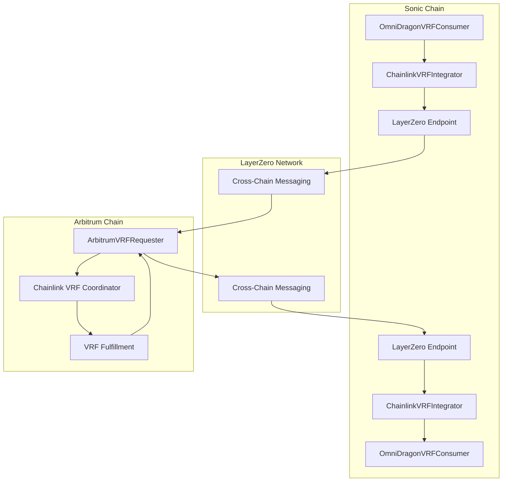
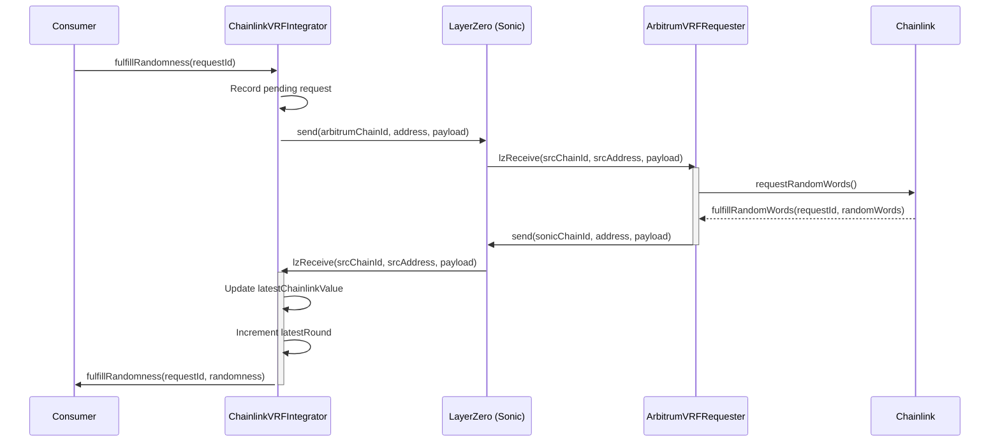

# Chainlink VRF Integrator

The ChainlinkVRFIntegrator contract serves as a bridge between the OmniDragon VRF system on Sonic and Chainlink's VRF service on Arbitrum, enabling secure cross-chain randomness.

## Overview

This contract is part of OmniDragon's cross-chain randomness architecture, responsible for forwarding randomness requests to Arbitrum and receiving the results via LayerZero messaging.



## Key Features

- **Cross-Chain Integration**: Connects Sonic to Arbitrum's Chainlink VRF service
- **LayerZero Messaging**: Uses LayerZero for secure cross-chain communication
- **Request Management**: Tracks pending and fulfilled randomness requests
- **Fallback Mechanism**: Provides a backup random value if the cross-chain request fails
- **Access Control**: Only authorized consumers can request randomness

## Contract Details

**Source:** [`ChainlinkVRFIntegrator.sol`](https://github.com/wenakita/omnidragon/blob/main/contracts/chainlink/ChainlinkVRFIntegrator.sol)

### Key Storage Variables

```solidity
// LayerZero settings
address public lzEndpoint;
uint16 public arbitrumChainId;
bytes public arbitrumVRFRequesterAddress;

// Randomness state
uint256 public latestChainlinkValue;
uint256 public latestRound;
uint256 public lastUpdateTimestamp;

// Request tracking
mapping(uint256 => address) public pendingRequests;
mapping(uint256 => bool) public fulfilledRequests;

// Authorized consumers
mapping(address => bool) public authorizedConsumers;
```

## Main Functions

### Configuration Management

```solidity
// Update LayerZero settings
function updateLzSettings(
    address _lzEndpoint,
    uint16 _arbitrumChainId,
    bytes memory _arbitrumVRFRequesterAddress
) external onlyOwner

// Authorizes a consumer to request randomness
function setAuthorizedConsumer(address _consumer, bool _authorized) external onlyOwner
```

### Randomness Operations

```solidity
// Returns the latest randomness value
function getLatestRandomness() external view override returns (uint256 random, uint256 round)

// Allows a consumer to request randomness
function fulfillRandomness(uint256 _requestId) external override nonReentrant

// Receive randomness response from Arbitrum
function lzReceive(
    uint16 _srcChainId,
    bytes memory _srcAddress,
    uint64 _nonce,
    bytes memory _payload
) external override onlyLzEndpoint
```

### Fee Estimation

```solidity
// Estimate fees for sending a request to Arbitrum
function estimateFees(uint256 _requestId) external view returns (uint256)
```

## Cross-Chain Request Flow

The randomness request follows a path across multiple chains:



## Security Considerations

The contract includes several security measures:

- **Reentrancy Protection**: Uses ReentrancyGuard for external calls
- **Source Validation**: Verifies that LayerZero messages come from the trusted Arbitrum contract
- **Request Tracking**: Prevents double-fulfillment of randomness requests
- **Fallback Value**: Maintains a seed value that can be used if cross-chain communication fails
- **Gas Fee Management**: Allows estimation of cross-chain fees for proper transaction execution

## Integration with OmniDragonVRFConsumer

The ChainlinkVRFIntegrator is one of the randomness sources that feeds into the OmniDragonVRFConsumer. To integrate:

1. Deploy the ChainlinkVRFIntegrator with the correct LayerZero endpoint and Arbitrum configuration
2. Add the integrator to OmniDragonVRFConsumer using `addNetwork()`
3. Assign an appropriate weight for Chainlink VRF in the randomness aggregation

Example setup:

```solidity
// Add Chainlink VRF to the multi-oracle system
bytes32 chainlinkNetworkId = keccak256("CHAINLINK_VRF");
vrfConsumer.addNetwork(
    chainlinkNetworkId,
    chainlinkIntegratorAddress,
    200  // Weight: 200 out of total weights
);
```

## Cross-Chain Gas Considerations

When using the ChainlinkVRFIntegrator, be aware of the cross-chain gas costs:

1. **Source Chain Fee**: Cost to send the message from Sonic to Arbitrum
2. **Destination Chain Fee**: Cost to execute the Chainlink VRF request on Arbitrum
3. **Return Message Fee**: Cost to send the randomness result back to Sonic

The `estimateFees()` function can be used to calculate the total expected cost for a cross-chain randomness request.
