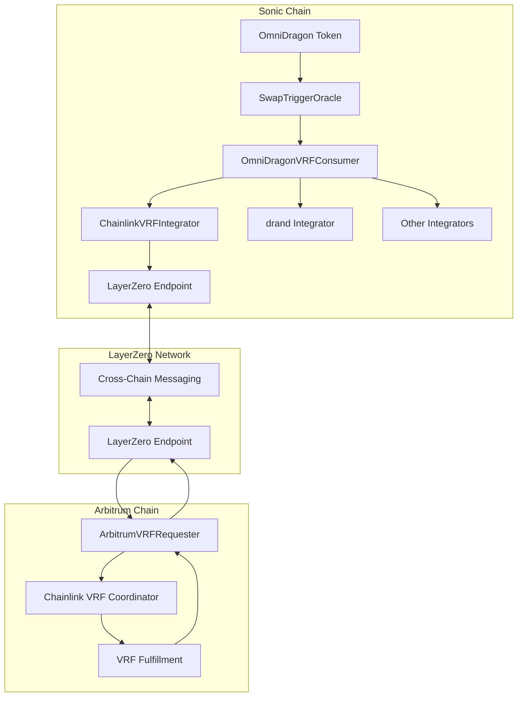
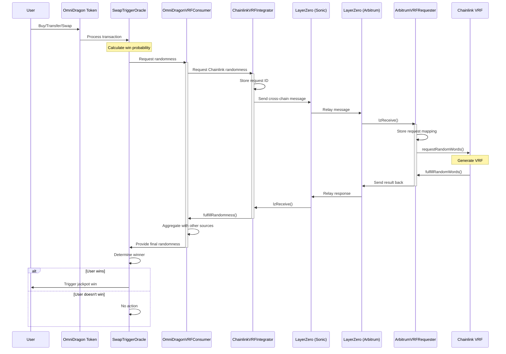

# Cross-Chain Randomness Architecture

OmniDragon implements a pioneering cross-chain randomness architecture that leverages multiple blockchains and randomness sources to create a secure, reliable, and manipulation-resistant system for generating verifiable randomness.

## Architecture Overview

The cross-chain randomness architecture spans multiple blockchains, using LayerZero for secure messaging between chains:



## Why Cross-Chain Randomness?

OmniDragon's cross-chain approach to randomness offers several advantages:

1. **Chain-Specific Strengths**: Leverages specialized services on different chains (like Chainlink VRF on Arbitrum)
2. **Security Diversification**: Distributes trust across multiple blockchain ecosystems
3. **Attack Resistance**: Requires an attacker to compromise multiple chains simultaneously
4. **Provider Diversity**: Combines different randomness generation methods (BLS signatures, VRFs, etc.)
5. **Latency Optimization**: Can prioritize faster sources while using slower ones for verification

## Key Components by Chain

### Sonic Chain Components

- **OmniDragonVRFConsumer**: Aggregates randomness from multiple sources
- **ChainlinkVRFIntegrator**: Interfaces with Arbitrum's Chainlink VRF via LayerZero
- **drand Integrator**: Connects to the drand network for additional randomness
- **Other Integrators**: Pluggable architecture for additional randomness sources
- **SwapTriggerOracle**: Initiates lottery entries based on token swaps

### Arbitrum Chain Components

- **ArbitrumVRFRequester**: Receives requests from Sonic and interacts with Chainlink
- **Chainlink VRF Coordinator**: Provides verifiable randomness on Arbitrum
- **VRF Consumer Contract**: Processes Chainlink VRF responses

### Cross-Chain Infrastructure

- **LayerZero Protocol**: Provides secure message passing between chains
- **LayerZero Endpoints**: Chain-specific entry points for cross-chain messaging
- **Message Verification**: Ensures messages come from trusted sources
- **Fee Management**: Handles gas costs across different chains

## Cross-Chain Message Flow

The cross-chain randomness flow works as follows:



## LayerZero Integration

LayerZero provides the secure cross-chain messaging backbone:

1. **Message Passing**: Serialized request and response payloads
2. **Source Verification**: Ensures messages come from trusted contracts
3. **Ultra Light Nodes (ULNs)**: Verify block headers for secure cross-chain communication
4. **Relayers**: Transmit messages between chains
5. **Endpoints**: Chain-specific entry points that validate and process messages

## Security Considerations

The cross-chain randomness system implements multiple security measures:

### Chain-Level Security

- **Source Validation**: Verifies that messages come from trusted contracts
- **Destination Validation**: Ensures messages are sent to the correct destination
- **Request Authentication**: Only authorized contracts can initiate randomness requests
- **Nonce Tracking**: Prevents replay attacks by validating message nonces

### Randomness Security

- **Multi-Source Aggregation**: Combines randomness from multiple providers for enhanced security
- **Source Weighting**: Assigns different weights to different providers based on trust
- **Threshold Requirements**: Ensures minimum number of active sources for valid randomness
- **Cryptographic Verification**: Verifies signatures and proofs when available

### Fallback Mechanisms

- **Local Randomness Source**: Provides a fallback if cross-chain sources are unavailable
- **Timeout Handling**: Detects and manages request timeouts
- **Source Redundancy**: Uses multiple randomness sources for reliability
- **Degraded Mode Operation**: Continues functioning with fewer sources if necessary

## Gas and Fee Considerations

Cross-chain operations involve multiple gas costs:

1. **Source Chain Fees**: Cost to initiate the request (Sonic)
2. **LayerZero Fees**: Fee for the cross-chain message
3. **Destination Chain Fees**: Cost to process the request (Arbitrum)
4. **Chainlink VRF Fee**: LINK token cost for using Chainlink VRF
5. **Return Message Fees**: Cost to send the result back to Sonic

The system provides fee estimation functions to calculate expected costs.

## Integration Example

Here's how a contract would integrate with the cross-chain randomness system:

```solidity
// Example consumer on Sonic chain
contract CrossChainRandomnessConsumer {
    OmniDragonVRFConsumer public vrfConsumer;
    mapping(uint256 => bool) public pendingRequests;
    
    constructor(address _vrfConsumer) {
        vrfConsumer = OmniDragonVRFConsumer(_vrfConsumer);
    }
    
    function requestRandomness() external returns (uint256) {
        // Generate unique request ID
        uint256 requestId = uint256(keccak256(abi.encode(
            block.timestamp, 
            msg.sender, 
            address(this)
        )));
        
        // Record the request
        pendingRequests[requestId] = true;
        
        // This will trigger the cross-chain flow
        vrfConsumer.requestRandomness(address(this), requestId);
        
        return requestId;
    }
    
    function fulfillRandomness(
        uint256 _requestId, 
        uint256 _randomValue,
        uint256 _round
    ) external {
        require(msg.sender == address(vrfConsumer), "Invalid sender");
        require(pendingRequests[_requestId], "Unknown request");
        
        // Use randomness here
        // ...
        
        // Clean up
        delete pendingRequests[_requestId];
    }
}
```

## Deployment Pipeline

Deploying the cross-chain randomness system involves several steps:

1. **Arbitrum Deployment**:
   - Deploy ArbitrumVRFRequester
   - Create Chainlink VRF subscription
   - Fund subscription with LINK tokens
   - Add requester as consumer to subscription

2. **Sonic Deployment**:
   - Deploy ChainlinkVRFIntegrator
   - Deploy OmniDragonVRFConsumer
   - Deploy additional integrators (drand, etc.)
   - Configure OmniDragonVRFConsumer with integrators and weights

3. **LayerZero Configuration**:
   - Set trusted remote addresses for both contracts
   - Configure gas limits and adapter parameters
   - Fund contracts with native tokens for gas fees

4. **System Integration**:
   - Connect SwapTriggerOracle to OmniDragonVRFConsumer
   - Authorize consumer contracts
   - Set up monitoring and fallback systems

## Monitoring and Maintenance

To ensure reliable operation of the cross-chain randomness system:

1. **Chainlink Subscription**: Regularly monitor and top up the LINK balance
2. **LayerZero Gas**: Maintain sufficient ETH for cross-chain messaging
3. **Request Timeouts**: Implement monitoring for stalled or failed requests
4. **Source Health**: Track the status and reliability of each randomness source
5. **Gas Optimization**: Periodically review and optimize gas usage parameters 