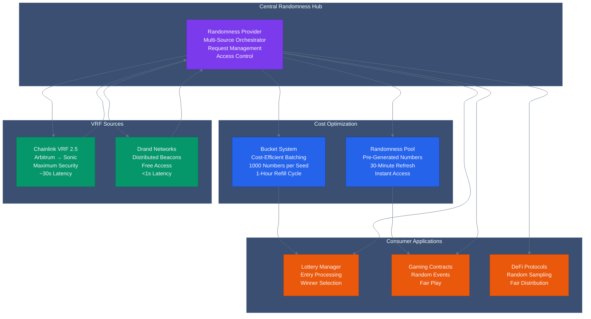
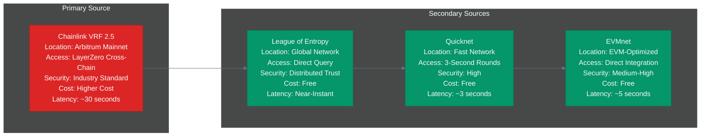
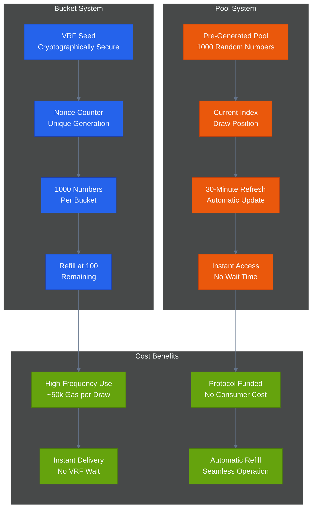
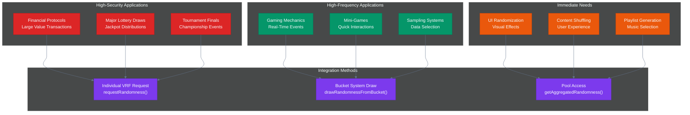
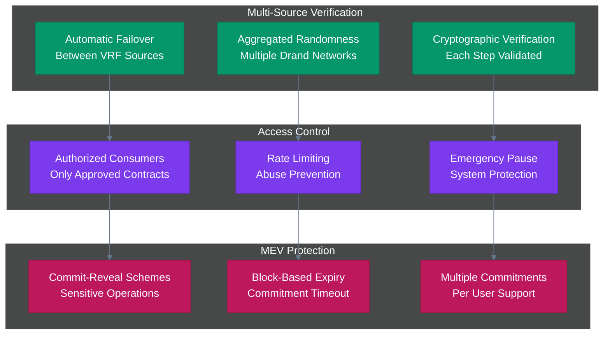
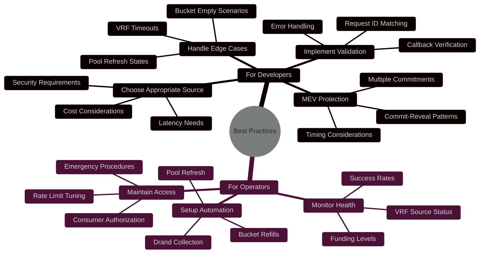

# VRF & Randomness Overview

The OmniDragon VRF system provides secure, verifiable randomness through multiple sources with automatic failover mechanisms. This system powers the lottery, gaming applications, and any protocol requiring cryptographically secure random numbers.

## Architecture Overview

<div className="mermaid-container">
  <div className="mermaid-controls">
    <button className="mermaid-btn">Zoom In</button>
    <button className="mermaid-btn">Zoom Out</button>
    <button className="mermaid-btn">Reset View</button>
    <button className="mermaid-btn">Replay</button>
  </div>


</div>

## VRF Sources

<div className="mermaid-container">
  <div className="mermaid-controls">
    <button className="mermaid-btn">Animate Sources</button>
  </div>


</div>

### Primary: Chainlink VRF 2.5
- **Location**: Arbitrum mainnet
- **Access**: Via LayerZero cross-chain messaging
- **Security**: Industry-standard cryptographic verification
- **Cost**: Higher cost, maximum security
- **Latency**: ~30 seconds (cross-chain)

### Secondary: Drand Networks
- **League of Entropy**: Main beacon network
- **Quicknet**: Fast randomness (3-second rounds)
- **EVMnet**: EVM-optimized randomness
- **Security**: Distributed trust model
- **Cost**: Free (only gas costs)
- **Latency**: Near-instant

## Cost Optimization Systems

<div className="mermaid-container">
  <div className="mermaid-controls">
    <button className="mermaid-btn">Zoom In</button>
    <button className="mermaid-btn">Replay</button>
  </div>


</div>

### Bucket System
- **Purpose**: Cost-efficient randomness for high-frequency requests
- **Capacity**: 1000 random numbers per VRF seed
- **Refill**: Automatic when < 100 numbers remain
- **Use Case**: Gaming, frequent lottery entries

### Randomness Pool
- **Purpose**: Pre-generated randomness for instant access
- **Size**: 1000 pre-computed numbers
- **Refresh**: Every 30 minutes or when depleted
- **Use Case**: Immediate randomness needs

## Integration Patterns

<div className="mermaid-container">
  <div className="mermaid-controls">
    <button className="mermaid-btn">Show Patterns</button>
  </div>


</div>

### For High-Security Applications
```solidity
// Request individual VRF for maximum security
uint256 requestId = randomnessProvider.requestRandomness();
```

### For High-Frequency Applications
```solidity
// Use bucket system for cost efficiency
uint256 randomness = randomnessProvider.drawRandomnessFromBucket();
```

### For Immediate Needs
```solidity
// Get aggregated randomness instantly
uint256 randomness = randomnessProvider.getAggregatedRandomness();
```

## Security Features

<div className="mermaid-container">
  <div className="mermaid-controls">
    <button className="mermaid-btn">Zoom In</button>
    <button className="mermaid-btn">Replay</button>
  </div>


</div>

### Multi-Source Verification
- Automatic failover between VRF sources
- Aggregated randomness from multiple Drand networks
- Cryptographic verification at each step

### Access Control
- Only authorized consumers can request randomness
- Rate limiting and abuse prevention
- Emergency pause mechanisms

### MEV Protection
- Commit-reveal schemes for sensitive operations
- Block-based commitment expiry
- Multiple commitment support per user

## Performance Metrics

```mermaid
%%{init: {
  'theme': 'dark',
  'themeVariables': {
    'primaryColor': '#1d4ed8',
    'primaryTextColor': '#f8fafc',
    'lineColor': '#64748b',
    'tertiaryColor': '#0f172a'
  },
  'xyChart': {
    'width': 800,
    'height': 500
  }
}}%%
xychart-beta
    title "VRF Method Performance Comparison"
    x-axis ["Cost Score", "Latency Score", "Security Score", "Throughput Score"]
    y-axis "Performance Rating" 0 --> 10
    bar [2, 2, 10, 3]
    bar [8, 9, 8, 8]
    bar [9, 10, 6, 9]
    bar [10, 10, 6, 10]
```

<div className="mermaid-container">
  <div className="mermaid-controls">
    <button className="mermaid-btn">Show Performance</button>
  </div>


</div>

| Method | Cost | Latency | Security | Use Case |
|--------|------|---------|----------|----------|
| **Chainlink VRF** | High | ~30s | Maximum | Critical applications |
| **Drand Aggregated** | Low | &lt;1s | High | General purpose |
| **Bucket Draw** | Very Low | &lt;1s | Medium | High-frequency |
| **Pool Access** | Minimal | Instant | Medium | Immediate needs |

## Contract Addresses

### Sonic Mainnet
- **Randomness Provider**: `[TO_BE_DEPLOYED]`
- **Chainlink Integrator**: `[TO_BE_DEPLOYED]`
- **Drand Integrators**: `[TO_BE_DEPLOYED]`

### Arbitrum Mainnet
- **VRF Requester**: `[TO_BE_DEPLOYED]`
- **VRF Coordinator**: `0x3C0Ca683b403E37668AE3DC4FB62F4B29B6f7a3e`

## Best Practices

<div className="mermaid-container">
  <div className="mermaid-controls">
    <button className="mermaid-btn">Show Practices</button>
  </div>


</div>

### For Developers
1. **Choose appropriate randomness source** based on security needs
2. **Implement proper callback validation** for VRF responses
3. **Handle bucket empty scenarios** gracefully
4. **Monitor pool status** for high-frequency operations
5. **Use commit-reveal** for MEV-sensitive operations

### For Protocol Operators
1. **Monitor VRF source health** and funding levels
2. **Set up automated Drand collection** for fresh randomness
3. **Configure pool refresh automation** based on usage patterns
4. **Maintain proper access control** for authorized consumers

## Links

- **[Randomness Provider](/contracts/core/randomness-provider)**: Core randomness contract
- **[Chainlink Integration](/contracts/randomness/chainlink)**: Chainlink VRF details
- **[Drand Integration](/contracts/randomness/drand)**: Drand network integration
- **[VRF Interfaces](/contracts/randomness/interfaces)**: Interface documentation


 