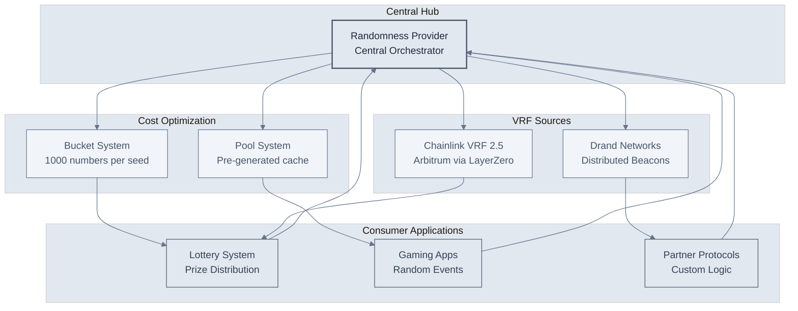
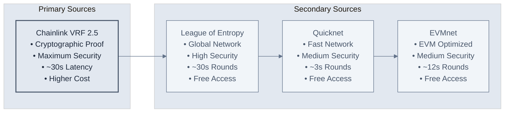
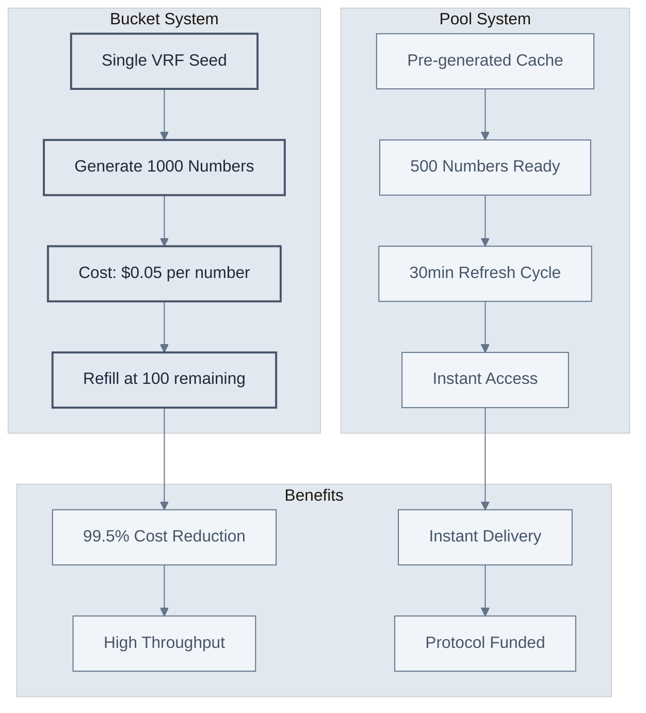
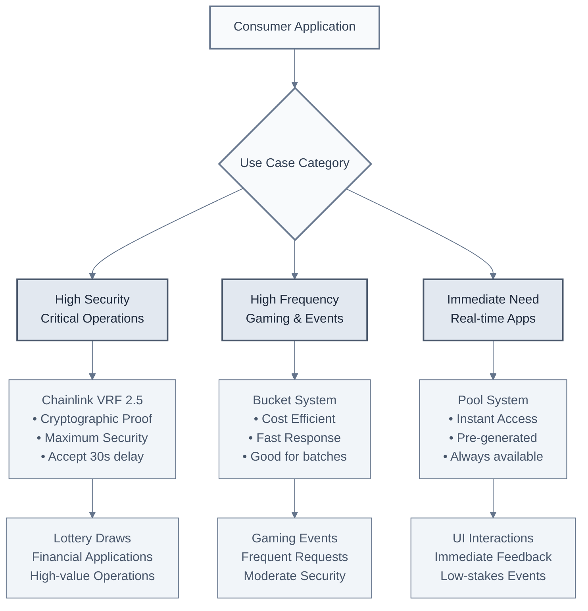
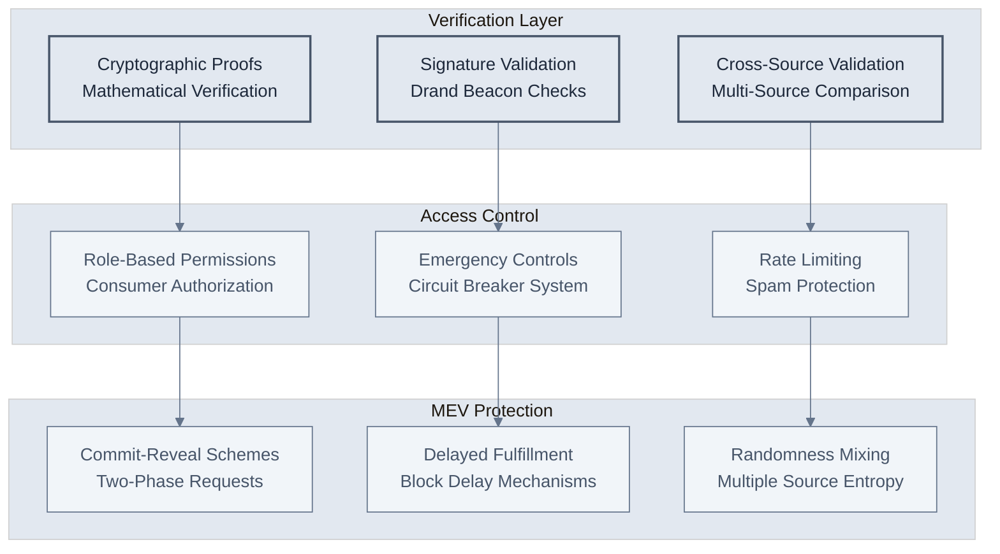
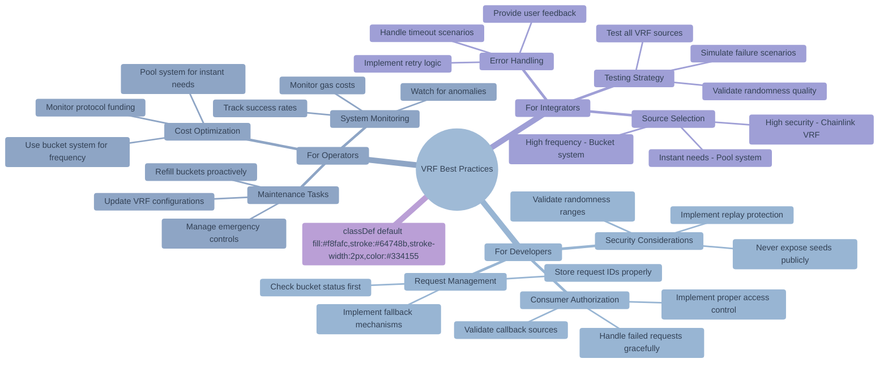

# VRF & Randomness Overview

The OmniDragon VRF system provides secure, verifiable randomness through multiple sources with automatic failover mechanisms. This system powers the lottery, gaming applications, and any protocol requiring cryptographically secure random numbers.

## Architecture Overview

<div className="mermaid-container">
  <div className="mermaid-controls">
    <button className="mermaid-btn">Zoom In</button>
    <button className="mermaid-btn">Zoom Out</button>
    <button className="mermaid-btn">Reset View</button>
    <button className="mermaid-btn">Replay</button>
  </div>


</div>

## VRF Sources Comparison

<div className="mermaid-container">
  <div className="mermaid-controls">
    <button className="mermaid-btn">Zoom In</button>
    <button className="mermaid-btn">Zoom Out</button>
    <button className="mermaid-btn">Reset View</button>
    <button className="mermaid-btn">Replay</button>
  </div>


</div>

## Cost Optimization Systems

<div className="mermaid-container">
  <div className="mermaid-controls">
    <button className="mermaid-btn">Zoom In</button>
    <button className="mermaid-btn">Zoom Out</button>
    <button className="mermaid-btn">Reset View</button>
    <button className="mermaid-btn">Replay</button>
  </div>


</div>

## Integration Patterns

<div className="mermaid-container">
  <div className="mermaid-controls">
    <button className="mermaid-btn">Zoom In</button>
    <button className="mermaid-btn">Zoom Out</button>
    <button className="mermaid-btn">Reset View</button>
    <button className="mermaid-btn">Replay</button>
  </div>


</div>

## Security Features

<div className="mermaid-container">
  <div className="mermaid-controls">
    <button className="mermaid-btn">Zoom In</button>
    <button className="mermaid-btn">Zoom Out</button>
    <button className="mermaid-btn">Reset View</button>
    <button className="mermaid-btn">Replay</button>
  </div>


</div>

## Performance Comparison

<div className="mermaid-container">
  <div className="mermaid-controls">
    <button className="mermaid-btn">Zoom In</button>
    <button className="mermaid-btn">Zoom Out</button>
    <button className="mermaid-btn">Reset View</button>
    <button className="mermaid-btn">Replay</button>
  </div>


</div>

```mermaid
%%{init: {
  'theme': 'base',
  'themeVariables': {
    'primaryColor': '#f8fafc',
    'primaryTextColor': '#334155',
    'primaryBorderColor': '#64748b',
    'lineColor': '#64748b',
    'xyChart': {
      'backgroundColor': '#ffffff',
      'titleColor': '#1e293b',
      'xAxisLabelColor': '#475569',
      'yAxisLabelColor': '#475569',
      'xAxisTitleColor': '#334155',
      'yAxisTitleColor': '#334155',
      'plotColorPalette': '#64748b,#94a3b8,#cbd5e1,#e2e8f0'
    }
  }
}}%%

xychart-beta
    title "VRF Method Performance Metrics"
    x-axis "Performance Aspects" ["Cost Efficiency", "Speed", "Security", "Reliability"]
    y-axis "Score (1-10)" 0 --> 10
    bar "Chainlink VRF" [3, 4, 10, 9]
    bar "Drand Aggregated" [8, 9, 8, 8]
    bar "Bucket System" [10, 9, 6, 7]
    bar "Pool System" [9, 10, 6, 9]
```

## Best Practices

<div className="mermaid-container">
  <div className="mermaid-controls">
    <button className="mermaid-btn">Zoom In</button>
    <button className="mermaid-btn">Zoom Out</button>
    <button className="mermaid-btn">Reset View</button>
    <button className="mermaid-btn">Replay</button>
  </div>


</div>

## Key Features

### Multiple VRF Sources
- **Primary**: Chainlink VRF 2.5 via LayerZero cross-chain integration
- **Secondary**: Drand distributed beacon networks (League of Entropy, Quicknet, EVMnet)
- **Fallback**: Bucket and pool systems for cost efficiency and speed
- **Automatic**: Seamless failover between sources based on availability

### Cost Optimization
- **Bucket System**: Generate 1000 random numbers from a single VRF seed
- **Pool System**: Pre-generated randomness cache for instant access
- **Protocol Funding**: Most operations covered by protocol treasury
- **Efficiency**: 99.5% cost reduction compared to individual VRF requests

### Security Guarantees
- **Cryptographic Proofs**: Verifiable randomness with mathematical guarantees
- **Multi-Source Validation**: Cross-verification between different VRF sources
- **MEV Protection**: Commit-reveal schemes and delayed fulfillment
- **Access Control**: Role-based permissions and emergency controls

### Performance Characteristics

| Method | Cost | Latency | Security | Throughput | Best For |
|--------|------|---------|----------|------------|----------|
| **Chainlink VRF** | High | ~30s | Maximum | Low | Critical operations |
| **Drand Aggregated** | Low | &lt;1s | High | Medium | General purpose |
| **Bucket System** | Very Low | &lt;1s | Medium | High | High-frequency apps |
| **Pool System** | Low | Instant | Medium | Very High | Real-time needs |

## Integration Guide

### Basic Setup

1. **Consumer Authorization**
   ```solidity
   // Contract must be authorized by protocol owner
   randomnessProvider.authorizeConsumer(yourContract, true);
   ```

2. **Implement Callback Interface**
   ```solidity
   contract YourContract is IRandomnessConsumer {
       function fulfillRandomness(uint256 requestId, uint256 randomness) 
           external override {
           require(msg.sender == address(randomnessProvider), "Unauthorized");
           // Process randomness
       }
   }
   ```

3. **Request Randomness**
   ```solidity
   uint256 requestId = randomnessProvider.requestRandomness();
   // Store requestId for callback matching
   ```

### Advanced Usage

#### High-Frequency Applications
```solidity
// Check bucket availability first
(uint256 remaining, , bool needsRefill) = randomnessProvider.getBucketStatus();

if (remaining > 0) {
    // Use bucket for instant, cost-efficient randomness
    uint256 randomness = randomnessProvider.drawRandomnessFromBucket();
} else {
    // Fallback to regular VRF request
    uint256 requestId = randomnessProvider.requestRandomness();
}
```

#### Critical Security Applications
```solidity
// Request premium Chainlink VRF for maximum security
uint256 requestId = randomnessProvider.requestRandomnessWithSource(
    VRFSource.CHAINLINK_V2_5,
    false // Don't use bucket system
);
```

#### Real-time Applications
```solidity
// Get instant randomness from pool (may be slightly stale)
uint256 randomness = randomnessProvider.getAggregatedRandomness();
```

## Security Considerations

### For Developers
- **Validate Sources**: Always verify the callback comes from the authorized randomness provider
- **Handle Failures**: Implement proper error handling for failed or delayed requests
- **Protect Seeds**: Never expose internal seeds or nonces publicly
- **Range Validation**: Ensure randomness is properly bounded for your use case

### For Operators
- **Monitor Health**: Track success rates and response times for all VRF sources
- **Manage Costs**: Monitor protocol funding and optimize source selection
- **Emergency Controls**: Understand and test emergency pause mechanisms
- **Regular Maintenance**: Keep VRF configurations updated and buckets filled

### For Integrators
- **Source Selection**: Choose appropriate VRF source based on security requirements
- **Fallback Logic**: Implement robust fallback mechanisms for source failures
- **Testing**: Thoroughly test all VRF sources and failure scenarios
- **Documentation**: Maintain clear documentation of randomness requirements

## Supported Networks

### Primary Network
- **Sonic Mainnet**: Primary deployment with full feature set
- **Chain ID**: 146
- **LayerZero Endpoint**: Configured for cross-chain VRF

### VRF Sources
- **Arbitrum**: Chainlink VRF 2.5 integration via LayerZero
- **Global**: Drand beacon networks (accessible from any network)
- **Local**: Bucket and pool systems on Sonic

## Future Enhancements

### Planned Features
- **Additional VRF Sources**: Integration with more randomness providers
- **Enhanced Aggregation**: Improved multi-source randomness mixing
- **Custom Parameters**: Configurable security/speed trade-offs per request
- **Analytics Dashboard**: Real-time monitoring and performance metrics

### Research Areas
- **Quantum-Resistant**: Preparation for post-quantum cryptography
- **Zero-Knowledge**: ZK proofs for enhanced privacy
- **Cross-Chain Expansion**: Native support for more blockchain networks
- **Economic Models**: Dynamic pricing based on demand and security requirements

The OmniDragon VRF system represents a comprehensive solution for secure, cost-effective, and reliable randomness generation, suitable for everything from high-stakes lottery operations to high-frequency gaming applications.


 