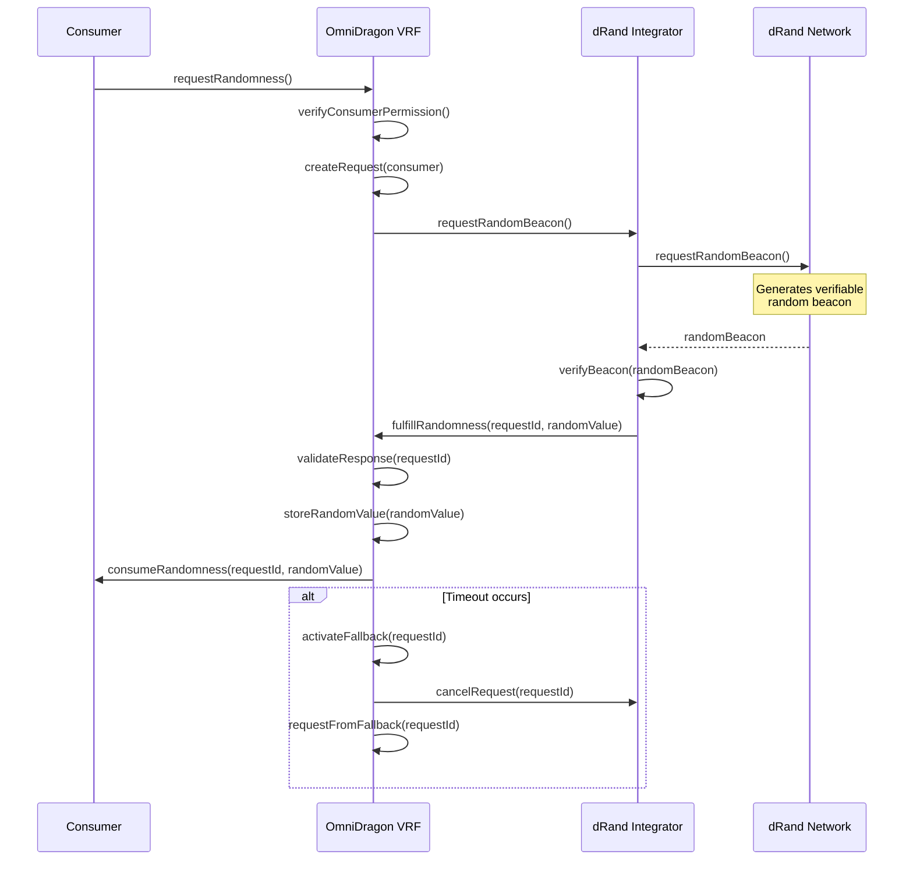

# OmniDragon VRF Consumer

The OmniDragon VRF Consumer (`OmniDragonVRFConsumer.sol`) is the central contract responsible for obtaining verifiable randomness from multiple sources and providing it to various components in the OmniDragon ecosystem.

## Contract Overview

The VRF Consumer serves as the randomness hub for the OmniDragon protocol, with key features including:

- Verifiable randomness from dRand and Chainlink
- Multi-source randomness aggregation
- Fallback randomness sources
- Secure randomness verification
- Cross-chain randomness consistency

## Key Functions

```solidity
// Request randomness from the primary source
function requestRandomness() external returns (uint256 requestId);

// Request randomness with a specific callback
function requestRandomness(address _consumer) external returns (uint256 requestId);

// Fulfill randomness request with verified random value
function fulfillRandomness(
    uint256 _requestId,
    uint256 _randomness
) external;

// Get the latest verified random value
function getLatestRandomValue() external view returns (uint256);

// Check if a request is pending
function isRequestPending(uint256 _requestId) external view returns (bool);

// Set fallback randomness sources
function setFallbackSource(address _source, bool _enabled) external onlyOwner;

// Set consumer permissions
function setConsumerPermission(address _consumer, bool _allowed) external onlyOwner;
```

## Architecture Diagram

```mermaid
flowchart TB
    %% Main VRF Consumer contract
    OmniDragonVRF["OmniDragon VRF Consumer"]:::main
    
    %% Randomness sources
    subgraph Sources ["Randomness Sources"]
        direction TB
        DRAND["dRand Network<br><small>(Primary Source)</small>"]:::source
        Chainlink["Chainlink VRF<br><small>(Secondary Source)</small>"]:::source
        ArbitrumVRF["Arbitrum VRF<br><small>(Chain-Specific Source)</small>"]:::source
        Fallback["Fallback Source<br><small>(Emergency Only)</small>"]:::source
    end
    
    %% VRF components
    subgraph Components ["Core Components"]
        direction TB
        RequestManager["Request Manager"]:::component
        VerificationEngine["Verification Engine"]:::component
        ResponseHandler["Response Handler"]:::component
        FallbackSystem["Fallback System"]:::component
    end
    
    %% Consumers of randomness
    subgraph Consumers ["Randomness Consumers"]
        direction TB
        JackpotSystem["Jackpot System"]:::consumer
        RaffleSystem["Raffle System"]:::consumer
        LootboxSystem["Lootbox System"]:::consumer
        GameSystem["Game Mechanics"]:::consumer
    end
    
    %% Connect components
    Sources -->|"Provides<br>randomness"| OmniDragonVRF
    OmniDragonVRF -->|"Delivers<br>verified<br>randomness"| Consumers
    Components -->|"Powers"| OmniDragonVRF
    
    %% Connect randomness flow
    Consumers -->|"Request<br>randomness"| RequestManager
    RequestManager -->|"Sends<br>request"| DRAND
    DRAND -->|"Returns<br>proof"| VerificationEngine
    VerificationEngine -->|"Verifies<br>proof"| ResponseHandler
    ResponseHandler -->|"Delivers<br>randomness"| Consumers
    
    %% Connect fallback flow
    FallbackSystem -->|"Monitors"| RequestManager
    FallbackSystem -->|"Activates<br>when needed"| Chainlink
    FallbackSystem -->|"Activates<br>when needed"| ArbitrumVRF
    FallbackSystem -->|"Last resort"| Fallback
    
    %% Styling
    classDef main fill:#4a80d1;stroke:#355899;color:#ffffff;font-weight:bold
    classDef source fill:#43a047;stroke:#2e7d32;color:#ffffff
    classDef component fill:#ff9800;stroke:#f57c00;color:#ffffff
    classDef consumer fill:#9c27b0;stroke:#7b1fa2;color:#ffffff
    
    %% Subgraph styling
    style Sources fill:rgba(76,175,80,0.1);stroke:#c8e6c9;color:#2e7d32
    style Components fill:rgba(255,152,0,0.1);stroke:#ffecb3;color:#ff8f00
    style Consumers fill:rgba(156,39,176,0.1);stroke:#e1bee7;color:#6a1b9a
```

## Randomness Request Flow

The process for requesting and receiving randomness follows a robust sequence:



## Multi-Source Randomness

The VRF Consumer can aggregate randomness from multiple sources for enhanced security:

```mermaid
flowchart LR
    %% Sources
    DRAND[("dRand<br>Network")]:::primary
    CHAINLINK[("Chainlink<br>VRF")]:::secondary
    ARBITRUM[("Arbitrum<br>VRF")]:::secondary
    
    %% Aggregation
    subgraph AggregationProcess ["Randomness Aggregation"]
        direction TB
        Source1["Source 1<br>Random Value"]:::value
        Source2["Source 2<br>Random Value"]:::value
        Source3["Source 3<br>Random Value"]:::value
        
        Combine{"Combine<br>Values"}:::process
        
        Hashing["Keccak256<br>Hashing"]:::process
        FinalValue["Final<br>Randomness"]:::result
    end
    
    %% Connect the sources to values
    DRAND -.->|"Provides"| Source1
    CHAINLINK -.->|"Provides"| Source2
    ARBITRUM -.->|"Provides"| Source3
    
    %% Show aggregation process
    Source1 --> Combine
    Source2 --> Combine
    Source3 --> Combine
    
    Combine -->|"Combined<br>Value"| Hashing
    Hashing -->|"Produces"| FinalValue
    
    %% Connect to consumers
    FinalValue -->|"Used by"| Jackpot["Jackpot<br>System"]:::consumer
    FinalValue -->|"Used by"| Raffle["Raffle<br>System"]:::consumer
    FinalValue -->|"Used by"| Games["Game<br>Mechanics"]:::consumer
    
    %% Styling
    classDef primary fill:#43a047;stroke:#2e7d32;color:#ffffff;font-weight:bold
    classDef secondary fill:#5c6bc0;stroke:#3949ab;color:#ffffff
    classDef value fill:#ff9800;stroke:#f57c00;color:#ffffff
    classDef process fill:#9c27b0;stroke:#7b1fa2;color:#ffffff
    classDef result fill:#e91e63;stroke:#c2185b;color:#ffffff;font-weight:bold
    classDef consumer fill:#607d8b;stroke:#455a64;color:#ffffff
    
    %% Subgraph styling
    style AggregationProcess fill:rgba(255,152,0,0.1);stroke:#ffecb3;color:#ff8f00
```

## Security Features

The OmniDragon VRF Consumer implements multiple security measures:

- **Request Validation**: Each request is validated for proper origin and permissions
- **Response Verification**: All random values are cryptographically verified
- **Timeout Handling**: Automatic fallback if primary source doesn't respond
- **Replay Protection**: Prevents reuse of random values
- **Access Control**: Only authorized consumers can request randomness
- **Secure Storage**: Random values are securely stored with access controls

## Integration Example

Here's how to integrate a contract with the OmniDragon VRF Consumer:

```solidity
// SPDX-License-Identifier: MIT
pragma solidity ^0.8.0;

import "@omnidragon/contracts/interfaces/IOmniDragonVRFConsumer.sol";
import "@omnidragon/contracts/interfaces/IDragonVRFConsumer.sol";

contract RandomnessConsumer is IDragonVRFConsumer {
    IOmniDragonVRFConsumer public vrfConsumer;
    
    // The request ID of the current pending request
    uint256 public currentRequestId;
    
    // The most recently received random value
    uint256 public randomResult;
    
    // Whether we have a pending request
    bool public hasPendingRequest;
    
    constructor(address _vrfConsumer) {
        vrfConsumer = IOmniDragonVRFConsumer(_vrfConsumer);
    }
    
    // Request randomness from the VRF consumer
    function requestRandomValue() external returns (uint256) {
        require(!hasPendingRequest, "Request already pending");
        
        // Request randomness and store the request ID
        currentRequestId = vrfConsumer.requestRandomness(address(this));
        hasPendingRequest = true;
        
        return currentRequestId;
    }
    
    // Called by VRF Consumer when randomness is ready
    function consumeRandomness(uint256 _requestId, uint256 _randomness) external override {
        // Verify caller is our VRF consumer
        require(msg.sender == address(vrfConsumer), "Caller is not VRF consumer");
        
        // Verify this is the request we're expecting
        require(_requestId == currentRequestId, "Request ID mismatch");
        
        // Store the random result
        randomResult = _randomness;
        hasPendingRequest = false;
        
        // Use the randomness (implementation specific)
        useRandomness(_randomness);
    }
    
    // Example function to use the randomness
    function useRandomness(uint256 _randomness) internal {
        // For example, select a winner from a list of participants
        // uint256 winnerIndex = _randomness % participants.length;
        // Winner logic implementation...
    }
}
```

## Interface

The OmniDragon VRF Consumer exposes its functionality through the following interface:

```solidity
interface IOmniDragonVRFConsumer {
    // Request randomness
    function requestRandomness() external returns (uint256 requestId);
    function requestRandomness(address _consumer) external returns (uint256 requestId);
    
    // Randomness fulfillment
    function fulfillRandomness(uint256 _requestId, uint256 _randomness) external;
    
    // Information retrieval
    function getLatestRandomValue() external view returns (uint256);
    function isRequestPending(uint256 _requestId) external view returns (bool);
    function getRandomValueForRequest(uint256 _requestId) external view returns (uint256);
    function getRequestStatus(uint256 _requestId) external view returns (uint8);
    
    // Configuration
    function setFallbackSource(address _source, bool _enabled) external;
    function setConsumerPermission(address _consumer, bool _allowed) external;
    function setTimeout(uint256 _timeout) external;
    
    // Events
    event RandomnessRequested(address indexed consumer, uint256 indexed requestId);
    event RandomnessFulfilled(uint256 indexed requestId, uint256 randomness);
    event FallbackActivated(uint256 indexed requestId, address fallbackSource);
    event ConsumerPermissionUpdated(address indexed consumer, bool allowed);
}
```

## Consumer Interface

Contracts that wish to consume randomness need to implement the following interface:

```solidity
interface IDragonVRFConsumer {
    function consumeRandomness(uint256 requestId, uint256 randomness) external;
}
```
