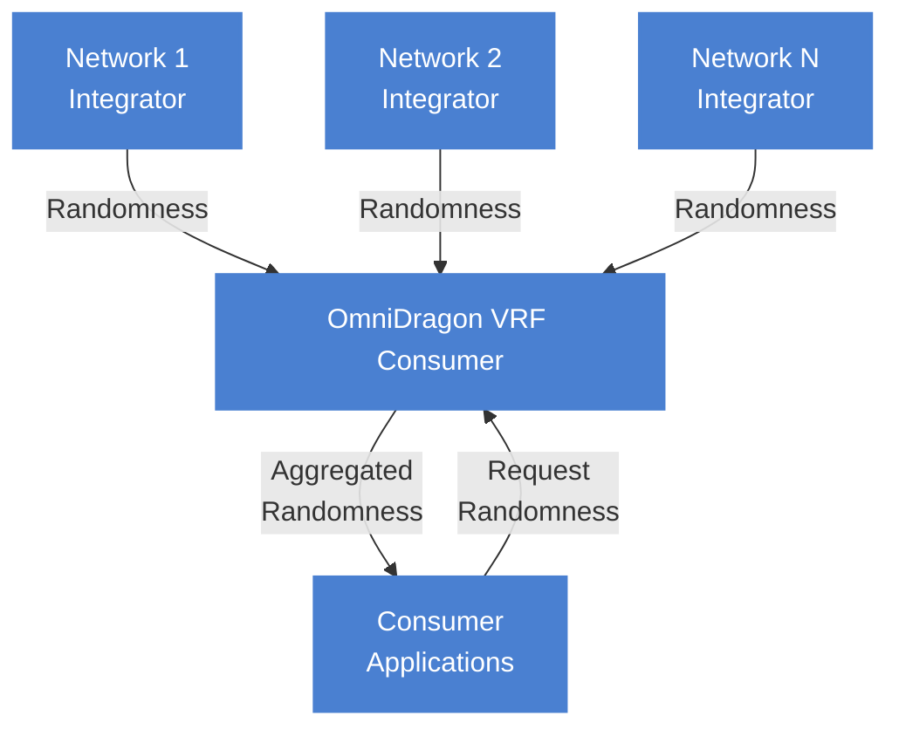

# OmniDragon VRF Consumer

The OmniDragon VRF Consumer (`OmniDragonVRFConsumer.sol`) is responsible for aggregating verifiable randomness from multiple sources for use in the OmniDragon ecosystem.

## Contract Overview

The VRF Consumer serves as the randomness hub for the OmniDragon protocol, with features including:

-**Multi-source randomness**: Ability to aggregate randomness from multiple source networks
-**Weighted aggregation**: Combines randomness using configurable weights
-**Consumer authorization**: Controls which contracts can request randomness
-**Failover support**: Continues operating if some randomness sources fail

## Actual Implementation

The OmniDragonVRFConsumer contract is implemented with the following structure:

```solidity
// OmniDragonVRFConsumer.sol
contract OmniDragonVRFConsumer is Ownable, ReentrancyGuard, IOmniDragonVRFConsumer {
    // Network tracking
    struct NetworkInfo {
        address integrator;
        bool active;
        uint256 weight;
        uint256 lastUpdate;
        uint256 lastValue;
        uint256 lastRound;
    }
    
    // Network storage
    mapping(bytes32 => NetworkInfo) public networks;
    bytes32[] public networkIds;
    
    // Randomness state
    uint256 public aggregatedRandomness;
    uint256 public lastAggregationTimestamp;
    uint256 public aggregationCounter;
    
    // Consumer tracking
    mapping(address => bool) public authorizedConsumers;
}
```

## Key Functions

The VRF Consumer implements several core functions for randomness aggregation and distribution:

```solidity
// Add a new randomness network
function addNetwork(bytes32 _networkId, address _integrator, uint256 _weight) external onlyOwner;

// Update an existing network
function updateNetwork(
    bytes32 _networkId, 
    address _integrator, 
    uint256 _weight, 
    bool _active
) external onlyOwner;

// Authorize a consumer to request randomness
function setAuthorizedConsumer(address _consumer, bool _authorized) external onlyOwner;

// Aggregate randomness from all active networks
function aggregateRandomness() public;

// Fulfill a randomness request for a consumer
function fulfillRandomness(address _consumer, uint256 _requestId) external override nonReentrant;

// Request randomness (helper function for consumers)
function requestRandomness(address _consumer, uint256 _requestId) external override;
```

## Randomness Aggregation Process

The VRF Consumer aggregates randomness using the following approach:

1. Starts with an initial seed value (previous aggregated randomness)
2. Collects randomness from all active network integrators
3. Combines values with weights using keccak256 hashing
4. Further mixes with block data and an incrementing counter
5. Produces a final random value that is unpredictable and well-distributed



## Integrator Interface

Each network integrator implements the `IDragonVRFIntegrator` interface:

```solidity
interface IDragonVRFIntegrator {
    // Get the latest randomness
    function getLatestRandomness() external view returns (uint256 randomness, uint256 round);
}
```

## Consumer Usage

Contracts that wish to consume randomness should implement:

```solidity
interface IDragonVRFConsumer {
    // Fulfill randomness callback
    function fulfillRandomness(
        uint256 requestId, 
        uint256 randomness,
        uint256 round
    ) external;
}
```

## Security Considerations

The VRF Consumer includes several security features:

1.**Authorization Controls**: Only authorized contracts can request randomness
2.**Reentrancy Protection**: Prevents reentrancy attacks during randomness fulfillment
3.**Owner-Only Administration**: Only the owner can add or modify randomness networks
4.**Fault Tolerance**: Continues operating even if some randomness sources fail

## Example Integration

Here's how to integrate with the OmniDragon VRF Consumer:

```solidity
// Example consumer contract
contract RandomnessConsumer is IDragonVRFConsumer {
    IOmniDragonVRFConsumer public vrfConsumer;
    uint256 public latestRandomValue;
    uint256 private requestCounter;
    
    constructor(address _vrfConsumerAddress) {
        vrfConsumer = IOmniDragonVRFConsumer(_vrfConsumerAddress);
    }
    
    // Request randomness
    function getRandomNumber() external returns (uint256 requestId) {
        requestId = ++requestCounter;
        vrfConsumer.requestRandomness(address(this), requestId);
        return requestId;
    }
    
    // Receive randomness
    function fulfillRandomness(
        uint256 requestId, 
        uint256 randomness,
        uint256 roundNumber
    ) external override {
        // Verify caller
        require(msg.sender == address(vrfConsumer), "Unauthorized");
        
        // Store randomness
        latestRandomValue = randomness;
        
        // Use the randomness for your application
        // ...
    }
}
```

## Interface

The OmniDragon VRF Consumer exposes its functionality through the following interface:

```solidity
interface IOmniDragonVRFConsumer {
    // Request randomness
    function requestRandomness() external returns (uint256 requestId);
    function requestRandomness(address _consumer) external returns (uint256 requestId);
    
    // Randomness fulfillment
    function fulfillRandomness(uint256 _requestId, uint256 _randomness) external;
    
    // Information retrieval
    function getLatestRandomValue() external view returns (uint256);
    function isRequestPending(uint256 _requestId) external view returns (bool);
    function getRandomValueForRequest(uint256 _requestId) external view returns (uint256);
    function getRequestStatus(uint256 _requestId) external view returns (uint8);
    
    // Configuration
    function setFallbackSource(address _source, bool _enabled) external;
    function setConsumerPermission(address _consumer, bool _allowed) external;
    function setTimeout(uint256 _timeout) external;
    
    // Events
    event RandomnessRequested(address indexed consumer, uint256 indexed requestId);
    event RandomnessFulfilled(uint256 indexed requestId, uint256 randomness);
    event FallbackActivated(uint256 indexed requestId, address fallbackSource);
    event ConsumerPermissionUpdated(address indexed consumer, bool allowed);
}
```

## Consumer Interface

Contracts that wish to consume randomness need to implement the following interface:

```solidity
interface IDragonVRFConsumer {
    function consumeRandomness(uint256 requestId, uint256 randomness) external;
}
```
