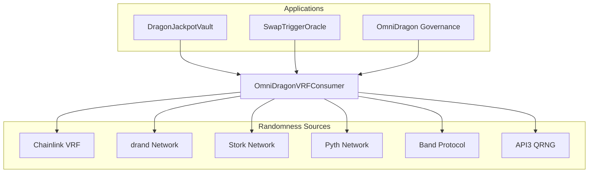
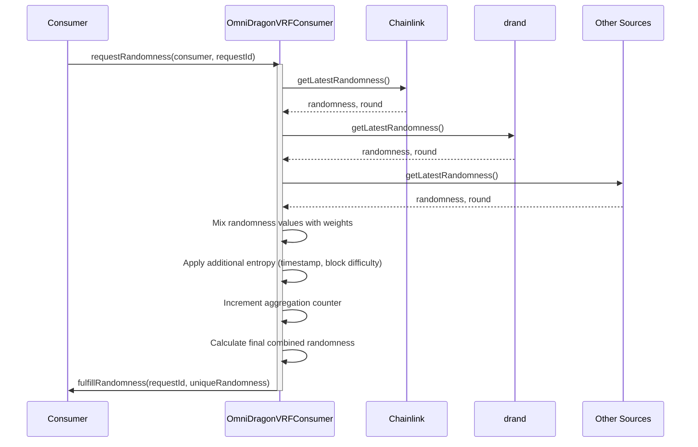

# OmniDragon VRF Consumer

The OmniDragonVRFConsumer is a sophisticated verifiable random function (VRF) consumer that aggregates randomness from multiple sources to provide high-quality entropy for the OmniDragon ecosystem.

## Overview

OmniDragonVRFConsumer serves as the central randomness aggregator, combining data from various VRF providers to create a secure and manipulation-resistant source of entropy.



## Key Features

- **Multi-source Aggregation**: Combines randomness from several providers
- **Network Weighting**: Assigns different weights to different randomness sources
- **Fault Tolerance**: Continues operating even if some providers fail
- **Manipulation Resistance**: Cross-validation between sources prevents tampering
- **Pluggable Architecture**: New randomness sources can be added or removed dynamically
- **Access Control**: Only authorized consumers can request randomness

## Contract Details

**Source:** [`OmniDragonVRFConsumer.sol`](https://github.com/wenakita/omnidragon/blob/main/contracts/drand/OmniDragonVRFConsumer.sol)

### Data Structures

```solidity
// Network tracking
struct NetworkInfo {
    address integrator;  // VRF integrator contract address
    bool active;         // Whether network is active
    uint256 weight;      // Weight in aggregation
    uint256 lastUpdate;  // Last update timestamp
    uint256 lastValue;   // Last random value
    uint256 lastRound;   // Last round number
}
```

### Key Storage Variables

```solidity
// Network storage
mapping(bytes32 => NetworkInfo) public networks;
bytes32[] public networkIds;

// Randomness state
uint256 public aggregatedRandomness;
uint256 public lastAggregationTimestamp;
uint256 public aggregationCounter;

// Consumer tracking
mapping(address => bool) public authorizedConsumers;
```

## Main Functions

### Network Management

```solidity
// Add a new VRF network source
function addNetwork(bytes32 _networkId, address _integrator, uint256 _weight) external onlyOwner

// Update an existing network's settings
function updateNetwork(bytes32 _networkId, address _integrator, uint256 _weight, bool _active) external onlyOwner

// Remove a network from the system
function removeNetwork(bytes32 _networkId) external onlyOwner
```

### Randomness Aggregation

```solidity
// Aggregate randomness from all active networks
function aggregateRandomness() public

// Request randomness (helper function for consumers)
function requestRandomness(address _consumer, uint256 _requestId) external override

// Fulfill a randomness request for a consumer
function fulfillRandomness(address _consumer, uint256 _requestId) external override nonReentrant
```

### Getter Functions

```solidity
// Get the current aggregated randomness
function getAggregatedRandomness() external view override returns (uint256)

// Get details about a specific network
function getNetworkDetails(bytes32 _networkId) external view returns (
    address integrator,
    bool active,
    uint256 weight,
    uint256 lastUpdate,
    uint256 lastValue,
    uint256 lastRound
)
```

## Randomness Aggregation Process

The OmniDragonVRFConsumer employs a sophisticated algorithm to aggregate randomness from multiple sources:



The aggregation formula creates a robust random value through several steps:

1. **Collection**: Gather random values from all active sources
2. **Validation**: Filter out stale or invalid values
3. **Weighting**: Apply weight factors to each source
4. **Combination**: Hash the weighted values together
5. **Strengthening**: Add block.timestamp, block.difficulty, and counter as additional entropy
6. **Finalization**: Produce the final randomness value through keccak256 hashing

## Security Considerations

The contract includes several security measures:

- **Reentrancy Protection**: Uses ReentrancyGuard for external calls
- **Access Control**: Only owner and authorized consumers can request or fulfill randomness
- **Fault Isolation**: Failures in individual sources don't affect the entire system
- **Try/Catch Pattern**: Uses try/catch to handle potential failures gracefully
- **Minimum Provider Threshold**: Can continue operating even with some inactive sources

## Integration Guide

To integrate with the OmniDragonVRFConsumer, contracts should:

1. Implement the `IDragonVRFConsumer` interface
2. Request authorization from the contract owner
3. Generate unique request IDs for randomness requests
4. Implement a fulfillment callback function

```solidity
// Example consumer implementation
contract MyRandomnessConsumer is IDragonVRFConsumer {
    OmniDragonVRFConsumer public vrf;
    mapping(uint256 => bool) public requests;
    
    constructor(address _vrf) {
        vrf = OmniDragonVRFConsumer(_vrf);
    }
    
    function requestRandom() external returns (uint256) {
        uint256 requestId = uint256(keccak256(abi.encode(block.timestamp, msg.sender, address(this))));
        requests[requestId] = true;
        vrf.requestRandomness(address(this), requestId);
        return requestId;
    }
    
    function fulfillRandomness(uint256 _requestId, uint256 _randomness, uint256 _round) external override {
        require(msg.sender == address(vrf), "Only VRF");
        require(requests[_requestId], "Unknown request");
        
        // Use randomness here
        // ...
        
        // Mark as fulfilled
        delete requests[_requestId];
    }
} 