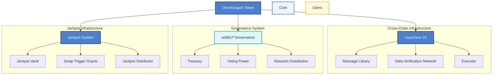
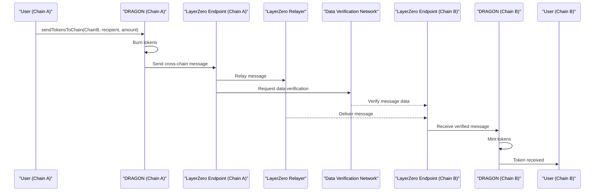
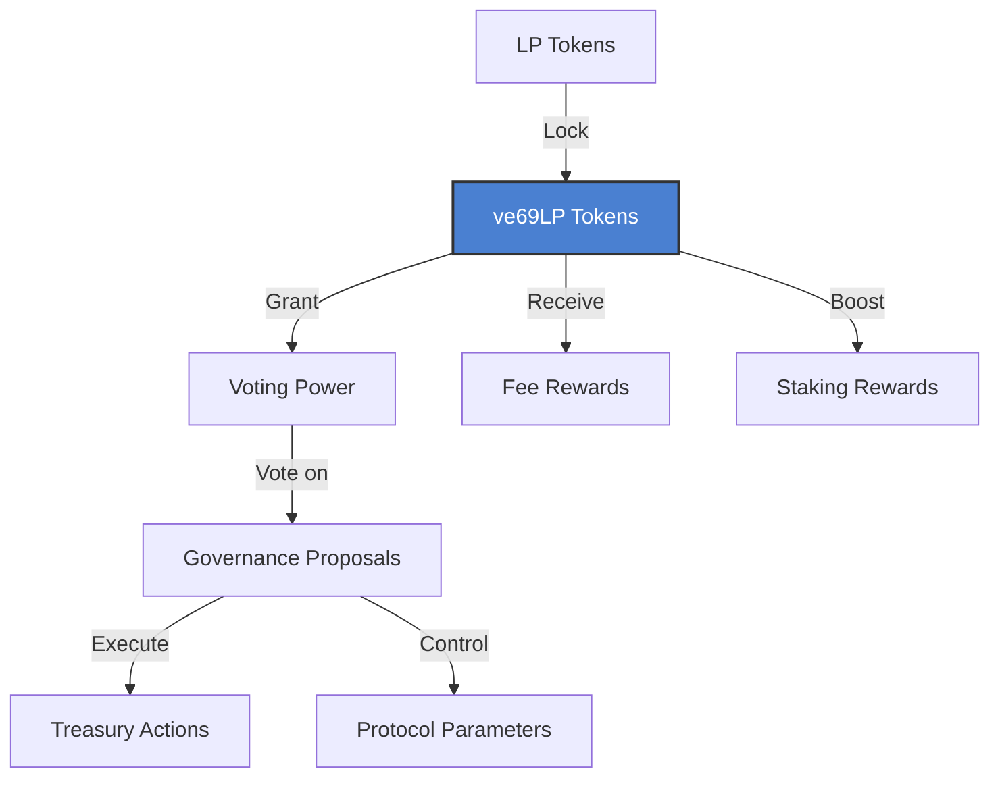
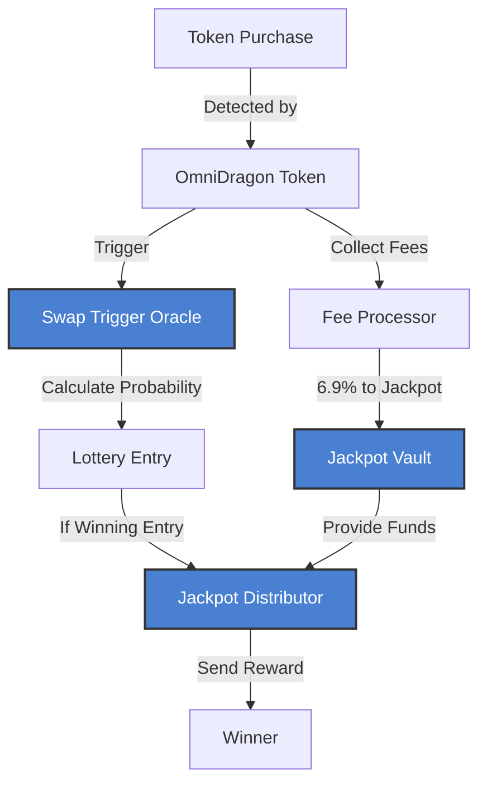
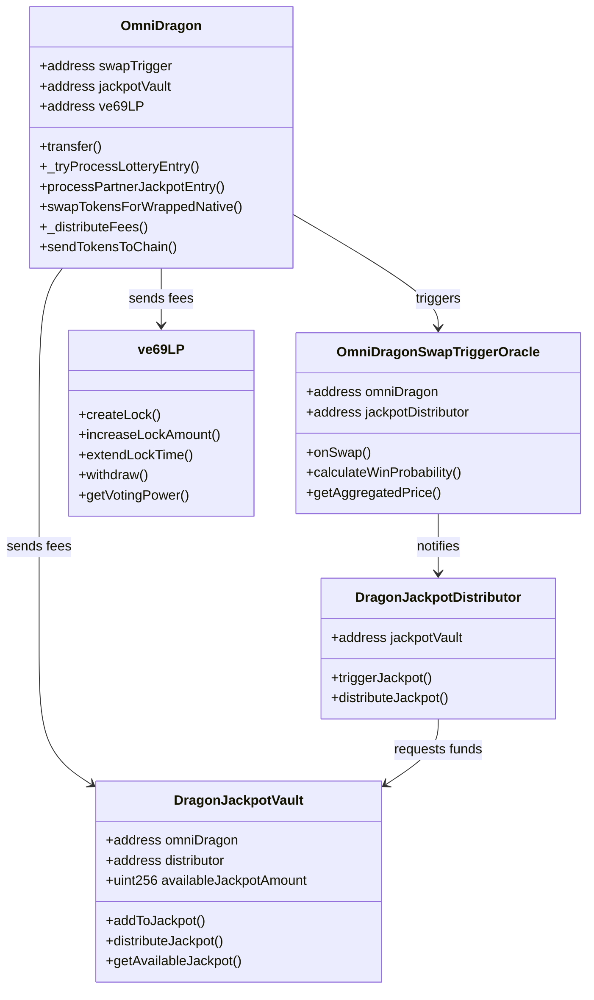
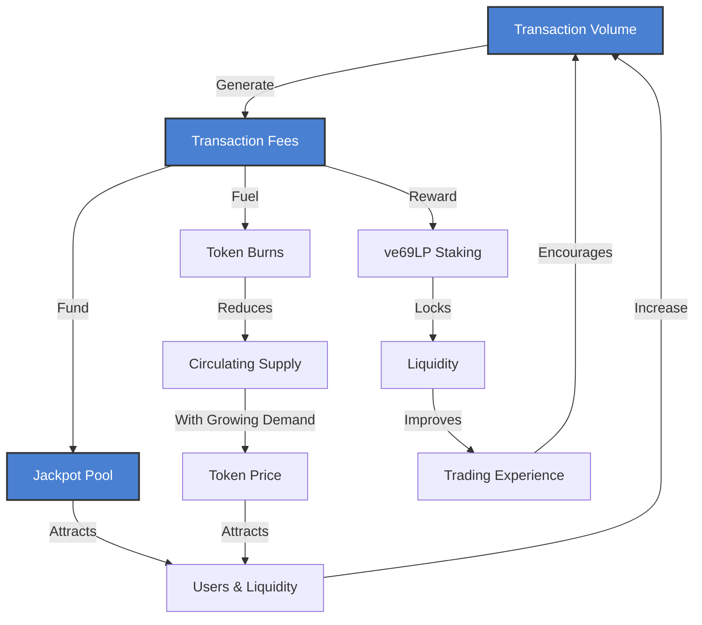
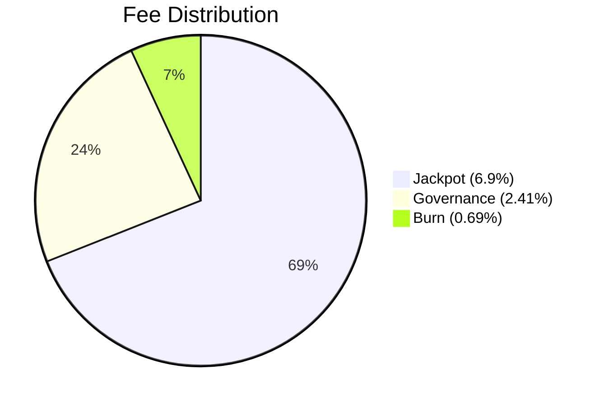

# Animated Ecosystem Diagrams

This page demonstrates our interactive ecosystem diagrams with animation controls. Click the Play button below each diagram to see the flow animation.

## System Architecture

The Sonic Red Dragon architecture consists of several interconnected components that work together to provide cross-chain functionality, governance, and the jackpot system:

## Cross-Chain Message Flow

This sequence diagram shows how cross-chain messaging works through LayerZero V2:

## Governance System

The governance system is based on the ve69LP (vote-escrowed) model:

## Jackpot System Flow

The jackpot system provides on-chain lottery functionality through this process flow:

## Technical Contract Relationships

The relationship between the contracts can be visualized as follows:

## Tokenomics Flow

The economic flywheel of the OmniDragon ecosystem:

## Fee Distribution

The token implements a fee model that distributes transaction fees as follows:

Each time you press the Play button, you'll see an animated visualization of the diagram that helps you understand the flow and relationships between different components. 