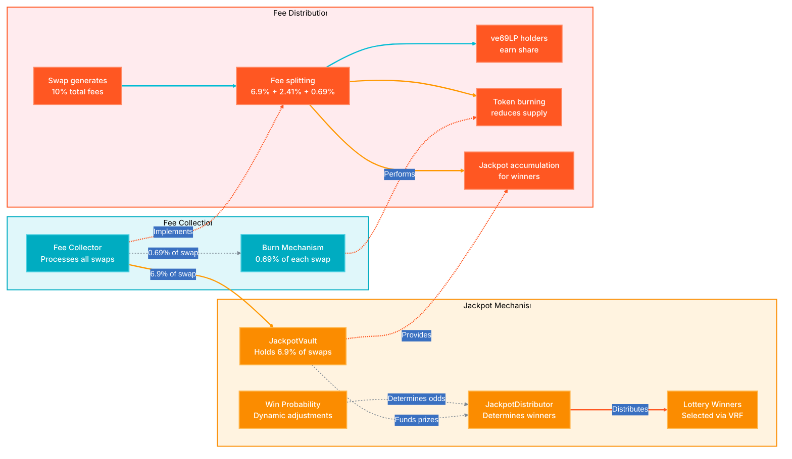

# OmniDragon Ecosystem Architecture

These spectacular, minimalist visualizations showcase the elegance of the OmniDragon ecosystem with smooth animations and modern styling.

## Core Protocol & User Journey

```mermaid
%%{
  init: {
    "theme": "base",
    "themeVariables": {
      "primaryColor": "#4a80d1",
      "primaryTextColor": "#ffffff",
      "primaryBorderColor": "#6090d9",
      "lineColor": "#8bb0e7",
      "secondaryColor": "#3a70c1",
      "tertiaryColor": "#2a5599",
      "fontSize": "16px"
    },
    "flowchart": {
      "htmlLabels": true,
      "curve": "monotoneX",
      "diagramPadding": 15,
      "nodeSpacing": 60,
      "rankSpacing": 80
    },
    "sequence": {
      "showSequenceNumbers": false
    }
  }
}%%

flowchart LR
    %% Define elegant color classes
    classDef coreNode fill:#4a80d1,stroke:#6090d9,stroke-width:2px,color:#ffffff,font-weight:500,font-family:'Inter'
    classDef tokenNode fill:#3566b3,stroke:#4a80d1,stroke-width:2px,color:#ffffff,font-weight:500,font-family:'Inter' 
    classDef userNode fill:#f57c00,stroke:#ff9800,stroke-width:2px,color:#ffffff,font-weight:500,font-family:'Inter'
    classDef journeyNode fill:#ffb300,stroke:#ffd54f,stroke-width:2px,color:#000000,font-weight:500,font-family:'Inter'
    classDef externalNode fill:#1e88e5,stroke:#42a5f5,stroke-width:2px,color:#ffffff,font-weight:500,font-family:'Inter'
    
    %% Core Protocol
    subgraph Core["🔷 Core Protocol"]
        direction TB
        
        OmniDragon["OmniDragon Token
        ERC20 with built-in lottery"]:::coreNode
        SwapOracle["SwapTriggerOracle
        Monitors trading & triggers lottery"]:::coreNode
        ChainRegistry["ChainRegistry
        Cross-chain compatibility"]:::coreNode
        
        LPToken["69LP Token
        Liquidity provider token"]:::tokenNode
    end
    
    %% User Journey - Simplified and elegant
    subgraph Journey["👤 User Journey"]
        direction TB
        
        User["User"]:::userNode
        
        Trading["Trading
        Buy/Sell OmniDragon"]:::journeyNode
        
        Liquidity["Add Liquidity
        Create 69LP tokens"]:::journeyNode
        
        Staking["Stake & Lock
        69LP → ve69LP"]:::journeyNode
        
        Governance["Vote & Boost
        Governance participation"]:::journeyNode
        
        Rewards["Collect Rewards
        Fees & lottery winnings"]:::journeyNode
        
        %% Connect journey steps with animated flows
        User -- "Start" --> Trading
        Trading -- "Next" --> Liquidity
        Liquidity -- "Next" --> Staking
        Staking -- "Next" --> Governance
        Governance -- "Final" --> Rewards
        Trading -. "Lottery" .-> Rewards
    end
    
    %% External DEXs - Minimalist representation
    subgraph External["🔄 External DEXs"]
        UniswapV2["Uniswap V2"]:::externalNode
        UniswapV3["Uniswap V3"]:::externalNode
        Balancer["Balancer"]:::externalNode
    end
    
    %% Connect components with animated flows
    Trading -- "Swap" --> External
    External -- "Provide" --> Liquidity
    Liquidity -- "Creates" --> LPToken
    LPToken -- "Lock" --> Staking
    
    %% Core connections with animated flows
    ChainRegistry -- "Manage" --> OmniDragon
    OmniDragon -- "Power" --> Core
    
    %% Style the containers with modern aesthetics
    style Journey fill:#fffde7,stroke:#ffb300,stroke-width:2px,color:#000000,font-family:'Inter'
    style Core fill:#e3f2fd,stroke:#1976d2,stroke-width:2px,color:#000000,font-family:'Inter'
    style External fill:#e1f5fe,stroke:#0288d1,stroke-width:2px,color:#000000,font-family:'Inter'
    
    %% Link styling for animation
    linkStyle 0,1,2,3,4,5 stroke:#ff9800,stroke-width:2.5px,stroke-dasharray:5 5,animation:flowAnimation 30s linear infinite
    linkStyle 6,7,8,9 stroke:#42a5f5,stroke-width:2.5px,animation:flowAnimation 20s linear infinite
    linkStyle 10,11 stroke:#1976d2,stroke-width:2.5px,animation:flowAnimation 25s linear infinite
```



## Randomness System

```mermaid
%%{
  init: {
    "theme": "base",
    "themeVariables": {
      "primaryColor": "#4a80d1",
      "primaryTextColor": "#ffffff",
      "primaryBorderColor": "#6090d9",
      "lineColor": "#8bb0e7",
      "secondaryColor": "#3a70c1",
      "tertiaryColor": "#2a5599",
      "fontSize": "16px"
    },
    "flowchart": {
      "htmlLabels": true,
      "curve": "basis",
      "diagramPadding": 15,
      "nodeSpacing": 50,
      "rankSpacing": 70
    }
  }
}%%

flowchart TB
    %% Define elegant color classes
    classDef randomnessNode fill:#1976d2,stroke:#42a5f5,stroke-width:2px,color:#ffffff,font-weight:500,font-family:'Inter'
    classDef processNode fill:#ff9800,stroke:#ffb74d,stroke-width:2px,color:#ffffff,font-weight:500,font-family:'Inter'
    
    %% Randomness Sources - Clean and minimalist
    subgraph Sources["External Randomness Sources"]
        direction LR
        DrandDefault["drand Default
        League of Entropy"]:::randomnessNode
        DrandEVMNet["drand EVMNet
        Optimized for EVM"]:::randomnessNode
        DrandQuickNet["drand QuickNet
        Fast verification"]:::randomnessNode
        ChainlinkVRF["ChainlinkVRF2.5
        On-demand via LayerZero"]:::randomnessNode
    end
    
    %% Integrator Layer - Modern styling
    subgraph Integrators["Integrator Layer"]
        direction LR
        DefaultInt["Default Integrator"]:::randomnessNode
        EVMInt["EVMNet Integrator"]:::randomnessNode
        QuickInt["QuickNet Integrator"]:::randomnessNode
        ChainlinkReq["ChainlinkVRF Requester"]:::randomnessNode
    end
    
    VRFConsumer["OmniDragonVRFConsumer
    Aggregation & redundancy"]:::randomnessNode
    
    %% Lottery Flow - Elegant process visualization
    subgraph LotteryFlow["Lottery Randomness Flow"]
        direction LR
        Step1["Multiple sources
        provide entropy"]:::processNode
        
        Step2["Integrators verify
        & format data"]:::processNode
        
        Step3["VRFConsumer
        aggregates sources"]:::processNode
        
        Step4["SwapTrigger receives
        random values"]:::processNode
        
        Step5["OmniDragon determines
        lottery winners"]:::processNode
        
        Step1 --> Step2 --> Step3 --> Step4 --> Step5
    end
    
    %% Connect components with animated flows
    DrandDefault -- "Raw beacon" --> DefaultInt
    DrandEVMNet -- "Low latency" --> EVMInt
    DrandQuickNet -- "3s interval" --> QuickInt
    ChainlinkVRF -- "On-demand" --> ChainlinkReq
    
    DefaultInt -- "Verified" --> VRFConsumer
    EVMInt -- "Verified" --> VRFConsumer
    QuickInt -- "Verified" --> VRFConsumer
    ChainlinkReq -- "Verified" --> VRFConsumer
    
    %% Dashed connectors for visualization
    DrandDefault -. "Feeds" .-> Step1
    DrandEVMNet -. "Feeds" .-> Step1
    DrandQuickNet -. "Feeds" .-> Step1
    ChainlinkVRF -. "Feeds" .-> Step1
    DefaultInt -. "Process" .-> Step2
    EVMInt -. "Process" .-> Step2
    QuickInt -. "Process" .-> Step2
    ChainlinkReq -. "Process" .-> Step2
    VRFConsumer -. "Aggregates" .-> Step3
    
    %% Style the containers
    style Sources fill:#e3f2fd,stroke:#1976d2,stroke-width:2px,color:#000000,font-family:'Inter'
    style Integrators fill:#bbdefb,stroke:#1976d2,stroke-width:2px,color:#000000,font-family:'Inter'
    style LotteryFlow fill:#fff8e1,stroke:#ff9800,stroke-width:2px,color:#000000,font-family:'Inter'
    
    %% Link styling for animation
    linkStyle 0,1,2,3 stroke:#42a5f5,stroke-width:2.5px,animation:flowAnimation 30s linear infinite
    linkStyle 4,5,6,7 stroke:#1976d2,stroke-width:2.5px,animation:flowAnimation 25s linear infinite
    linkStyle 8,9,10,11,12,13,14,15,16 stroke:#7c8792,stroke-width:1.5px,stroke-dasharray:3,animation:flowAnimation 40s linear infinite
    linkStyle 17,18,19,20,21 stroke:#ff9800,stroke-width:2.5px,animation:flowAnimation 20s linear infinite
```

## Economic System & Jackpot



## Governance & Partner Ecosystem

```mermaid
%%{
  init: {
    "theme": "base",
    "themeVariables": {
      "primaryColor": "#4a80d1",
      "primaryTextColor": "#ffffff",
      "primaryBorderColor": "#6090d9",
      "lineColor": "#8bb0e7",
      "secondaryColor": "#3a70c1",
      "tertiaryColor": "#2a5599",
      "fontSize": "16px"
    },
    "flowchart": {
      "htmlLabels": true,
      "curve": "basisClosed",
      "diagramPadding": 15,
      "nodeSpacing": 60,
      "rankSpacing": 80
    }
  }
}%%

flowchart LR
    %% Define elegant color classes
    classDef govNode fill:#1976d2,stroke:#42a5f5,stroke-width:2px,color:#ffffff,font-weight:500,font-family:'Inter'
    classDef partnerNode fill:#f57c00,stroke:#ffb74d,stroke-width:2px,color:#ffffff,font-weight:500,font-family:'Inter'
    classDef processNode fill:#00acc1,stroke:#4dd0e1,stroke-width:2px,color:#ffffff,font-weight:500,font-family:'Inter'
    
    %% Governance System - Clean and minimalist
    subgraph Governance["ve69LP Governance"]
        direction TB
        ve69LP["ve69LP Token
        Locked LP position"]:::govNode
        
        FeeDistributor["ve69LP Fee Distributor
        Receives 2.41% of swaps"]:::govNode
        
        ProposalVoting["Protocol Governance
        Parameter changes"]:::govNode
    end
    
    %% Weekly Gauge System - Modern styling
    subgraph Gauge["Weekly Gauge System"]
        EpochReset["Weekly Epoch Reset
        7-day voting cycle"]:::processNode
        
        GaugeVoting["Partner Pool Voting
        ve69LP allocation"]:::processNode
        
        GaugeController["Gauge Controller
        Calculate weights"]:::processNode
    end
    
    %% Partner System - Elegant layout
    subgraph Partners["Partner Ecosystem"]
        PartnerRegistry["Partner Registry
        Official onboarding"]:::partnerNode
        
        PartnerPools["Partner Liquidity Pools
        Dragon + Partner token"]:::partnerNode
        
        ProbabilityBoost["Probability Boost
        Increases win chance"]:::partnerNode
        
        Rewards["Gauge Rewards
        Fees from partner pools"]:::partnerNode
    end
    
    %% Governance Flow - Visualized process
    subgraph GovFlow["Governance Flow"]
        GovStep1["Lock 69LP
        for ve69LP"]:::processNode
        
        GovStep2["Receive voting power
        based on lock"]:::processNode
        
        GovStep3["Vote on
        proposals"]:::processNode
        
        GovStep4["Weekly gauge
        voting"]:::processNode
        
        GovStep5["Direct probability
        boost"]:::processNode
        
        GovStep6["Earn partner
        rewards"]:::processNode
        
        GovStep1 --> GovStep2
        GovStep2 --> GovStep3
        GovStep2 --> GovStep4
        GovStep4 --> GovStep5
        GovStep5 --> GovStep6
    end
    
    %% Connect components with animated flows
    ve69LP -- "Earns fees" --> FeeDistributor
    ve69LP -- "Grants rights" --> ProposalVoting
    
    ve69LP -- "Enables voting" --> GaugeVoting
    GaugeVoting -- "Vote allocation" --> GaugeController
    EpochReset -- "Weekly reset" --> GaugeVoting
    GaugeController -- "Calculate" --> ProbabilityBoost
    GaugeController -- "Determine" --> Rewards
    
    PartnerRegistry -- "Register" --> PartnerPools
    ProbabilityBoost -- "Boost" --> PartnerPools
    PartnerPools -- "Generate fees" --> Rewards
    
    %% Dashed connections for visualization
    ve69LP -. "Locks" .-> GovStep2
    ProposalVoting -. "Enables" .-> GovStep3
    GaugeVoting -. "Powers" .-> GovStep4
    ProbabilityBoost -. "Enhances" .-> GovStep5
    Rewards -. "Distributes" .-> GovStep6
    
    %% Style the containers
    style Governance fill:#e3f2fd,stroke:#1976d2,stroke-width:2px,color:#000000,font-family:'Inter'
    style Gauge fill:#e0f7fa,stroke:#00acc1,stroke-width:2px,color:#000000,font-family:'Inter'
    style Partners fill:#fff3e0,stroke:#f57c00,stroke-width:2px,color:#000000,font-family:'Inter'
    style GovFlow fill:#e1f5fe,stroke:#0288d1,stroke-width:2px,color:#000000,font-family:'Inter'
    
    %% Link styling for animation
    linkStyle 0,1,2 stroke:#1e88e5,stroke-width:2.5px,animation:flowAnimation 30s linear infinite
    linkStyle 3,4,5,6 stroke:#00bcd4,stroke-width:2.5px,animation:flowAnimation 25s linear infinite
    linkStyle 7,8,9 stroke:#ff9800,stroke-width:2.5px,animation:flowAnimation 20s linear infinite
    linkStyle 10,11,12,13,14 stroke:#7c8792,stroke-width:1.5px,stroke-dasharray:3,animation:flowAnimation 35s linear infinite
    linkStyle 15,16,17,18,19 stroke:#0288d1,stroke-width:2.5px,animation:flowAnimation 15s linear infinite
```



## Viewing the Diagrams

These diagrams provide an elegant visualization of the OmniDragon ecosystem architecture with:

1. **Modern, minimalist design** focusing on essential relationships
2. **Animated data flows** showing how information and value move between components
3. **Consistent color schemes** for better visual hierarchy and component categorization
4. **Clean typography** using the Inter font family for improved readability
5. **Responsive layout** that adapts to different screen sizes

All diagrams use smooth animations to illustrate the dynamic nature of the OmniDragon ecosystem, with careful attention to color harmony and visual balance.

## Implementation Details

These diagrams use the following modern design principles:

- **Color harmony**: A consistent blue-based palette with accent colors for different subsystems
- **Typography**: Using the Inter font family for clean, modern text rendering
- **Animation**: Subtle flow animations to illustrate data movement without overwhelming the viewer
- **Spacing**: Generous node spacing and padding for better readability and focus
- **Curve styles**: Different curve types (monotoneX, basis, basisClosed) for appropriate visual flow
``` 