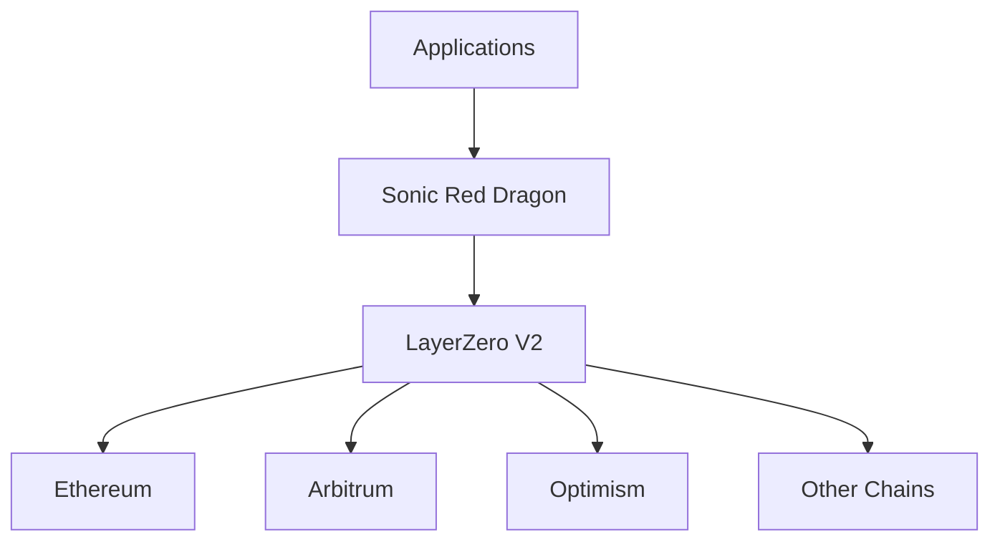

# LayerZero Integration

Sonic Red Dragon leverages LayerZero V2 for secure and efficient cross-chain operations. This page provides an overview of our LayerZero integration and its key features.

## Overview

LayerZero V2 is a cross-chain messaging protocol that enables secure and efficient communication between different blockchains. Sonic Red Dragon uses LayerZero V2 for:

- Cross-chain token transfers
- Cross-chain state synchronization
- Secure message passing
- Gas optimization

## Architecture

## Key Features

### Cross-Chain Messaging

LayerZero V2 provides a robust messaging system that enables:

- Secure message delivery
- Message verification
- Replay protection
- Gas optimization

### Token Bridging

Our token bridging system uses LayerZero V2 to:

- Transfer tokens between chains
- Maintain token supply consistency
- Ensure secure token locking/unlocking
- Optimize gas costs

### Security

Security features include:

- Message verification
- Replay protection
- Rate limiting
- Circuit breakers

## Supported Chains

Sonic Red Dragon currently supports the following chains:

- Ethereum Mainnet
- Arbitrum One
- Optimism
- Base
- More chains coming soon...

## Next Steps

1. Read the [LayerZero Integration Guide](./integration.md)
2. Review the [Smart Contracts Overview](../../smart-contracts/token.md)
3. Check out our [Example Projects](https://github.com/wenakita/omnidragon-examples) 