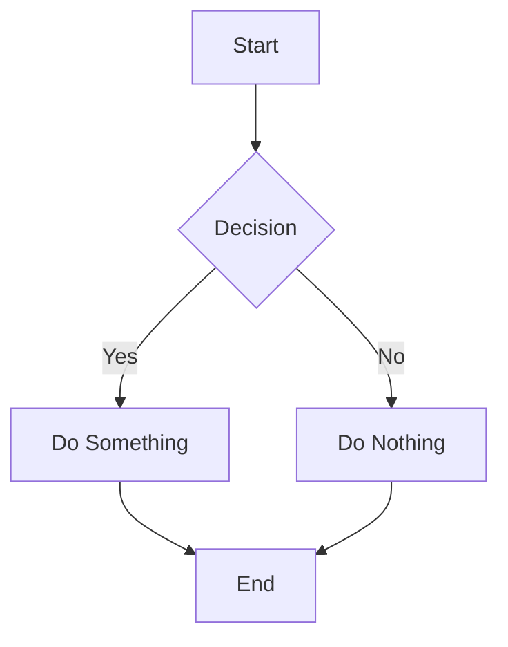

# Final Mermaid Test

## Simple Method 1: Standard Mermaid Block

## Simple Method 2: Component

<MermaidWrapper chart={`
sequenceDiagram
    participant User
    participant System
    User->>System: Request
    System->>System: Process
    System-->>User: Response
`} />

## Simple Method 3: Raw HTML

classDiagram
    class Animal {
        +String name
        +move()
    }
    class Dog {
        +bark()
    }
    class Bird {
        +fly()
    }
    Animal <|-- Dog
    Animal <|-- Bird

`}} /> 