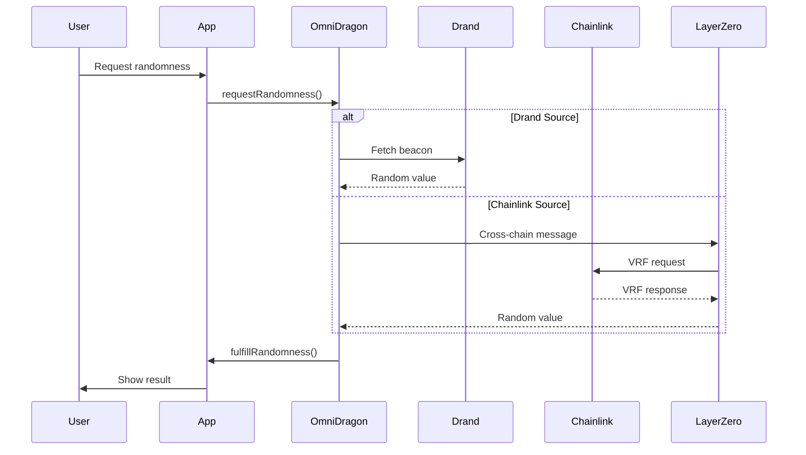

import ModernPageHeader from '@site/src/components/ModernPageHeader';
import ModernCard from '@site/src/components/ModernCard';
import FloatingParticles from '@site/src/components/FloatingParticles';

<ModernPageHeader 
  title="Getting Started with OmniDragon"
  subtitle="Your journey into cross-chain VRF begins here"
  description="Whether you're a developer building applications, an end user, or a security researcher, this guide will help you get started with our revolutionary cross-chain randomness system."
  badge="Quick Start Guide"
/>

<FloatingParticles />

## What You'll Learn

- 🔧 How to interact with the OmniDragon VRF system
- 💻 Setting up your development environment
- 🎲 Making your first randomness request
- 🌐 Understanding cross-chain operations
- 🔒 Security best practices

## Prerequisites

Before you begin, ensure you have:

- Basic understanding of blockchain and smart contracts
- Familiarity with Ethereum/EVM-compatible networks
- MetaMask or similar Web3 wallet
- Some ETH on Sonic and/or Arbitrum for gas fees

## Choose Your Path

<div className="feature-cards-modern" style={{marginTop: '3rem', marginBottom: '3rem'}}>
  <ModernCard
    title="🎮 Application Developer"
    description="Build applications that need secure randomness - gaming contracts, lottery systems, DeFi protocols, and NFT projects"
    link="#developer-quickstart"
    linkText="Start Building"
    delay={100}
  />
  
  <ModernCard
    title="👤 End User"
    description="Use applications built on OmniDragon - play games, participate in lotteries, engage in governance, and perform cross-chain operations"
    link="#user-quickstart"
    linkText="Get Started"
    delay={200}
  />
  
  <ModernCard
    title="🔍 Security Researcher"
    description="Analyze and improve the security of the OmniDragon system - review audits, understand the threat model, and contribute to security"
    link="#security-considerations"
    linkText="Explore Security"
    delay={300}
  />
</div>

## Developer Quickstart {#developer-quickstart}

### Step 1: Environment Setup

First, set up your development environment:

```bash
# Clone the repository
git clone https://github.com/wenakita/omnidragon.git
cd omnidragon

# Install dependencies
npm install

# Set up environment variables
cp .env.example .env
# Edit .env with your configuration
```

### Step 2: Network Configuration

Add the supported networks to your development setup:

```javascript
// hardhat.config.js
networks: {
  sonic: {
    url: "https://rpc.soniclabs.com",
    chainId: 146,
    accounts: [process.env.PRIVATE_KEY]
  },
  arbitrum: {
    url: "https://arb1.arbitrum.io/rpc",
    chainId: 42161,
    accounts: [process.env.PRIVATE_KEY]
  }
}
```

### Step 3: Your First Randomness Request

Here's a simple example of requesting randomness:

```solidity
// SPDX-License-Identifier: MIT
pragma solidity ^0.8.19;

import "@interfaces/core/IOmniDragon.sol";

contract MyGameContract {
    IOmniDragon public immutable omniDragon;
    
    mapping(uint256 => address) public requesters;
    mapping(address => uint256) public userRandomness;
    
    event RandomnessRequested(address indexed user, uint256 indexed requestId);
    event RandomnessReceived(address indexed user, uint256 randomness);
    
    constructor(address _omniDragon) {
        omniDragon = IOmniDragon(_omniDragon);
    }

    function requestRandomness() external payable {
        // Request randomness with payment
        uint256 requestId = omniDragon.requestRandomness{value: msg.value}();
        
        requesters[requestId] = msg.sender;
        emit RandomnessRequested(msg.sender, requestId);
    }
    
    function fulfillRandomness(uint256 requestId, uint256 randomness) external {
        require(msg.sender == address(omniDragon), "Only OmniDragon");
        
        address user = requesters[requestId];
        userRandomness[user] = randomness;
        
        emit RandomnessReceived(user, randomness);
        
        // Your game logic here
        _processGameResult(user, randomness);
    }
    
    function _processGameResult(address user, uint256 randomness) internal {
        // Implement your game logic
        uint256 result = randomness % 100; // 0-99
        // Handle the random result...
    }
}
```

### Step 4: Deploy and Test

```bash
# Compile contracts
npx hardhat compile

# Deploy to testnet
npx hardhat run scripts/deploy-game.js --network sonic

# Run tests
npx hardhat test
```

### Step 5: Integration Testing

Test your integration with our comprehensive test suite:

```javascript
const { expect } = require("chai");
const { ethers } = require("hardhat");

describe("MyGameContract", function () {
  let omniDragon, gameContract;
  
  beforeEach(async function () {
    // Deploy mock OmniDragon for testing
    const OmniDragonMock = await ethers.getContractFactory("OmniDragonMock");
    omniDragon = await OmniDragonMock.deploy();
    
    const GameContract = await ethers.getContractFactory("MyGameContract");
    gameContract = await GameContract.deploy(omniDragon.address);
  });
  
  it("Should request randomness successfully", async function () {
    const tx = await gameContract.requestRandomness({ value: ethers.utils.parseEther("0.01") });
    await expect(tx).to.emit(gameContract, "RandomnessRequested");
  });
});
```

## User Quickstart {#user-quickstart}

### Step 1: Wallet Setup

1. **Install MetaMask** or your preferred Web3 wallet
2. **Add Networks**:
   - **Sonic Mainnet**: Chain ID 146, RPC: https://rpc.soniclabs.com
   - **Arbitrum Mainnet**: Chain ID 42161, RPC: https://arb1.arbitrum.io/rpc

### Step 2: Get Test Tokens

For testing on testnets:
- **Sonic Testnet**: Get test S from the faucet
- **Arbitrum Testnet**: Get test ETH from the faucet

### Step 3: Interact with Applications

1. **Find OmniDragon-powered applications**
2. **Connect your wallet**
3. **Follow the application's interface** to:
   - Request randomness
   - Participate in games/lotteries
   - View results

### Step 4: Monitor Transactions

Track your transactions across chains:
- **Sonic Explorer**: https://explorer.soniclabs.com
- **Arbitrum Explorer**: https://arbiscan.io
- **LayerZero Scan**: https://layerzeroscan.com

## Understanding the System

### Architecture Overview



### Key Concepts

**Randomness Sources**:
- **Drand**: Fast, distributed beacon network
- **Chainlink VRF**: Industry-standard verifiable randomness
- **Automatic Failover**: System switches sources if needed

**Cross-Chain Flow**:
- Requests can originate on any supported chain
- LayerZero handles secure message passing
- Results are delivered back to the requesting chain

**Cost Optimization**:
- **Bucket System**: Batch multiple requests for efficiency
- **Pool Mechanisms**: Share costs across users
- **Dynamic Pricing**: Costs adjust based on network conditions

## Security Considerations {#security-considerations}

### For Developers

1. **Validate Randomness Source**:
   ```solidity
   require(msg.sender == address(omniDragon), "Invalid caller");
   ```

2. **Handle Reentrancy**:
   ```solidity
   modifier nonReentrant() {
       require(!locked, "Reentrant call");
       locked = true;
       _;
       locked = false;
   }
   ```

3. **Implement Timeouts**:
   ```solidity
   require(block.timestamp <= requestTime + TIMEOUT, "Request expired");
   ```

### For Users

1. **Verify Contract Addresses**: Always check you're interacting with official contracts
2. **Understand Costs**: Randomness requests require payment for gas and VRF fees
3. **Monitor Transactions**: Use block explorers to track cross-chain operations

## Common Patterns

### Gaming Applications

```solidity
contract LotteryGame {
    struct Ticket {
        address player;
        uint256 numbers;
        bool claimed;
    }
    
    mapping(uint256 => Ticket[]) public gameTickets;
    uint256 public currentGame;
    
    function buyTicket(uint256 numbers) external payable {
        gameTickets[currentGame].push(Ticket({
            player: msg.sender,
            numbers: numbers,
            claimed: false
        }));
    }
    
    function drawWinner() external {
        omniDragon.requestRandomness{value: vrfFee}();
    }
    
    function fulfillRandomness(uint256 requestId, uint256 randomness) external {
        uint256 winningIndex = randomness % gameTickets[currentGame].length;
        address winner = gameTickets[currentGame][winningIndex].player;
        // Distribute prize...
    }
}
```

### DeFi Applications

```solidity
contract RandomizedYield {
    function claimRewards() external {
        uint256 baseReward = calculateBaseReward(msg.sender);
        omniDragon.requestRandomness{value: vrfFee}();
        // Store pending claim...
    }
    
    function fulfillRandomness(uint256 requestId, uint256 randomness) external {
        address claimer = pendingClaims[requestId];
        uint256 multiplier = (randomness % 50) + 100; // 100-149% multiplier
        uint256 finalReward = baseReward * multiplier / 100;
        // Transfer rewards...
    }
}
```

## Next Steps

<div className="feature-cards-modern" style={{marginTop: '3rem'}}>
  <ModernCard
    title="📚 Smart Contracts"
    description="Deep dive into contract APIs and implementation details"
    link="/contracts/core/omnidragon"
    delay={100}
  />
  
  <ModernCard
    title="🧪 Testing Guide"
    description="Comprehensive testing strategies and best practices"
    link="/guide/testing-framework"
    delay={200}
  />
  
  <ModernCard
    title="🚀 Deployment"
    description="Production deployment guide and checklist"
    link="/052525updates/SONIC_VRF_DEPLOYMENT_GUIDE"
    delay={300}
  />
</div>

## Support & Community

- **Documentation**: Comprehensive guides and references
- **GitHub Issues**: Report bugs and request features
- **Developer Support**: Technical assistance for integrations
- **Security Contact**: For security-related inquiries

---

> **Ready to build?** Choose your path above and start integrating secure, verifiable randomness into your applications with OmniDragon! 