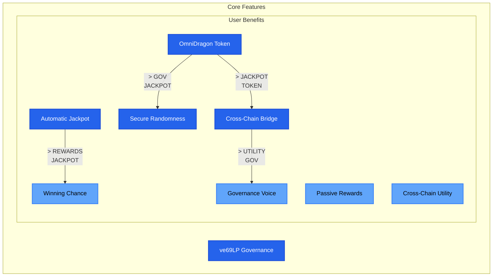

# OmniDragon Protocol Overview

Welcome to the OmniDragon protocol documentation. This overview provides a high-level introduction to the protocol, its key components, and how they work together to create a powerful cross-chain ecosystem.

## What is OmniDragon?

OmniDragon is a multi-chain token protocol that combines several innovative features:



### Key Features

1.**Automatic Jackpot System**: Every buy transaction has a chance to win a jackpot, creating an exciting and rewarding experience.

2.**Cross-Chain Functionality**: Seamlessly operate across multiple blockchains, including Ethereum, BNB Chain, Arbitrum, and Avalanche.

3.**Deflationary Tokenomics**: Automatic burn mechanism reduces supply over time, creating potential for increased scarcity.

4.**ve69LP Governance**: Community-driven decision making through a vote-escrowed governance model.

5.**Secure Randomness Infrastructure**: Multi-source randomness solution that ensures fair and verifiable randomness generation.

## Protocol Architecture

The OmniDragon protocol consists of several interconnected components:
```

```mermaidclassDiagram
class OmniDragon {
+address swapTrigger
        +address jackpotVault
        +address ve69LP
        +transfer()
        +_tryProcessLotteryEntry()
    }
    class JackpotSystem {
+address vault
        +address distributor
        +address randomnessProvider
        +processEntry()
        +distributeReward()
    }
    class CrossChainBridge {
+address omniDragon
        +address lzEndpoint
        +sendTokens()
        +receiveTokens()
    }
    class Ve69LPGovernance {
+address omniDragon
        +lock()
        +vote()
        +propose()
    }
    class RandomnessProvider {
+requestRandomness()
        +fulfillRandomness()
        +getVerifiedRandom()
    }
    OmniDragon -->|> JackpotSystem : triggers
    OmniDragon| CrossChainBridge : enables cross-chain
    OmniDragon -->|> Ve69LPGovernance : enables governance
    JackpotSystem| RandomnessProvider : requests randomness
```

## Token Mechanics

The OmniDragon token (DRAGON) implements a fee mechanism that creates sustainable value:

| Transaction Type | Total Fee | Jackpot | Governance | Burn |
|------------------|-----------|---------|------------|------|
| Buy              | 10%       | 6.9%    | 2.41%      | 0.69% |
| Sell             | 10%       | 6.9%    | 2.41%      | 0.69% |
| Transfer         | 0.69%     | 0%      | 0%         | 0.69% |

These fees fund the jackpot system, governance rewards, and token burns, creating a sustainable ecosystem.

## Jackpot System

The jackpot system provides an automatic jackpot for token holders:

```mermaidsequenceDiagram
participant User
participant Token
participant SwapTrigger
participant RandomnessProvider
participant JackpotDistributor
participant JackpotVault
    User ->> Token: Buy DRAGON tokens
    Token ->> SwapTrigger: Notify of purchase
    SwapTrigger ->> SwapTrigger: Calculate win probability
    SwapTrigger ->> RandomnessProvider: Request randomness
    RandomnessProvider ->> JackpotDistributor: Provide randomness
    JackpotDistributor ->> JackpotDistributor: Determine winner
    JackpotDistributor ->> JackpotVault: Request reward distribution
    JackpotVault ->> User: Transfer reward (if won)
```

Every buy transaction has a chance to win a portion of the accumulated jackpot, with the probability adjusted based on purchase size, jackpot size, and time since last win.

## Cross-Chain Functionality

The protocol operates seamlessly across multiple blockchains:
```

```mermaid
flowchart TB
subgraph "Ethereum"
    ETH_TOKEN["OmniDragon Token"]
    ETH_BRIDGE["Cross-Chain Bridge"]
    subgraph "BNB Chain"
    BSC_TOKEN["OmniDragon Token"]
    BSC_BRIDGE["Cross-Chain Bridge"]
    subgraph "Arbitrum"
    ARB_TOKEN["OmniDragon Token"]
    ARB_BRIDGE["Cross-Chain Bridge"]
    subgraph "Avalanche"
    AVAX_TOKEN["OmniDragon Token"]
    AVAX_BRIDGE["Cross-Chain Bridge"]
    ETH_TOKEN <--> ETH_BRIDGE
    BSC_TOKEN <--> BSC_BRIDGE
    ARB_TOKEN <--> ARB_BRIDGE
    AVAX_TOKEN <--> AVAX_BRIDGE
    ETH_BRIDGE <--> BSC_BRIDGE
    ETH_BRIDGE <--> ARB_BRIDGE
    ETH_BRIDGE <--> AVAX_BRIDGE
    BSC_BRIDGE <--> ARB_BRIDGE
    BSC_BRIDGE <--> AVAX_BRIDGE
    ARB_BRIDGE <--> AVAX_BRIDGE
    classDef eth fill:#627eea,stroke:#4f46e5,stroke-width:2px,color:#ffffff
    classDef bsc fill:#f0b90b,stroke:#d97706,stroke-width:2px,color:#000000
    classDef arb fill:#28a0f0,stroke:#0ea5e9,stroke-width:2px,color:#ffffff
    classDef avax fill:#e84142,stroke:#dc2626,stroke-width:2px,color:#ffffff
    class ETH_TOKEN,ETH_BRIDGE eth
    class BSC_TOKEN,BSC_BRIDGE bsc
    class ARB_TOKEN,ARB_BRIDGE arb
    class AVAX_TOKEN,AVAX_BRIDGE avax
endend
endend
endend
end
```

Users can transfer tokens between chains using the cross-chain bridge, which uses LayerZero for secure message passing.

## Governance System

The governance system enables community-driven decision making:

```mermaidflowchart TB
A[LP Token Holders] -->|> B[Lock LP Tokens]
    B| C[Receive Voting Power]
    C -->|> D[Create Proposals]
    C| E[Vote on Proposals]
    E -->|> F[Proposal Passes]
    F| G[Execute Changes]

    classDef default fill:#2563eb,stroke:#1d4ed8,stroke-width:2px,color:#ffffff
```

Token holders can lock LP tokens to receive voting power, which can be used to create and vote on proposals. Longer lock periods grant higher voting power.

## Randomness Infrastructure

The randomness infrastructure provides secure, verifiable random numbers:
```

```mermaidflowchart TB
A[Randomness Request] -->|> B[Randomness Provider]
    B| C{Source Selection}
    C -->|> D[Drand Beacon]
    C| E[Chainlink VRF]
    C -->|> F[Block Hash]
    D| G[Combine Sources]
    E -->|>|> G
    F| G
    G| H[Verified Random Number]

    classDef default fill:#2563eb,stroke:#1d4ed8,stroke-width:2px,color:#ffffff
    classDef decision fill:#f59e0b,stroke:#d97706,stroke-width:2px,color:#ffffff

    class C decision
```

The system combines multiple randomness sources to ensure security and reliability, with a verification layer to validate all inputs.

## Getting Started

Now that you have a high-level understanding of the OmniDragon protocol, you can:

1.**[Quick Start Guide](/getting-started/quick-start)**: Learn how to interact with the protocol as a user.
2.**[Developer Setup](/guides/getting-started/developer-setup)**: Set up your development environment to build on OmniDragon.
3.**[Core Concepts](/concepts/architecture)**: Dive deeper into the protocol's architecture and components.

## Next Steps

Continue to the [Quick Start Guide](/getting-started/quick-start) to learn how to get started with OmniDragon.
