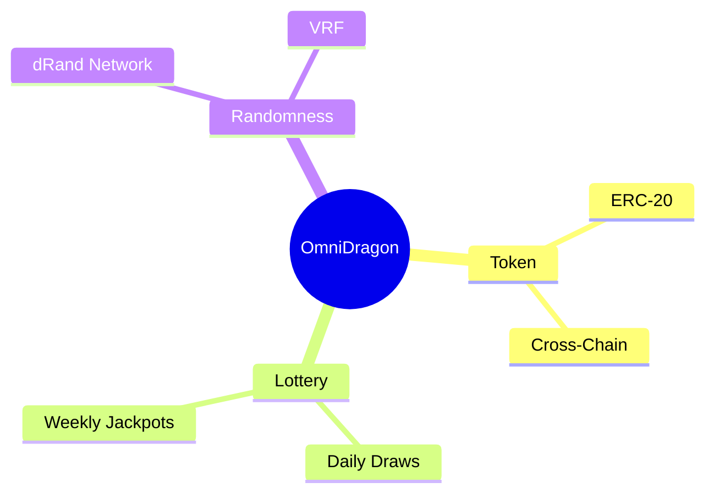

# Creating Elegant Diagrams

Our documentation system features enhanced Mermaid diagrams with animations, interactivity, and beautiful styling. This guide will show you how to create elegant diagrams that make your documentation more engaging and easier to understand.

## Basic Mermaid Diagrams

To create a basic Mermaid diagram, use the standard Mermaid syntax within a code block:

````md
```mermaidflowchart TD
    A[Start] --> B{Is it working?}
B -->|Yes| C[Great!]
    B -->|>|>|No| D[Debug]
    C| E[Deploy]
    D| B
```
````

This will render as:
```

```mermaidflowchart TD
    A[Start] --> B{Is it working?}
B -->|Yes| C[Great!]
    B -->|>|>|No| D[Debug]
    C| E[Deploy]
    D| B
```

## Immersive Diagrams

For more complex diagrams that deserve special attention, you can use our Immersive Mermaid component by wrapping your diagram in a `<div data-immersive>` tag:

````md
<div data-immersive>

```mermaidflowchart LR
    A[OmniDragon Token] --> B[Cross-Chain Bridge]
    B -->|> C[Ethereum]
    B| D[BNB Chain]
    B -->|> E[Polygon]
    C| F[DEX Liquidity]
    D -->|> F
    E| F
```

</div>
````

This will render with enhanced styling, animations, particle effects, and a gradient border:

<div data-immersive>
```

```mermaidflowchart LR
    A[OmniDragon Token] --> B[Cross-Chain Bridge]
    B -->|> C[Ethereum]
    B| D[BNB Chain]
    B -->|> E[Polygon]
    C| F[DEX Liquidity]
    D -->|> F
    E| F
```

</div>

## Adding Titles and Captions

You can add titles and captions to your diagrams by adding heading and paragraph elements before and after the diagram:

````md
### Token Flow Diagram

<div data-immersive>

```mermaidflowchart LR
    A[Token] -->|> B[Bridge]
    B| C[Chains]
```

</div>

*This diagram illustrates the flow of tokens through the cross-chain bridge.*
````

Our components will automatically detect these elements and incorporate them into the diagram container:

### Token Flow Diagram

<div data-immersive>
```

```mermaidflowchart LR
    A[Token] -->|> B[Bridge]
    B| C[Chains]
```

</div>

*This diagram illustrates the flow of tokens through the cross-chain bridge.*

## Interactive Features

All enhanced diagrams include interactive features:

1.**Hover Effects**: Hover over nodes and edges to see highlight effects
2.**Click Interactions**: Click on nodes to highlight connected paths
3.**Control Buttons**: 
   - Replay animations
   - Toggle fullscreen view
   - Download SVG

Try interacting with the diagram below:

```mermaidflowchart TD
    A[User] --> B{Has Tokens?}
B -->|Yes| C[Enter Lottery]
    B -->|>|No| D[Buy Tokens]
    C| E[Wait for Draw]
    D -->|> C
    E| F{Winner?}
F -->|Yes| G[Claim Prize]
    F -->|>|>|No| H[Try Again]
    G| I[Bridge to Chain]
    H| C
```

## Diagram Types

Our enhanced Mermaid components support all standard Mermaid diagram types:

### Sequence Diagrams
```

```mermaidsequenceDiagram
participant User
participant Contract
participant Oracle
User ->> Contract: Place Bet
    Contract ->> Oracle: Request Random Number
    Oracle ->> Contract: Return Random Number
    Contract ->> User: Distribute Prize
```

### State Diagrams

<div data-immersive>

```mermaidstateDiagram-v2
    [*] -->|> Idle
    Idle| WaitingForRandom: User places bet
    WaitingForRandom -->|> Processing: Random number received
    Processing| Winner: User wins
    Processing -->|>|> Loser: User loses
    Winner| Idle
    Loser| Idle
```

</div>

### Class Diagrams
```

```mermaidclassDiagram
class Token {
+string name
        +string symbol
        +uint256 totalSupply
        +transfer(address, uint256)
    }
class Lottery {
+uint256 ticketPrice
        +uint256 jackpot
        +buyTicket()
        +drawWinner()
    }
Token <|-- Lottery : uses
```

### Entity Relationship Diagrams

<div data-immersive>

```mermaiderDiagram
    USER ||--o{ TICKET : purchases
    TICKET }
o--|| LOTTERY : belongs_to
    LOTTERY ||--o{ PRIZE : contains
    PRIZE }
o--o{ USER : won_by
```

</div>

### Gantt Charts
```

```mermaidgantt
    title Development Roadmap
    dateFormat  YYYY-MM-DD
    
    section Phase 1
    Research           :done,    des1, 2024-01-01, 2024-01-31
    Development        :active,  dev1, 2024-02-01, 2024-04-30
    
    section Phase 2
    Testing            :         test1, 2024-05-01, 2024-06-30
    Deployment         :         dep1, 2024-07-01, 2024-07-31
```

### Pie Charts

<div data-immersive>

```mermaidpie title Token Distribution
    "Team" : 15
    "Ecosystem" : 25
    "Community" : 30
    "Liquidity" : 20
    "Marketing" : 10
```

</div>

### Journey Diagrams
```

```mermaidjourney
    title User Journey
    section Onboarding
      Create Account: 5: User
      Connect Wallet: 3: User
    section Usage
      Buy Tokens: 5: User
      Enter Lottery: 5: User
```

### Mindmaps

<div data-immersive>



</div>

## Best Practices

For the most elegant and effective diagrams:

1.**Keep it Simple**: Focus on the key concepts and relationships
2.**Use Consistent Styling**: Maintain consistent node shapes and colors
3.**Add Context**: Include titles and captions to explain the diagram
4.**Choose the Right Type**: Select the diagram type that best represents your data
5.**Use Immersive Mode**: For complex or important diagrams that deserve emphasis
6.**Test Interactivity**: Ensure your diagram works well with interactive features

## Accessibility Considerations

Our enhanced diagrams include several accessibility features:

-**Keyboard Navigation**: All interactive elements are keyboard accessible
-**Screen Reader Support**: Diagrams include appropriate ARIA attributes
-**Reduced Motion**: Animations are disabled for users who prefer reduced motion
-**High Contrast**: Diagram elements use sufficient color contrast
-**Responsive Design**: Diagrams adapt to different screen sizes

## Advanced Customization

For advanced users, you can customize the appearance and behavior of diagrams by modifying the following files:

- `src/components/ModernMermaid.tsx`: Modern diagram component
- `src/components/ImmersiveMermaid.tsx`: Immersive diagram component
- `src/components/ModernMermaid.module.css`: Styling for modern diagrams
- `src/components/ImmersiveMermaid.module.css`: Styling for immersive diagrams
- `src/utils/enhancedMermaidAnimations.ts`: Animation utilities
- `src/clientModules/enhancedMermaidInit.js`: Initialization module

## Troubleshooting

If your diagrams aren't rendering correctly:

1.**Check Syntax**: Ensure your Mermaid syntax is correct
2.**Inspect Console**: Check for errors in the browser console
3.**Try Basic Mode**: Remove the `data-immersive` attribute to use basic rendering
4.**Update Dependencies**: Ensure you have the latest version of Mermaid
5.**Clear Cache**: Try clearing your browser cache and reloading

For more help, see the [Mermaid documentation](https://mermaid.js.org/intro/).
