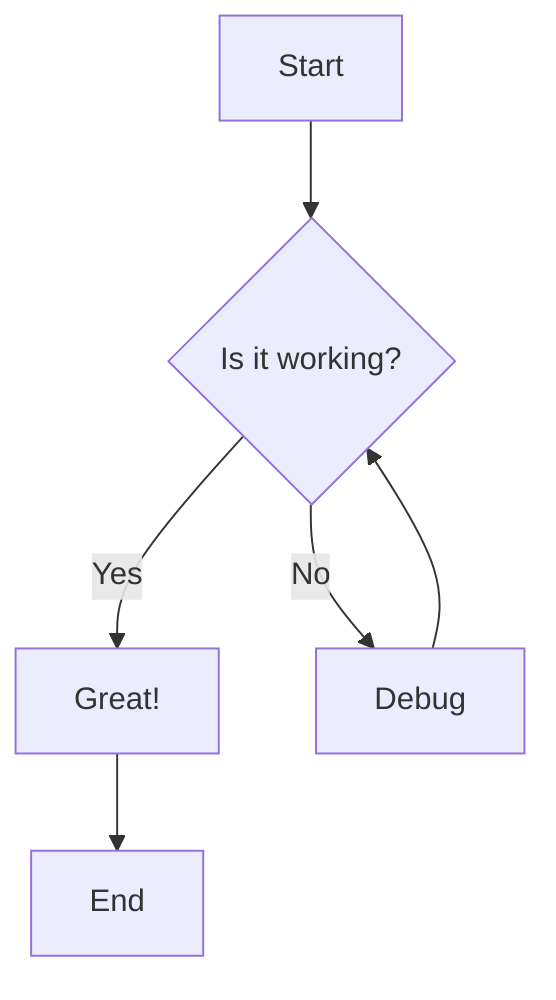
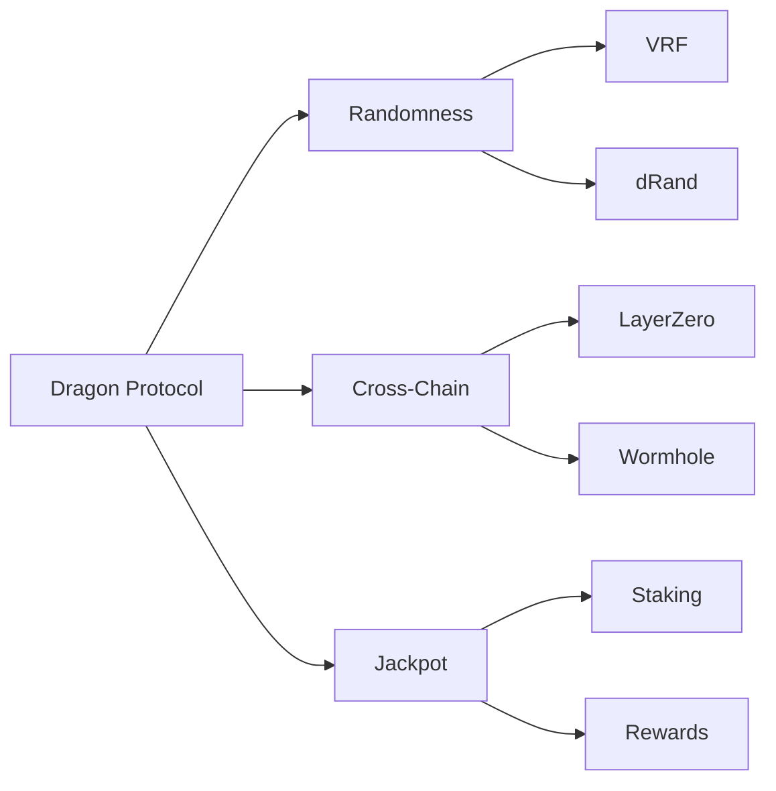
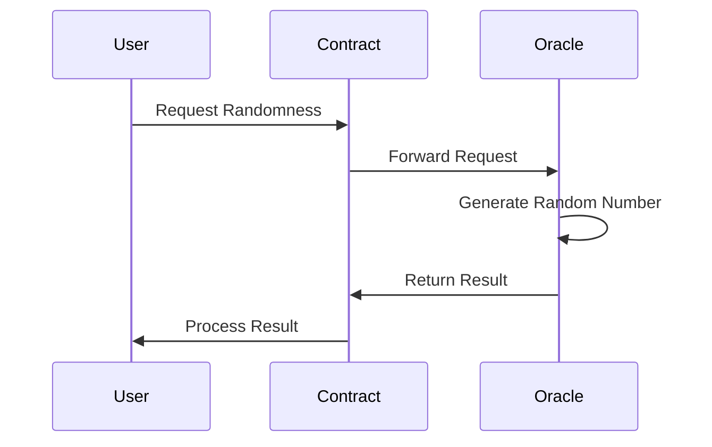
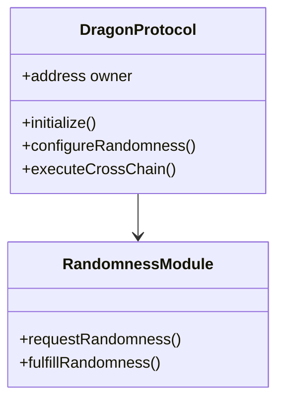
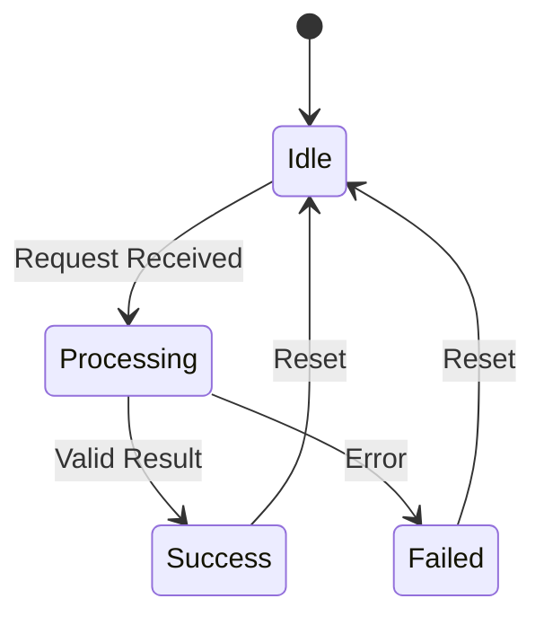
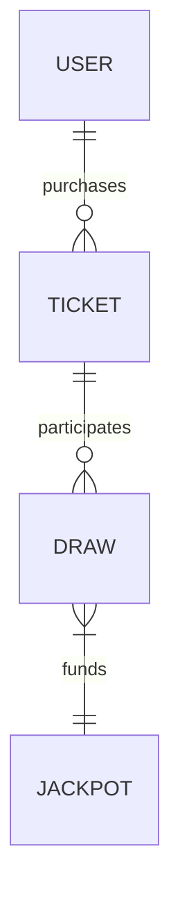
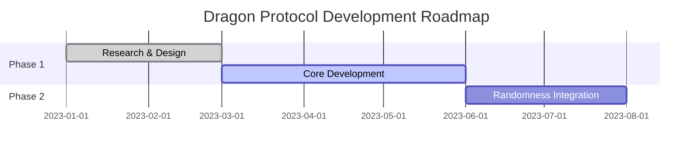
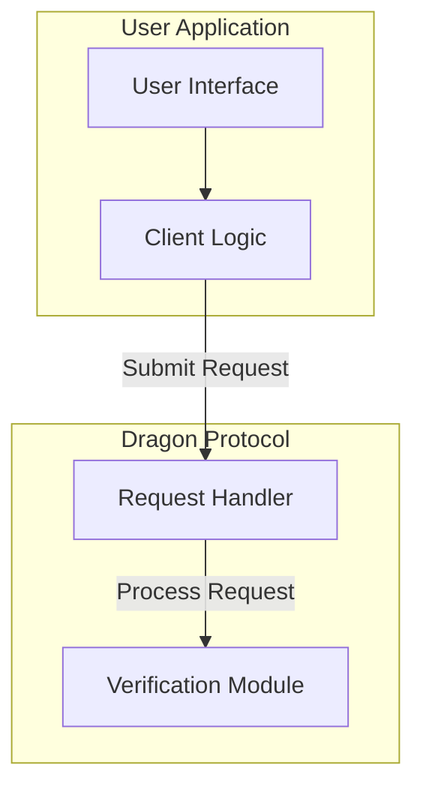
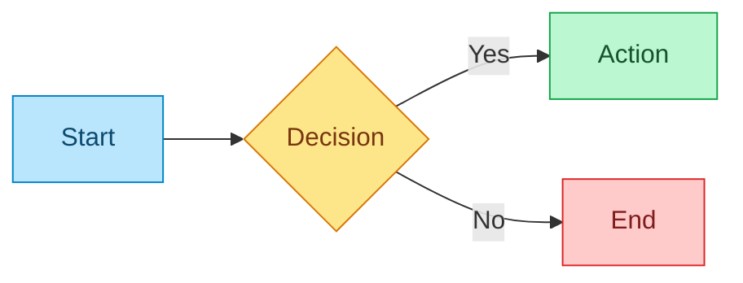

# Creating Elegant Diagrams

This guide will show you how to create beautiful, interactive diagrams for your documentation using our enhanced Mermaid integration.

## Introduction

Diagrams are a powerful way to communicate complex ideas and relationships. Our enhanced Mermaid integration provides:

- **Beautiful styling** - Modern, clean design with proper light/dark mode support
- **Animations** - Smooth animations that bring your diagrams to life
- **Interactivity** - Click on nodes to highlight connections
- **Controls** - Replay animations, toggle fullscreen, or download SVG
- **Accessibility** - Proper keyboard navigation and screen reader support

## Basic Mermaid Diagrams

To create a basic Mermaid diagram, simply use the standard Mermaid code block syntax:

````md

````

This will render as:


## Immersive Diagrams

For more important diagrams, you can use the immersive style by wrapping your Mermaid code block in a div with the `immersive-diagram` class:

````md
<div className="immersive-diagram">



</div>
````

This will render with a more immersive style, including particle effects and a gradient border:

<div className="immersive-diagram">


</div>

## Adding Titles and Captions

You can add titles and captions to your diagrams:

````md
<div className="immersive-diagram">
  <h3 className="diagram-title">Dragon Protocol Architecture</h3>

  ```mermaid
  flowchart TD
      A[User Interface] --> B[Smart Contract Layer]
      B --> C[Core Protocol]
      C --> D1[Randomness Module]
      C --> D2[Cross-Chain Module]
      C --> D3[Jackpot Module]
      D1 --> E1[VRF Service]
      D1 --> E2[dRand Network]
      D2 --> F1[LayerZero]
      D2 --> F2[Wormhole]
      D3 --> G1[Staking Contract]
      D3 --> G2[Rewards Distribution]
  ```

  <p className="diagram-caption">High-level architecture of the Dragon Protocol ecosystem</p>
</div>
````

This will render as:

<div className="immersive-diagram">
  <h3 className="diagram-title">Dragon Protocol Architecture</h3>

  ```mermaid
  flowchart TD
      A[User Interface] --> B[Smart Contract Layer]
      B --> C[Core Protocol]
      C --> D1[Randomness Module]
      C --> D2[Cross-Chain Module]
      C --> D3[Jackpot Module]
      D1 --> E1[VRF Service]
      D1 --> E2[dRand Network]
      D2 --> F1[LayerZero]
      D2 --> F2[Wormhole]
      D3 --> G1[Staking Contract]
      D3 --> G2[Rewards Distribution]
  ```

  <p className="diagram-caption">High-level architecture of the Dragon Protocol ecosystem</p>
</div>

## Diagram Types

Mermaid supports various diagram types. Here are some examples:

### Flowchart


### Sequence Diagram



### Class Diagram



### State Diagram



### Entity Relationship Diagram



### Gantt Chart



## Interactive Features

All diagrams have interactive features:

1. **Node Highlighting**: Click on any node to highlight it and its connections
2. **Hover Effects**: Hover over nodes and edges for visual feedback
3. **Controls**: Use the controls to replay animations, toggle fullscreen, or download the diagram
4. **Responsive**: Diagrams adapt to different screen sizes

## Best Practices

Here are some best practices for creating effective diagrams:

1. **Keep it simple** - Focus on the key concepts and relationships
2. **Use clear labels** - Make sure your labels are descriptive and concise
3. **Use consistent styling** - Use consistent node shapes and colors
4. **Add context** - Use titles and captions to provide context
5. **Use the right diagram type** - Choose the diagram type that best fits your data
6. **Test in both light and dark mode** - Make sure your diagrams look good in both modes

## Advanced Techniques

### Subgraphs

You can use subgraphs to group related nodes:



### Custom Styling

You can customize the appearance of nodes and edges:



## Conclusion

With our enhanced Mermaid integration, you can create beautiful, interactive diagrams that make your documentation more engaging and easier to understand. Use these features to visualize complex systems, workflows, and relationships in an elegant way.

For more examples, see the [Enhanced Mermaid Diagrams](/mermaid-working) page.
