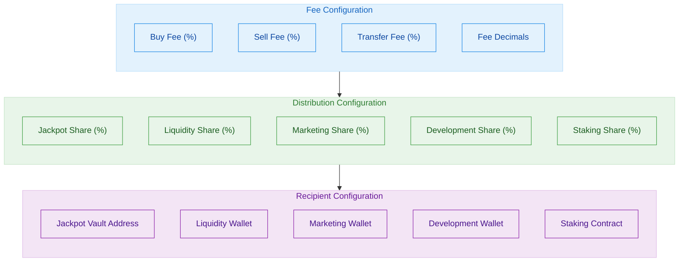

# Configuration Guide

This guide explains how to configure the OmniDragon protocol for various deployment environments and use cases.

## Environment Configuration

OmniDragon uses environment variables for configuration. Create an `.env` file based on the example:

```bash
# Network configuration
MAINNET_RPC_URL=https://mainnet.infura.io/v3/YOUR_API_KEY
ARBITRUM_RPC_URL=https://arbitrum-mainnet.infura.io/v3/YOUR_API_KEY
BSC_RPC_URL=https://bsc-dataseed.binance.org

# Deployment accounts
DEPLOYER_PRIVATE_KEY=your_deployer_private_key
OWNER_ADDRESS=0xOwnerAddress
FEE_COLLECTOR_ADDRESS=0xFeeCollectorAddress

# Contract settings
TOKEN_NAME=OmniDragon
TOKEN_SYMBOL=OMNI
INITIAL_SUPPLY=1000000000000000000000000000
```

## Network Configuration

OmniDragon supports multiple networks defined in `hardhat.config.js`:

```javascript
require("dotenv").config();
require("@nomicfoundation/hardhat-toolbox");
require("@openzeppelin/hardhat-upgrades");

/** @type import('hardhat/config').HardhatUserConfig */
module.exports = {
  solidity: {
    version: "0.8.19",
    settings: {
      optimizer: {
        enabled: true,
        runs: 200
      }
    }
  },
  networks: {
    hardhat: {
      // Local development settings
    },
    arbitrum: {
      url: process.env.ARBITRUM_RPC_URL,
      accounts: [process.env.DEPLOYER_PRIVATE_KEY],
      chainId: 42161
    },
    bsc: {
      url: process.env.BSC_RPC_URL,
      accounts: [process.env.DEPLOYER_PRIVATE_KEY],
      chainId: 56
    },
    ethereum: {
      url: process.env.MAINNET_RPC_URL,
      accounts: [process.env.DEPLOYER_PRIVATE_KEY],
      chainId: 1
    }
  },
  etherscan: {
    apiKey: {
      arbitrumOne: process.env.ARBISCAN_API_KEY,
      bsc: process.env.BSCSCAN_API_KEY,
      mainnet: process.env.ETHERSCAN_API_KEY
    }
  }
};
```

## Contract Parameters

The OmniDragon protocol can be configured through parameters in deployment scripts:

```javascript
// scripts/deploy.js
async function main() {
  // Deploy parameters
  const tokenParams = {
    name: process.env.TOKEN_NAME || "OmniDragon",
    symbol: process.env.TOKEN_SYMBOL || "OMNI",
    initialSupply: process.env.INITIAL_SUPPLY || ethers.utils.parseEther("1000000000"),
    feeConfig: {
      buyFeePercent: 1000, // 10.00%
      sellFeePercent: 1000, // 10.00%
      transferFeePercent: 200, // 2.00%
      feeDecimals: 2
    }
  };
  
  // Deploy contracts
  // ...implementation...
}
```

## Fee Configuration

The OmniDragon token includes a flexible fee system that can be configured:



### Fee Parameters

| Parameter | Description | Default | Range |
|-----------|-------------|---------|-------|
| `buyFeePercent` | Fee applied to buy transactions | 1000 (10.00%) | 0-3000 (0-30%) |
| `sellFeePercent` | Fee applied to sell transactions | 1000 (10.00%) | 0-3000 (0-30%) |
| `transferFeePercent` | Fee applied to transfer transactions | 200 (2.00%) | 0-1000 (0-10%) |
| `feeDecimals` | Decimal precision for fee calculations | 2 | 1-4 |

### Distribution Configuration

| Parameter | Description | Default | Range |
|-----------|-------------|---------|-------|
| `jackpotShare` | Percentage allocated to jackpot | 6900 (69.0%) | 0-10000 (0-100%) |
| `liquidityShare` | Percentage allocated to liquidity | 1000 (10.0%) | 0-10000 (0-100%) |
| `marketingShare` | Percentage allocated to marketing | 500 (5.0%) | 0-10000 (0-100%) |
| `developmentShare` | Percentage allocated to development | 500 (5.0%) | 0-10000 (0-100%) |
| `stakingShare` | Percentage allocated to staking rewards | 1100 (11.0%) | 0-10000 (0-100%) |

## Jackpot Configuration

The jackpot system can be configured with these parameters:

```javascript
// scripts/configJackpot.js
async function main() {
  // Jackpot system parameters
  const jackpotParams = {
    minJackpotSize: ethers.utils.parseEther("10000"), // Minimum size to trigger
    maxWinners: 10, // Maximum number of winners per distribution
    baseEntryProbability: 100, // Base probability for jackpot entry
    entryMultiplierFactor: 150, // Multiplier for additional entries
    cooldownPeriod: 86400 // 24 hours cooldown between jackpots
  };
  
  // Configure jackpot contracts
  // ...implementation...
}
```

## Cross-Chain Configuration

To configure cross-chain functionality:

```javascript
// scripts/configCrossChain.js
async function main() {
  // Cross-chain parameters
  const crossChainParams = {
    supportedChains: [
      {
        chainId: 1, // Ethereum
        endpoint: "0xLZEndpointOnEthereum",
        fee: ethers.utils.parseEther("0.001")
      },
      {
        chainId: 56, // BSC
        endpoint: "0xLZEndpointOnBSC",
        fee: ethers.utils.parseEther("0.0005")
      },
      {
        chainId: 42161, // Arbitrum
        endpoint: "0xLZEndpointOnArbitrum",
        fee: ethers.utils.parseEther("0.0002")
      }
    ],
    gaslimit: 200000,
    messageVersion: 1
  };
  
  // Configure cross-chain functionality
  // ...implementation...
}
```

## Randomness Configuration

Configure randomness sources for the jackpot trigger:

```javascript
// scripts/configRandomness.js
async function main() {
  // Randomness configuration
  const randomnessParams = {
    chainlink: {
      coordinator: "0xChainlinkVRFCoordinator",
      keyhash: "0xKeyhashForChainlinkVRF",
      fee: ethers.utils.parseEther("0.0001"),
      confirmations: 3
    },
    drand: {
      endpoint: "https://api.drand.sh",
      chainHash: "0xDrandChainHash",
      publicKey: "0xDrandPublicKey"
    },
    arbitrumVRF: {
      coordinator: "0xArbitrumVRFCoordinator",
      confirmations: 1
    }
  };
  
  // Configure randomness contracts
  // ...implementation...
}
```

## Gas Optimization

Configure gas optimization parameters:

```javascript
// Gas optimization settings
const gasSettings = {
  eip1559Mode: true, // Use EIP-1559 transactions
  maxFeePerGas: ethers.utils.parseUnits("50", "gwei"),
  maxPriorityFeePerGas: ethers.utils.parseUnits("1.5", "gwei")
};
```

## Multi-Chain Deployment

For deploying across multiple chains:

```bash
# Deploy to Ethereum
npx hardhat run scripts/deploy.js --network ethereum

# Deploy to Arbitrum
npx hardhat run scripts/deploy.js --network arbitrum

# Deploy to BSC
npx hardhat run scripts/deploy.js --network bsc

# Configure cross-chain connections
npx hardhat run scripts/setPeers.js --network ethereum
npx hardhat run scripts/setPeers.js --network arbitrum
npx hardhat run scripts/setPeers.js --network bsc
```

## Contract Verification

Verify deployed contracts on block explorers:

```bash
# Verify on Etherscan
npx hardhat verify --network ethereum DEPLOYED_CONTRACT_ADDRESS CONSTRUCTOR_ARG1 CONSTRUCTOR_ARG2

# Verify on Arbiscan
npx hardhat verify --network arbitrum DEPLOYED_CONTRACT_ADDRESS CONSTRUCTOR_ARG1 CONSTRUCTOR_ARG2

# Verify on BSCScan
npx hardhat verify --network bsc DEPLOYED_CONTRACT_ADDRESS CONSTRUCTOR_ARG1 CONSTRUCTOR_ARG2
```

## Advanced Configuration

For advanced deployment scenarios, create a configuration file:

```javascript
// config/deployment.config.js
module.exports = {
  mainnet: {
    // Mainnet configuration
    token: {
      name: "OmniDragon",
      symbol: "OMNI",
      initialSupply: "1000000000000000000000000000"
    },
    fees: {
      buy: 1000,
      sell: 1000,
      transfer: 200
    },
    // Other mainnet-specific settings
  },
  testnet: {
    // Testnet configuration
    token: {
      name: "OmniDragon Test",
      symbol: "OMNIT",
      initialSupply: "100000000000000000000000000"
    },
    fees: {
      buy: 500,
      sell: 500,
      transfer: 100
    }
    // Other testnet-specific settings
  }
};
```

And use it in deployment scripts:

```javascript
const config = require("../config/deployment.config");

async function main() {
  // Get environment-specific config
  const network = hre.network.name;
  const envConfig = network.includes("mainnet") ? config.mainnet : config.testnet;
  
  // Use configuration
  // ...implementation...
}
```
