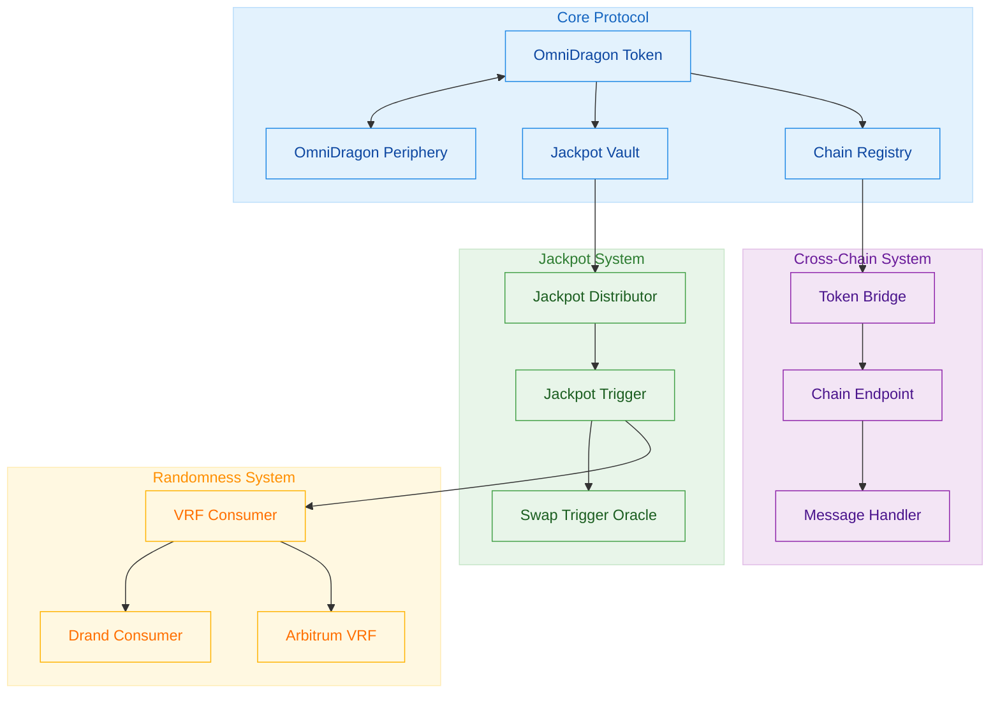

# Development Guide

This guide provides best practices and workflows for developing with the OmniDragon protocol.

## Architecture Overview

Before diving into development, understand the OmniDragon architecture:



## Development Workflow

### Local Development Setup

After completing the [installation](./installation.md), set up your development environment:

```bash
# Start a local Hardhat node
npx hardhat node

# In a separate terminal, deploy the contracts
npx hardhat run scripts/deploy.js --network localhost
```

### Testing Approach

OmniDragon follows a comprehensive testing strategy:

1. **Unit Tests**: Test individual contract functions
2. **Integration Tests**: Test interactions between contracts
3. **System Tests**: Test complete workflows
4. **Fuzz Tests**: Test with random inputs using property-based testing

Example test structure:

```javascript
describe("OmniDragon", function() {
  // Unit tests for OmniDragon token
  describe("Core functionality", function() {
    it("Should track balance changes correctly", async function() {
      // Test implementation
    });
    
    it("Should apply fees correctly", async function() {
      // Test implementation
    });
  });
  
  // Integration tests with jackpot system
  describe("Jackpot integration", function() {
    it("Should send fees to jackpot vault", async function() {
      // Test implementation
    });
  });
});
```

### Debugging Techniques

When debugging contracts:

1. **Console Logging**: Use Hardhat's `console.log` for debugging
   ```solidity
   import "hardhat/console.sol";
   
   function transfer(address to, uint256 amount) public override returns (bool) {
       console.log("Transfer from:", msg.sender, "to:", to, "amount:", amount);
       // Function implementation
   }
   ```

2. **Events**: Use events for tracking state changes
   ```solidity
   event FeeCollected(address from, address to, uint256 amount, uint256 feeAmount);
   
   function _collectFee(address from, address to, uint256 amount) internal returns (uint256) {
       uint256 feeAmount = calculateFee(from, to, amount);
       emit FeeCollected(from, to, amount, feeAmount);
       return amount - feeAmount;
   }
   ```

3. **Test Fixtures**: Use Hardhat fixtures for test setup
   ```javascript
   const { loadFixture } = require("@nomicfoundation/hardhat-network-helpers");
   
   async function deployTokenFixture() {
     // Deploy contracts and return instances
   }
   
   describe("OmniDragon", function() {
     it("Should work as expected", async function() {
       const { token, vault } = await loadFixture(deployTokenFixture);
       // Test implementation
     });
   });
   ```

## Customization and Extension

### Creating a Custom Integration

To integrate with OmniDragon, implement the appropriate interfaces:

```solidity
// SPDX-License-Identifier: MIT
pragma solidity ^0.8.17;

import "@omnidragon/interfaces/IJackpotTrigger.sol";
import "@omnidragon/interfaces/IOmniDragon.sol";

contract CustomJackpotTrigger is IJackpotTrigger {
    IOmniDragon public omniDragon;
    address public jackpotDistributor;
    
    constructor(address _omniDragon, address _jackpotDistributor) {
        omniDragon = IOmniDragon(_omniDragon);
        jackpotDistributor = _jackpotDistributor;
    }
    
    function checkAndTriggerJackpot() external override returns (bool) {
        // Custom trigger logic
        uint256 jackpotAmount = omniDragon.getCurrentJackpotAmount();
        
        // Determine if jackpot should trigger
        if (shouldTriggerJackpot(jackpotAmount)) {
            // Trigger jackpot distribution
            IDragonJackpotDistributor(jackpotDistributor).initiateJackpotDistribution();
            return true;
        }
        
        return false;
    }
    
    function shouldTriggerJackpot(uint256 amount) internal view returns (bool) {
        // Custom trigger conditions
        return amount > threshold && otherConditions;
    }
}
```

### Contract Upgrades

OmniDragon uses the transparent proxy pattern for upgrades:

1. **Implementing Upgrades**:
   ```javascript
   const { upgradeProxy } = require("@openzeppelin/hardhat-upgrades");
   
   async function main() {
     const OmniDragonV2 = await ethers.getContractFactory("OmniDragonV2");
     const upgraded = await upgradeProxy(PROXY_ADDRESS, OmniDragonV2);
     console.log("OmniDragon upgraded to V2");
   }
   ```

2. **Upgrade Best Practices**:
   - Never change storage layout in upgrades
   - Use `initializer` functions for new initialization logic
   - Always test upgrades on testnet before mainnet

## Cross-Chain Development

### Setting Up Multi-Chain Environment

For developing cross-chain functionality:

```javascript
// hardhat.config.js
module.exports = {
  networks: {
    arbitrum: {
      url: process.env.ARBITRUM_RPC_URL,
      accounts: [process.env.PRIVATE_KEY]
    },
    bsc: {
      url: process.env.BSC_RPC_URL,
      accounts: [process.env.PRIVATE_KEY]
    },
    ethereum: {
      url: process.env.ETHEREUM_RPC_URL,
      accounts: [process.env.PRIVATE_KEY]
    }
  }
};
```

### Testing Cross-Chain Functions

For testing cross-chain functionality:

```javascript
describe("Cross-chain transfers", function() {
  it("Should handle cross-chain token transfers", async function() {
    // Deploy contracts on different networks
    const sourceToken = await deployToNetwork("arbitrum");
    const destToken = await deployToNetwork("bsc");
    
    // Set up mock cross-chain messaging
    await mockCrossChainMessaging(sourceToken, destToken);
    
    // Test cross-chain transfer
    await sourceToken.sendTokensToChain(
      BSC_CHAIN_ID,
      user.address,
      ethers.utils.parseEther("100")
    );
    
    // Verify tokens arrive on destination chain
    expect(await destToken.balanceOf(user.address))
      .to.equal(ethers.utils.parseEther("100"));
  });
});
```

## Security Best Practices

When developing for OmniDragon:

1. **Follow the Checks-Effects-Interactions Pattern**
   ```solidity
   function withdraw(uint256 amount) external {
       // Checks
       require(amount > 0, "Zero amount");
       require(balances[msg.sender] >= amount, "Insufficient balance");
       
       // Effects
       balances[msg.sender] -= amount;
       
       // Interactions
       (bool success, ) = msg.sender.call{value: amount}("");
       require(success, "Transfer failed");
   }
   ```

2. **Use OpenZeppelin Libraries** for standard functionality
3. **Implement Rate Limiting** for sensitive operations
4. **Add Emergency Pause Functionality** for critical contracts
5. **Thoroughly Test Edge Cases** with fuzzing and property-based testing

## Continuous Integration

OmniDragon uses a CI/CD pipeline for development:

```yaml
# .github/workflows/ci.yml
name: CI

on:
  push:
    branches: [ main, develop ]
  pull_request:
    branches: [ main, develop ]

jobs:
  test:
    runs-on: ubuntu-latest
    steps:
      - uses: actions/checkout@v3
      - name: Setup Node.js
        uses: actions/setup-node@v3
        with:
          node-version: '16'
      - name: Install dependencies
        run: npm ci
      - name: Run tests
        run: npm test
      - name: Run linters
        run: npm run lint
```

## Community Contributions

To contribute to OmniDragon:

1. Fork the repository
2. Create a feature branch
3. Implement your changes with tests
4. Submit a pull request
5. Engage with review feedback

We follow [Conventional Commits](https://www.conventionalcommits.org/) for commit messages.

## Resource Links

- [API Reference](../reference/api.md)
- [Technical Architecture](../technical-architecture/overview.md)
- [Contracts Overview](../contracts/overview.md)
- [GitHub Repository](https://github.com/omnidragon/omnidragon)
