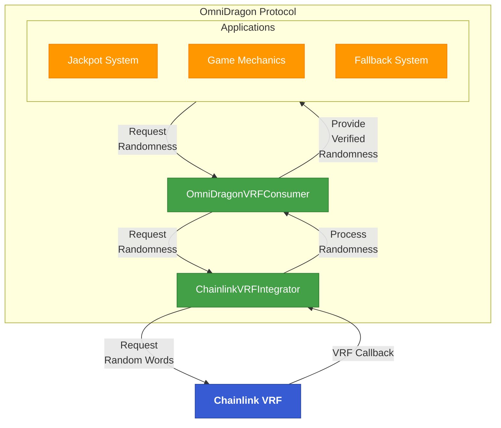
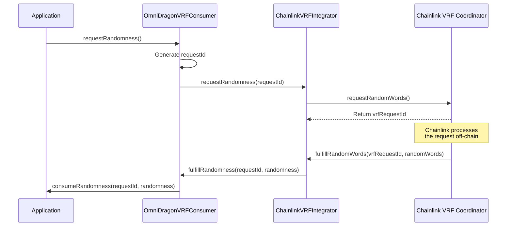

# Chainlink Integration

OmniDragon integrates with [Chainlink](https://chain.link/) services to enhance security and reliability across the protocol. Our primary Chainlink integration is the Verifiable Random Function (VRF), which serves as a secondary randomness source alongside dRand.

## What is Chainlink?

Chainlink is a decentralized oracle network that enables smart contracts to securely access off-chain data feeds, web APIs, and traditional bank payments. For OmniDragon, we leverage:

- **Chainlink VRF**: Verifiable Random Function for secure on-chain randomness
- **Chainlink Price Feeds**: For accurate token pricing in certain operations
- **Chainlink Automation**: For triggering time-based system operations

## OmniDragon's Chainlink VRF Implementation



## Core Features

### 1. Secondary Randomness Source

Chainlink VRF serves as a backup randomness source in OmniDragon:

- Provides a fallback if dRand is temporarily unavailable
- Offers an additional layer of security through randomness diversification
- Ensures randomness availability across all supported chains

### 2. Chainlink VRF v2 Integration

OmniDragon leverages Chainlink VRF v2, which offers significant improvements:

- Subscription-based model for cost efficiency
- Multiple random values in a single request
- Adjustable gas limits for randomness fulfillment

### 3. Chain-Specific Implementations

OmniDragon implements chain-specific Chainlink VRF connectors for optimal performance across all supported networks:

- Ethereum VRF configuration
- Arbitrum VRF configuration
- Polygon VRF configuration
- BNB Chain VRF configuration

## Technical Implementation

OmniDragon's Chainlink integration consists of several components:

### ChainlinkVRFIntegrator

This contract interfaces with Chainlink's VRF service:

```solidity
// ChainlinkVRFIntegrator.sol (simplified)
contract ChainlinkVRFIntegrator is VRFConsumerBaseV2, IDragonVRFIntegrator {
    // Chainlink VRF Coordinator
    VRFCoordinatorV2Interface public COORDINATOR;
    
    // Subscription ID for Chainlink VRF
    uint64 public subscriptionId;
    
    // Key hash for the VRF service
    bytes32 public keyHash;
    
    // Request to randomness mapping
    mapping(uint256 => uint256) public requestIdToRequestIndex;
    
    // Request randomness from Chainlink
    function requestRandomness(uint256 requestId) external override returns (uint256) {
        // Request random words from Chainlink VRF
        uint256 vrfRequestId = COORDINATOR.requestRandomWords(
            keyHash,
            subscriptionId,
            REQUEST_CONFIRMATIONS,
            callbackGasLimit,
            1 // number of words
        );
        
        // Map OmniDragon request ID to Chainlink request ID
        requestIdToRequestIndex[vrfRequestId] = requestId;
        
        return vrfRequestId;
    }
    
    // Receive randomness from Chainlink
    function fulfillRandomWords(uint256 requestId, uint256[] memory randomWords) 
        internal override {
        uint256 dragonRequestId = requestIdToRequestIndex[requestId];
        uint256 randomness = randomWords[0];
        
        // Forward randomness to VRF consumer
        IOmniDragonVRFConsumer(vrfConsumer).fulfillRandomness(
            dragonRequestId, 
            randomness
        );
    }
}
```

### ArbitrumVRFConsumer

Special implementation for Arbitrum's Chainlink VRF:

```solidity
// ArbitrumVRFConsumer.sol (simplified)
contract ArbitrumVRFConsumer is IDragonVRFIntegrator {
    // Arbitrum-specific VRF configuration
    // ...
    
    // Request randomness specifically for Arbitrum
    function requestRandomness(uint256 requestId) external override returns (uint256) {
        // Arbitrum-specific implementation
        // ...
    }
}
```

## Chainlink VRF Request Flow

The request flow for Chainlink VRF in OmniDragon:



## Chainlink Price Feeds

In addition to VRF, OmniDragon uses Chainlink Price Feeds for:

- Accurate token price information for USD conversion
- Dynamic fee adjustments based on market conditions
- Cross-chain value consistency

Example integration:

```solidity
// Using Chainlink Price Feed
contract TokenPriceConsumer {
    AggregatorV3Interface internal priceFeed;
    
    constructor(address _priceFeed) {
        priceFeed = AggregatorV3Interface(_priceFeed);
    }
    
    // Get the latest token price
    function getLatestPrice() public view returns (int) {
        (
            /* uint80 roundID */,
            int price,
            /* uint startedAt */,
            /* uint timeStamp */,
            /* uint80 answeredInRound */
        ) = priceFeed.latestRoundData();
        return price;
    }
}
```

## Chainlink Automation

OmniDragon uses Chainlink Automation (formerly Keepers) for:

- Periodic jackpot triggers
- Fee distribution automation
- Maintenance operations

## Integration Example

Here's an example of how to use OmniDragon's Chainlink VRF integration:

```solidity
// SPDX-License-Identifier: MIT
pragma solidity ^0.8.0;

import "@omnidragon/contracts/interfaces/IOmniDragonVRFConsumer.sol";
import "@omnidragon/contracts/interfaces/IDragonVRFConsumer.sol";

contract ChainlinkRandomnessExample is IDragonVRFConsumer {
    IOmniDragonVRFConsumer public vrfConsumer;
    uint256 public randomResult;
    
    constructor(address _vrfConsumerAddress) {
        vrfConsumer = IOmniDragonVRFConsumer(_vrfConsumerAddress);
    }
    
    // Request randomness from Chainlink as fallback
    function requestRandomNumberWithChainlink() external {
        // Set Chainlink as preferred source
        vrfConsumer.setPreferredSource(1); // 1 = Chainlink
        
        // Request randomness
        vrfConsumer.requestRandomness(address(this));
    }
    
    // Receive randomness callback
    function consumeRandomness(uint256 requestId, uint256 randomness) 
        external override {
        require(msg.sender == address(vrfConsumer), "Unauthorized");
        
        randomResult = randomness;
        
        // Use the randomness
        // ...
    }
}
```

## Supported Networks

OmniDragon's Chainlink VRF integration is available on the following networks:

| Network | Chainlink VRF Subscription ID | Status |
|---------|------------------------------|--------|
| Ethereum | TBD | Planned |
| Arbitrum | TBD | Planned |
| Polygon | TBD | Planned |
| BNB Chain | TBD | Planned |

## Security Considerations

When using OmniDragon's Chainlink integration:

1. **Fulfillment Gas**: Ensure sufficient gas is allocated for Chainlink VRF callbacks
2. **Request Rate**: Be mindful of request rate limits on the Chainlink subscription
3. **Price Feed Staleness**: Check the timestamp of price feeds to ensure data freshness
4. **Multiple Verifications**: For critical applications, verify randomness from multiple sources

## Additional Resources

- [Chainlink Documentation](https://docs.chain.link/)
- [Chainlink VRF Documentation](https://docs.chain.link/vrf/)
- [OmniDragon VRF Integration Guide](/integrations/chainlink/vrf)
