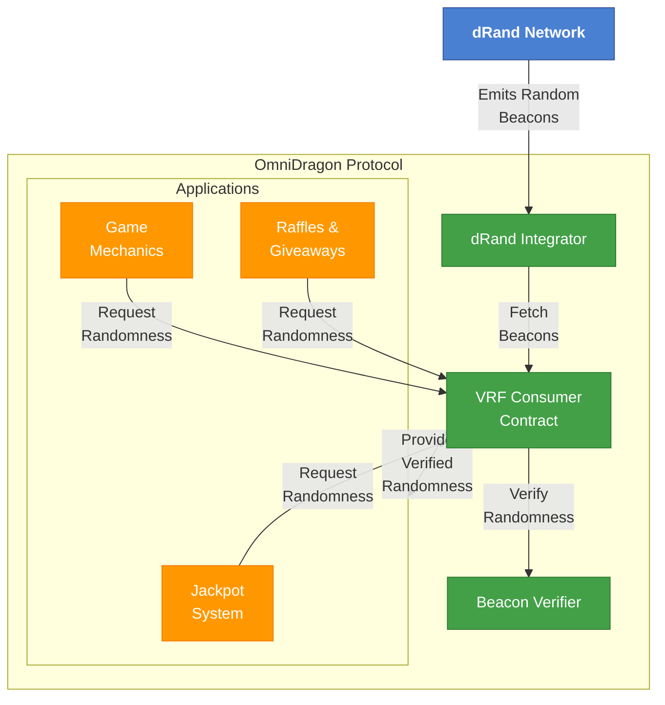
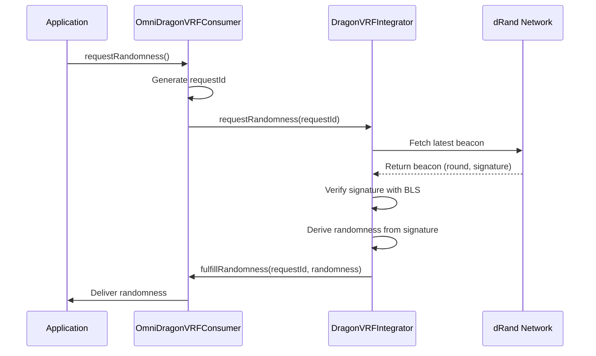

# dRand Network Integration

OmniDragon integrates with the [dRand Network](https://drand.love/) to provide cryptographically verifiable randomness for its jackpot system and other randomized mechanics. This integration ensures that all random processes in the OmniDragon ecosystem are provably fair and tamper-resistant.

## What is dRand?

dRand is a distributed randomness beacon protocol that generates verifiable, unpredictable, and unbiasable random values. Key features include:

- **Decentralized**: Operated by a distributed set of nodes across different organizations
- **Verifiable**: Anyone can verify the correctness of generated random values
- **Unpredictable**: Random values cannot be predicted in advance
- **Unbiasable**: No single party can bias the randomness generation process
- **Efficient**: Uses threshold cryptography for efficient randomness generation

## OmniDragon's dRand Implementation



## Core Features

### 1. Verifiable Randomness for Jackpot System

The OmniDragon jackpot system relies on dRand for selecting winners:

- Jackpot triggers request randomness from the VRF Consumer
- VRF Consumer fetches the latest dRand beacon
- The randomness is verified on-chain
- A winner is selected based on the verified random value
- The jackpot is distributed to the winner

### 2. Randomized Game Mechanics

OmniDragon's gaming features use dRand randomness for:

- Random item generation
- Probability-based outcomes
- Fair competition results

### 3. On-Chain Verification

All dRand randomness used in OmniDragon is verified on-chain:

- Signature verification using BLS12-381 cryptography
- Verification against the known dRand public key
- Round number validation to ensure freshness

## Technical Implementation

OmniDragon's dRand integration consists of several components:

### DragonVRFIntegrator

This contract integrates with the dRand network:

```solidity
// DragonVRFIntegrator.sol (simplified)
contract DragonVRFIntegrator is IDragonVRFIntegrator {
    // dRand public key for verification
    bytes public drandPublicKey;
    
    // Latest round and randomness
    uint256 public latestRound;
    uint256 public latestRandomness;
    
    // Request randomness from dRand
    function requestRandomness(uint256 requestId) external override;
    
    // Verify and process a dRand beacon
    function verifyAndProcessBeacon(
        uint256 round,
        bytes calldata signature,
        bytes calldata previousSignature
    ) external returns (uint256);
    
    // Get the latest randomness
    function getLatestRandomness() external view override returns (uint256);
}
```

### OmniDragonVRFConsumer

This contract consumes randomness and distributes it to applications:

```solidity
// OmniDragonVRFConsumer.sol (simplified)
contract OmniDragonVRFConsumer {
    // VRF integrator contract
    IDragonVRFIntegrator public integrator;
    
    // Mapping of request IDs to consumers
    mapping(uint256 => address) public requests;
    
    // Request randomness
    function requestRandomness(address consumer) 
        external returns (uint256 requestId);
    
    // Fulfill randomness
    function fulfillRandomness(uint256 requestId, uint256 randomness) external;
    
    // Get the latest random value
    function getLatestRandomValue() external view returns (uint256);
}
```

## dRand Beacon Verification

OmniDragon verifies dRand beacons using the following process:



## Backup Randomness Sources

To ensure high availability, OmniDragon implements backup randomness sources:

1. **Primary**: dRand Network
2. **Secondary**: Chainlink VRF
3. **Fallback**: Block hash-based randomness (only in emergency)

The system automatically switches to secondary sources if the primary source fails to deliver randomness within a specified timeframe.

## Integration Example

Here's an example of how to request randomness from the OmniDragon VRF system:

```solidity
// SPDX-License-Identifier: MIT
pragma solidity ^0.8.0;

import "@omnidragon/contracts/interfaces/IOmniDragonVRFConsumer.sol";
import "@omnidragon/contracts/interfaces/IDragonVRFConsumer.sol";

contract RandomnessExample is IDragonVRFConsumer {
    IOmniDragonVRFConsumer public vrfConsumer;
    uint256 public randomResult;
    bool public randomnessReceived;
    
    constructor(address _vrfConsumerAddress) {
        vrfConsumer = IOmniDragonVRFConsumer(_vrfConsumerAddress);
    }
    
    // Request randomness
    function requestRandomNumber() external {
        vrfConsumer.requestRandomness(address(this));
        randomnessReceived = false;
    }
    
    // Receive randomness from VRF consumer
    function consumeRandomness(uint256 requestId, uint256 randomness) 
        external override {
        require(msg.sender == address(vrfConsumer), "Unauthorized");
        
        randomResult = randomness;
        randomnessReceived = true;
        
        // Use the randomness (e.g., select winner, determine outcome)
    }
    
    // Example: Select a winner using randomness
    function selectWinner(address[] memory participants) 
        external view returns (address) {
        require(randomnessReceived, "No randomness available");
        
        uint256 winnerIndex = randomResult % participants.length;
        return participants[winnerIndex];
    }
}
```

## Security Considerations

When using OmniDragon's dRand integration:

1. **Verification**: Always verify that randomness comes from the authorized VRF consumer
2. **Freshness**: Check that the randomness is from a recent dRand round
3. **Public Inputs**: Never rely on user-provided inputs for randomness generation
4. **Multiple Sources**: For critical applications, consider using multiple sources of randomness

## Additional Resources

- [dRand Network Documentation](https://drand.love/docs/)
- [League of Entropy](https://leagueofentropy.com/) (dRand operators)
- [OmniDragon dRand Setup Guide](/integrations/drand/setup)
- [OmniDragon dRand Usage Examples](/integrations/drand/usage)
