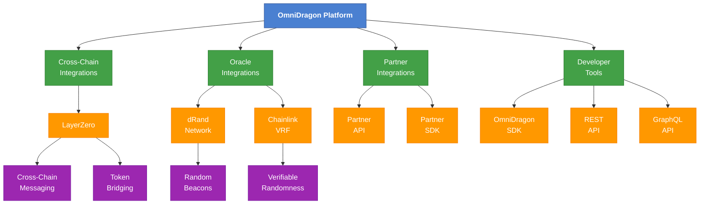

# OmniDragon Integration Guide

OmniDragon is designed for seamless integration with various platforms, protocols, and services. This guide provides comprehensive information on how to integrate with OmniDragon's ecosystem.

## Integration Options



## Key Integrations

### Cross-Chain Integrations

OmniDragon uses [LayerZero](https://layerzero.network/) as its primary cross-chain messaging protocol, enabling:

- **Token Transfers**: Move tokens seamlessly across supported chains
- **Cross-Chain Messaging**: Send arbitrary messages between chains
- **Unified Jackpot System**: Participate in jackpots across all chains

[Learn more about LayerZero integration →](/integrations/layerzero/overview)

### Oracle Integrations

OmniDragon integrates with multiple oracle solutions for verifiable randomness:

- **dRand Network**: Our primary source of randomness, providing verifiable, unpredictable, and unbiasable random values
- **Chainlink VRF**: Secondary randomness source for additional security

[Learn more about dRand integration →](/integrations/drand/overview)  
[Learn more about Chainlink integration →](/integrations/chainlink/overview)

### Partner Integrations

We offer tailored integration options for partners:

- **Partner API**: RESTful API for integrating OmniDragon functionalities
- **Partner SDK**: Comprehensive SDK for deeper integrations
- **Custom Contracts**: Specialized smart contracts for partner collaborations

[Learn more about partner integrations →](/integrations/partners/overview)

## Integration Guide by Use Case

### For DeFi Protocols

If you're a DeFi protocol looking to integrate with OmniDragon, you can:

1. **Integrate with our liquidity pools**: Add support for OmniDragon tokens in your AMM or lending platform
2. **Leverage our cross-chain capabilities**: Enable your users to use OmniDragon across multiple chains
3. **Incorporate our randomness solution**: Use our verified randomness for your protocol's needs

### For Game Developers

Game developers can enhance their games with:

1. **Randomized rewards**: Implement verifiably fair rewards using our VRF integration
2. **Cross-chain assets**: Allow game items and tokens to move across different blockchains
3. **Jackpot mechanics**: Incorporate OmniDragon's jackpot system into your game economy

### For Wallet Providers

Wallet providers can offer enhanced functionality:

1. **Cross-chain transfers**: Simplify the UX for sending OmniDragon tokens across chains
2. **Fee estimates**: Implement accurate fee estimation for OmniDragon transactions
3. **Jackpot notifications**: Alert users when they win jackpots or when jackpots are triggered

## Technical Integration Overview

### Smart Contract Integration

```solidity
// SPDX-License-Identifier: MIT
pragma solidity ^0.8.0;

import "@omnidragon/contracts/interfaces/IOmniDragon.sol";

contract OmniDragonIntegration {
    IOmniDragon public omniDragon;
    
    constructor(address _omniDragonAddress) {
        omniDragon = IOmniDragon(_omniDragonAddress);
    }
    
    // Example: Cross-chain transfer function
    function sendCrossChain(
        uint16 _dstChainId, 
        bytes calldata _destination,
        uint256 _amount
    ) external payable {
        // Transfer tokens from sender to this contract
        omniDragon.transferFrom(msg.sender, address(this), _amount);
        
        // Approve spending and initiate cross-chain transfer
        omniDragon.approve(address(omniDragon), _amount);
        omniDragon.sendToChain{value: msg.value}(
            _dstChainId,
            _destination,
            _amount,
            payable(msg.sender), // refund address
            address(0),          // zero payment address (for LayerZero)
            ""                   // adapter params
        );
    }
}
```

### JavaScript Integration

```javascript
import { OmniDragonSDK } from '@omnidragon/sdk';

// Initialize the SDK
const sdk = new OmniDragonSDK({
  rpcUrl: 'https://ethereum.rpc.endpoint',
  chainId: 1,
  privateKey: process.env.PRIVATE_KEY // Or use a wallet connector
});

// Send tokens across chains
async function sendTokensCrossChain(amount, destinationChain, recipientAddress) {
  try {
    const tx = await sdk.crossChain.sendTokens({
      amount,
      destinationChainId: destinationChain,
      recipient: recipientAddress,
      
      // Optional parameters
      gasLimit: 300000,
      relayerFee: '0.01' // ETH
    });
    
    console.log(`Transaction submitted: ${tx.hash}`);
    await tx.wait();
    console.log('Cross-chain transfer completed!');
  } catch (error) {
    console.error('Error sending tokens cross-chain:', error);
  }
}
```

## Supported Networks

OmniDragon is available on the following networks:

| Network | Chain ID | Token Address | Status |
|---------|----------|--------------|--------|
| Ethereum | 1 | 0x... (Coming Soon) | Planned |
| Arbitrum | 42161 | 0x... (Coming Soon) | Planned |
| Optimism | 10 | 0x... (Coming Soon) | Planned |
| Avalanche | 43114 | 0x... (Coming Soon) | Planned |
| Sonic | 146 | 0x... (Coming Soon) | Planned |

## Integration Support

If you need assistance with integrating OmniDragon into your project, we provide several support channels:

- **Documentation**: Comprehensive guides at docs.sonicreddragon.io
- **Developer Discord**: Join our [Discord server](https://discord.gg/omnidragon) for technical support
- **GitHub**: Check our [example repositories](https://github.com/wenakita/omnidragon-examples) with sample integration code
- **Direct Support**: Contact our integration team at integrations@sonicreddragon.io

## Security Considerations

When integrating with OmniDragon, follow these security best practices:

1. **Always verify transactions**: Implement proper transaction verification, especially for cross-chain operations
2. **Implement rate limiting**: Protect your systems from potential abuse or DoS attacks
3. **Handle fees properly**: Account for network fees and LayerZero fees in cross-chain operations
4. **Validate randomness**: When using our VRF solution, implement proper validation of the randomness source
5. **Test thoroughly**: Conduct extensive testing on testnets before deploying to production 