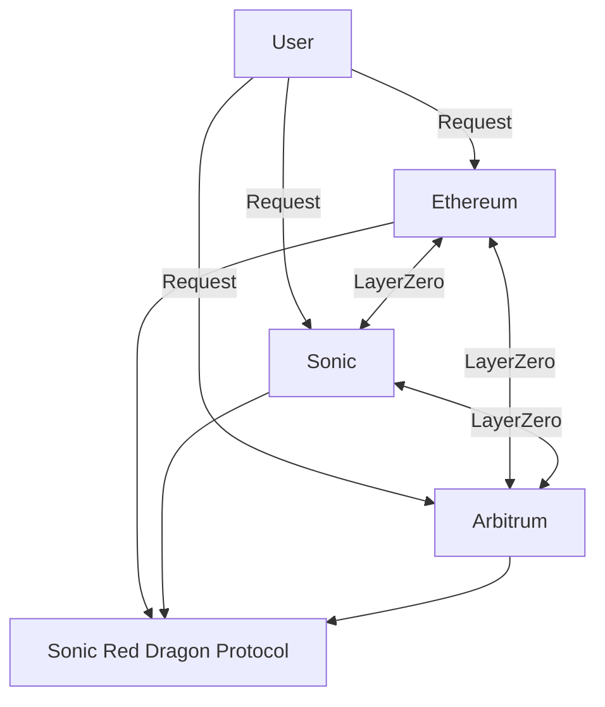
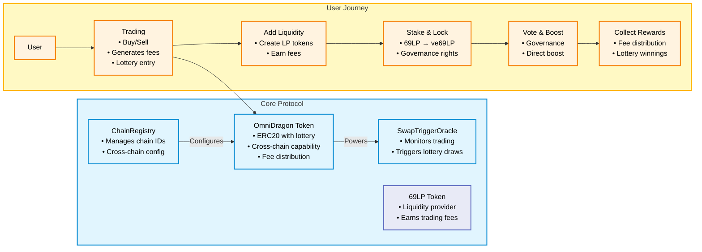
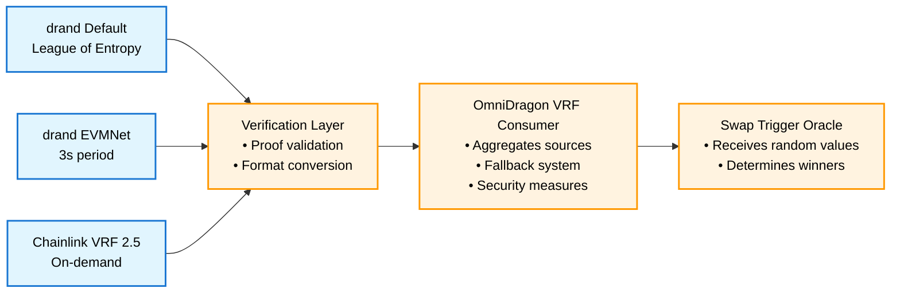

# Introduction

Welcome to Sonic Red Dragon documentation!

*Last updated: Added workflow automation for documentation deployment*

Sonic Red Dragon is a LayerZero V2 compatible token that brings unique features and capabilities to the cross-chain ecosystem.

## What is Sonic Red Dragon?

Sonic Red Dragon is a next-generation token built on the LayerZero V2 protocol, designed to provide seamless cross-chain functionality while maintaining high security and efficiency. Our token leverages advanced cryptographic techniques and the dRAND network for verifiable randomness, making it ideal for various DeFi applications.

## Architecture Overview

## Ecosystem Components

Sonic Red Dragon creates a comprehensive ecosystem with several interconnected components:

For a more detailed view of the ecosystem architecture, you can explore our [complete ecosystem diagrams](./ecosystem/architecture).

## Key Features

- **LayerZero V2 Compatibility**: Seamless cross-chain operations with enhanced security
- **dRAND Integration**: Verifiable randomness for fair and transparent operations
- **Advanced Security**: Built with modern cryptographic primitives
- **Cross-Chain Functionality**: Operate across multiple blockchain networks
- **Developer-Friendly**: Comprehensive documentation and easy integration

## Randomness System

One of our standout features is the advanced randomness system that powers our lottery mechanism:

Our randomness system combines multiple sources including drand networks and Chainlink VRF to ensure reliable and verifiable random number generation for our lottery mechanism.

## Getting Started

To start using Sonic Red Dragon in your project:

1. Review the [Contracts Overview](./contracts/overview) to understand our smart contract architecture
2. Learn about our [Randomness System](./ecosystem/drand-network) for verifiable random number generation
3. Check out our GitHub repository for implementation examples

## Community

Join our community to stay updated and get support:

- [Telegram](https://t.me/SonicRedDragon)
- [Discord](https://discord.gg/sonicreddragon)
- [Twitter](https://twitter.com/sonicreddragon)
- [GitHub](https://github.com/wenakita/omnidragon)

## Contributing

We welcome contributions from the community! Whether it's improving documentation, reporting bugs, or suggesting new features, your input helps make Sonic Red Dragon better for everyone.

Visit our [GitHub repository](https://github.com/wenakita/omnidragon) to:
- Report issues
- Submit pull requests
- Review our code
- Join discussions 