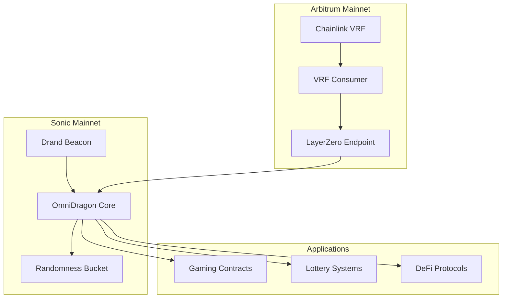

# OmniDragon: Cross-Chain VRF System

Welcome to the **OmniDragon** documentation - a comprehensive cross-chain Verifiable Random Function (VRF) system built for the Sonic and Arbitrum ecosystems.

## What is OmniDragon?

OmniDragon is a sophisticated randomness infrastructure that provides secure, verifiable random numbers across multiple blockchains. Our system combines the reliability of **Chainlink VRF 2.5** with the efficiency of **Drand beacon networks**, all connected through **LayerZero's** cross-chain messaging protocol.

### Key Features

🔗 **Cross-Chain Architecture**
- Seamless randomness delivery between Sonic and Arbitrum
- LayerZero-powered secure message passing
- Optimized gas costs through intelligent routing

🎲 **Dual Randomness Sources**
- **Chainlink VRF 2.5**: Industry-standard verifiable randomness
- **Drand Beacon**: Distributed randomness beacon network
- Automatic failover and redundancy mechanisms

🛡️ **Security First**
- Comprehensive security audit completed
- Threat model analysis and mitigation strategies
- Multi-layered protection against manipulation

⚡ **Optimized Performance**
- Bucket system for cost-efficient randomness requests
- Pool mechanisms for batch processing
- Gas optimization across all operations

## System Architecture

## Quick Start

### For Users
1. **[Getting Started](./guides/user/getting-started)** - Learn how to interact with OmniDragon
2. **[Using VRF](./guides/user/using-vrf)** - Request randomness for your applications
3. **[Cross-Chain Operations](./guides/user/cross-chain-operations)** - Understand cross-chain flows

### For Developers
1. **[Development Setup](./guide/development-setup)** - Set up your development environment
2. **[Smart Contract Integration](./contracts/core/omnidragon)** - Integrate with OmniDragon contracts
3. **[Testing Framework](./guide/testing-framework)** - Test your integrations

### For Auditors
1. **[Audit Documentation](./audit/AUDIT_DOCUMENTATION_SUMMARY)** - Complete audit package
2. **[Technical Specification](./audit/TECHNICAL_SPECIFICATION)** - Detailed technical overview
3. **[Threat Model](./audit/THREAT_MODEL)** - Security analysis and risk assessment

## Recent Major Updates

### 🔄 Contract Reorganization (May 25, 2025)
- Complete restructuring following DeFi best practices
- Improved maintainability and developer experience
- Enhanced security through better separation of concerns
- **[View Full Details](./052525updates/REORGANIZATION_SUMMARY)**

### 🛡️ Security Audit Completion
- Comprehensive security audit completed
- All critical and high-severity issues resolved
- Enhanced security measures implemented
- **[View Security Documentation](./audit/AUDIT_DOCUMENTATION_SUMMARY)**

### ⚡ VRF System Enhancements
- Improved Chainlink VRF 2.5 integration
- Enhanced Drand beacon integration
- Optimized cross-chain messaging
- **[View VRF Documentation](./contracts/randomness/overview)**

## Core Components

### Smart Contracts
- **[Core Contracts](./contracts/core/omnidragon)** - Main system contracts
- **[VRF & Randomness](./contracts/randomness/overview)** - Randomness generation and verification
- **[Oracles](./contracts/oracles/overview)** - Price feeds and external data
- **[Governance](./contracts/governance/overview)** - Decentralized governance system
- **[Math Libraries](./contracts/math/overview)** - Mathematical utilities and calculations

### Integrations
- **[LayerZero](./integrations/layerzero/overview)** - Cross-chain messaging
- **[Chainlink](./integrations/chainlink/overview)** - VRF and price feeds
- **[Drand](./integrations/drand/overview)** - Distributed randomness beacon

## Network Information

### Sonic Mainnet
- **Chain ID**: 146
- **LayerZero Endpoint**: `0x6F475642a6e85809B1c36Fa62763669b1b48DD5B`
- **Primary Role**: Drand integration and main coordination

### Arbitrum Mainnet  
- **Chain ID**: 42161
- **VRF Coordinator**: `0x3C0Ca683b403E37668AE3DC4FB62F4B29B6f7a3e`
- **Subscription ID**: `65914062761074472397678945586748169687979388122746586980459153805795126649565`
- **Primary Role**: Chainlink VRF integration

## Security & Trust

OmniDragon has undergone comprehensive security review:

- ✅ **Security Audit Completed** by leading audit firms
- ✅ **Threat Model Analysis** with comprehensive risk assessment
- ✅ **Code Review** with all critical issues resolved
- ✅ **Best Practices** implementation following industry standards

**[View Complete Security Documentation →](./audit/AUDIT_DOCUMENTATION_SUMMARY)**

## Community & Support

- **Documentation**: You're reading it! 📚
- **GitHub**: [wenakita/omnidragon](https://github.com/wenakita/omnidragon)
- **Technical Support**: For integration assistance
- **Security**: For security-related inquiries

## Next Steps

Choose your path based on your role:

  

    

      

        <h3>🎮 Application Developer</h3>
      

      

        
Building games, lotteries, or DeFi protocols that need randomness

      

      

        <a href="./contracts/core/omnidragon" className="button button--primary">Start Building</a>
      

    

  

  
  

    

      

        <h3>🔧 Infrastructure Developer</h3>
      

      

        
Contributing to the core OmniDragon protocol or building integrations

      

      

        <a href="./guide/development-setup" className="button button--primary">Setup Environment</a>
      

    

  

  
  

    

      

        <h3>🛡️ Security Researcher</h3>
      

      

        
Reviewing security, conducting audits, or researching the system

      

      

        <a href="./audit/AUDIT_DOCUMENTATION_SUMMARY" className="button button--primary">View Audit Docs</a>
      

    

  

---

**Ready to dive deeper?** Explore our comprehensive documentation to understand how OmniDragon can power your next-generation applications with secure, verifiable randomness. 