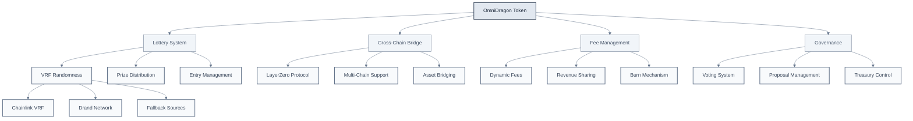
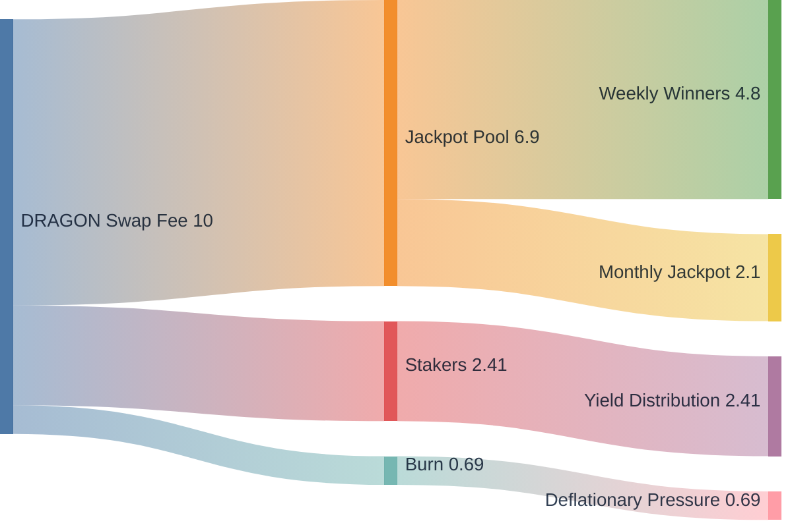
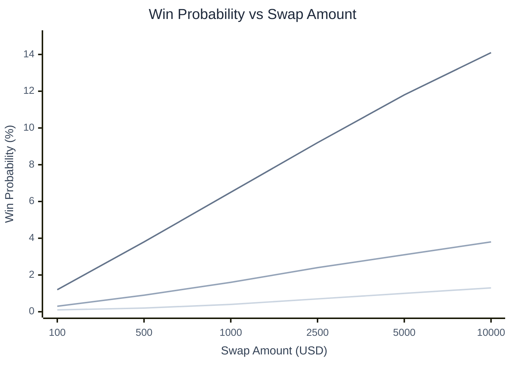
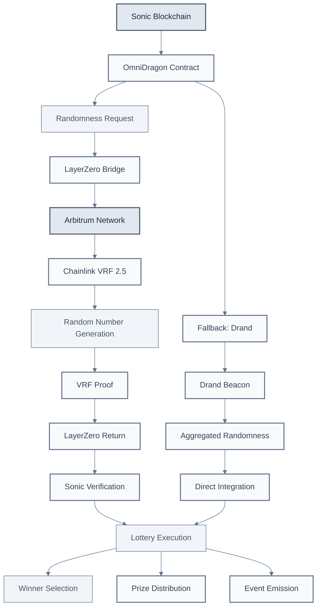
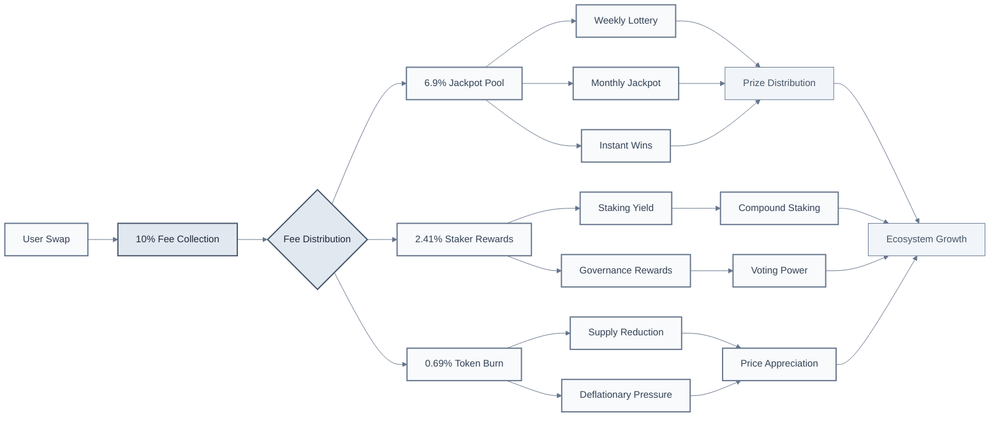

# Welcome to OmniDragon

**OmniDragon** is a revolutionary cross-chain token ecosystem built on Sonic blockchain, featuring an integrated lottery system powered by dual VRF sources, dynamic fee management, and advanced governance mechanisms.

## What is OmniDragon?

OmniDragon combines the best of DeFi innovation with gaming mechanics, creating a unique token that automatically generates lottery entries for holders while providing seamless cross-chain functionality through LayerZero integration.

### Core Features

- **Integrated Lottery System**: Automatic lottery entries on qualifying swaps with VRF-powered randomness
- **Cross-Chain Native**: Built-in LayerZero integration for seamless multi-chain operations  
- **Dynamic Fee Management**: Intelligent fee distribution across multiple ecosystem components
- **Governance Integration**: Community-driven decision making with transparent voting mechanisms
- **Advanced Security**: Multi-source VRF randomness with fallback mechanisms

## System Architecture

  

    <button className="mermaid-btn">Zoom In</button>
    <button className="mermaid-btn">Zoom Out</button>
    <button className="mermaid-btn">Reset View</button>
    <button className="mermaid-btn">Replay</button>
  

## Fee Structure & Distribution

  

    <button className="mermaid-btn">Zoom In</button>
    <button className="mermaid-btn">Zoom Out</button>
    <button className="mermaid-btn">Reset View</button>
    <button className="mermaid-btn">Replay</button>
  

## Lottery Probability System

  

    <button className="mermaid-btn">Zoom In</button>
    <button className="mermaid-btn">Zoom Out</button>
    <button className="mermaid-btn">Reset View</button>
    <button className="mermaid-btn">Replay</button>
  

## Cross-Chain VRF Architecture

  

    <button className="mermaid-btn">Zoom In</button>
    <button className="mermaid-btn">Zoom Out</button>
    <button className="mermaid-btn">Reset View</button>
    <button className="mermaid-btn">Replay</button>
  

## Token Economics Flow

  

    <button className="mermaid-btn">Zoom In</button>
    <button className="mermaid-btn">Zoom Out</button>
    <button className="mermaid-btn">Reset View</button>
    <button className="mermaid-btn">Replay</button>
  

## Getting Started

Ready to join the OmniDragon ecosystem? Here's how to get started:

### For Users
1. **Acquire DRAGON Tokens**: Purchase on supported DEXs
2. **Connect Wallet**: Use MetaMask or compatible wallet
3. **Start Swapping**: Every qualifying swap enters you into the lottery
4. **Stake for Rewards**: Earn additional yield through staking

### For Developers
1. **Review Documentation**: Explore our comprehensive guides
2. **Test Integration**: Use our testnet environment
3. **Deploy Contracts**: Leverage our battle-tested infrastructure
4. **Join Community**: Connect with other builders

### For Partners
1. **Integration Opportunities**: White-label lottery solutions
2. **Revenue Sharing**: Participate in fee distribution
3. **Cross-Chain Expansion**: Leverage our LayerZero integration
4. **Governance Participation**: Shape the future of OmniDragon

## Key Benefits

### For Token Holders
- **Automatic Lottery Entries**: No additional action required
- **Multiple Prize Tiers**: Weekly, monthly, and instant wins
- **Staking Rewards**: Earn yield on held tokens
- **Governance Rights**: Vote on protocol decisions

### For Developers
- **Battle-Tested Infrastructure**: Proven randomness solutions
- **Cross-Chain Ready**: Built-in LayerZero integration
- **Comprehensive APIs**: Easy integration tools
- **Active Support**: Dedicated developer community

### For Ecosystem
- **Sustainable Tokenomics**: Balanced fee distribution
- **Deflationary Mechanics**: Regular token burns
- **Community Governance**: Decentralized decision making
- **Continuous Innovation**: Regular protocol upgrades

---

**Ready to experience the future of DeFi gaming?** Join the OmniDragon ecosystem today and start earning rewards with every transaction!

 