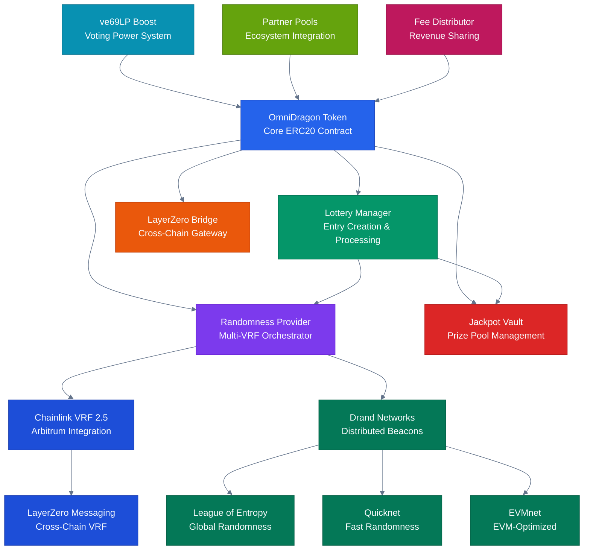
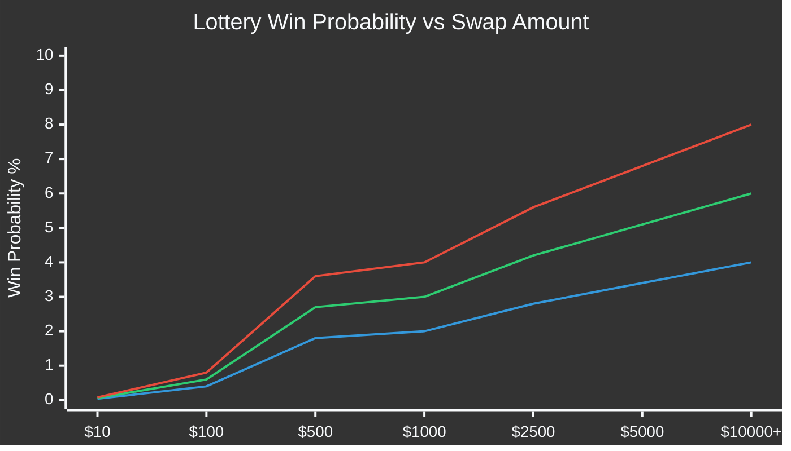
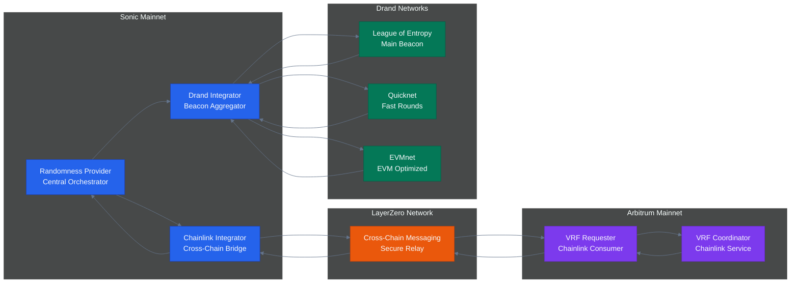
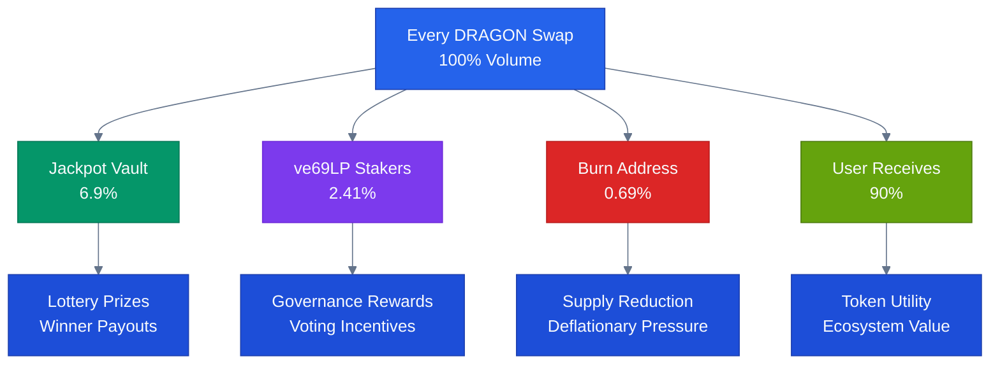

# Welcome to OmniDragon

**OmniDragon** is a revolutionary cross-chain token ecosystem built on Sonic blockchain, featuring an integrated lottery system powered by dual VRF sources, dynamic fee management, and advanced governance mechanisms.

## What is OmniDragon?

OmniDragon combines the best of DeFi innovation with gaming mechanics, creating a unique token that automatically generates lottery entries for holders while providing seamless cross-chain functionality through LayerZero integration.

### Core Features

- **Integrated Lottery System**: Automatic lottery entries on qualifying swaps with VRF-powered randomness
- **Cross-Chain Native**: Built-in LayerZero integration for seamless multi-chain operations  
- **Dynamic Fee Structure**: Intelligent fee distribution (6.9% jackpot, 2.41% stakers, 0.69% burn)
- **Advanced Governance**: Timelock-protected operations with emergency controls
- **Security First**: Comprehensive audit implementation with MEV protection

## System Architecture

<div className="mermaid-container">
  <div className="mermaid-controls">
    <button className="mermaid-btn">Zoom In</button>
    <button className="mermaid-btn">Zoom Out</button>
    <button className="mermaid-btn">Reset View</button>
    <button className="mermaid-btn">Replay</button>
  </div>
  

</div>

## Dragon Project Rules

Every DRAGON swap follows these immutable rules:

<div className="fee-structure-container">
  <div className="mermaid-controls">
    <button className="mermaid-btn">Animate Flow</button>
  </div>

```mermaid
%%{init: {
  'theme': 'dark',
  'themeVariables': {
    'primaryColor': '#2563eb',
    'primaryTextColor': '#f8fafc',
    'primaryBorderColor': '#1e40af',
    'lineColor': '#64748b',
    'secondaryColor': '#1e293b',
    'tertiaryColor': '#0f172a'
  },
  'sankey': {
    'width': 600,
    'height': 400,
    'nodeWidth': 20,
    'nodePadding': 8
  }
}}%%
sankey-beta
    DRAGON Swap,Jackpot Vault,6.9%
    DRAGON Swap,ve69LP Stakers,2.41%
    DRAGON Swap,Burn Address,0.69%
    DRAGON Swap,User Receives,90%
    
    Jackpot Vault,Lottery Prizes,6.9%
    ve69LP Stakers,Governance Rewards,2.41%
    Burn Address,Deflationary Burn,0.69%
```
</div>

| Fee Type | Percentage | Destination | Purpose |
|----------|------------|-------------|---------|
| **Jackpot** | 6.9% | Lottery jackpot vault | Prize pool for winners |
| **Stakers** | 2.41% | ve69LP fee distributor | Governance participation rewards |
| **Burn** | 0.69% | Permanently burned | Deflationary tokenomics |
| **Total** | 10% | On buys and sells | Ecosystem sustainability |

> **Important**: Only **buy transactions** qualify for lottery entries!

## Lottery Probability System

<div className="mermaid-container">
  <div className="mermaid-controls">
    <button className="mermaid-btn">Zoom In</button>
    <button className="mermaid-btn">Replay</button>
  </div>


</div>

## VRF Randomness Architecture

<div className="mermaid-container">
  <div className="mermaid-controls">
    <button className="mermaid-btn">Zoom In</button>
    <button className="mermaid-btn">Replay</button>
  </div>


</div>

## Quick Start Guide

### For Users

1. **Get DRAGON Tokens**
   - Buy on supported DEXs (Uniswap, etc.)
   - Bridge from other chains via LayerZero

2. **Participate in Lottery**
   - Minimum $10 swap to qualify for entry
   - Higher amounts = better win chances
   - Hold ve69LP for bonus probability

3. **Cross-Chain Transfer**
   - Use built-in LayerZero bridge
   - Seamless multi-chain experience

### For Developers

1. **Integration**
   ```solidity
   import "./interfaces/core/IOmniDragon.sol";
   
   IOmniDragon dragon = IOmniDragon(OMNIDRAGON_ADDRESS);
   ```

2. **Fee Calculation**
   ```solidity
   uint256 fees = dragon.calculateFees(from, to, amount);
   ```

3. **Cross-Chain Operations**
   ```solidity
   dragon.sendToChain(chainId, recipient, amount, refund, zro, params);
   ```

## Core Contracts

### [OmniDragon Token](/contracts/core/omnidragon)
The main ERC20 token with integrated lottery, fees, and cross-chain functionality.

**Key Features:**
- Dynamic fee processing
- Automatic lottery entry creation
- LayerZero cross-chain transfers
- Partner ecosystem integration
- Timelock governance protection

### [Randomness Provider](/contracts/core/randomness-provider)
Single source of truth for all randomness in the ecosystem.

**VRF Sources:**
- Chainlink VRF 2.5 (via LayerZero from Arbitrum)
- Drand League of Entropy
- Drand Quicknet & EVMnet
- Bucket system for cost efficiency

### [Lottery Manager](/contracts/core/lottery-manager)
Handles all lottery operations with sophisticated mathematical models.

**Features:**
- Probability calculations (0.04% to 10% win chance)
- Voting power boost integration
- Dynamic jackpot payouts (50% to 80%)
- Cooldown and entry limit protection

### [DragonMath Library](/contracts/math/dragon-math)
Core mathematical engine powering the entire ecosystem.

**Capabilities:**
- Precision arithmetic (18 decimals)
- Boost multiplier calculations
- Probability distributions
- Fee processing mathematics

## Security & Audit

OmniDragon has undergone comprehensive security audits with all critical and high-severity issues resolved:

- ✅ **Randomness Vulnerabilities**: Fixed with dual VRF sources
- ✅ **MEV Protection**: Commit-reveal schemes implemented
- ✅ **Access Control**: Timelock and emergency mechanisms
- ✅ **Mathematical Security**: DragonMath library hardened

[View Full Audit Documentation →](/audit/AUDIT_DOCUMENTATION_SUMMARY)

## Network Information

### Sonic Mainnet
- **Chain ID**: 146 (Sonic)
- **LayerZero Chain ID**: 332
- **Block Time**: ~1 second
- **Finality**: Instant

### Supported Chains
- **Sonic** (Primary)
- **Arbitrum** (VRF source)
- **Ethereum** (via LayerZero)
- **Additional chains** (configurable)

## Token Economics

### Supply Details
- **Total Supply**: 6,942,000 DRAGON
- **Initial Supply**: 6,942,000 DRAGON (no inflation)
- **Burn Mechanism**: 0.69% of all swaps permanently burned
- **Deflationary**: Supply decreases over time

### Fee Distribution Flow

<div className="mermaid-container">
  <div className="mermaid-controls">
    <button className="mermaid-btn">Animate Flow</button>
  </div>


</div>

## Getting Started

### Choose Your Path

<div className="cards-container">
  <div className="card">
    <h3>Users</h3>
    <p>Start trading and participating in the lottery system</p>
    <a href="/getting-started#for-users">Get Started →</a>
  </div>
  
  <div className="card">
    <h3>Developers</h3>
    <p>Integrate OmniDragon into your applications</p>
    <a href="/getting-started#for-developers">Build Now →</a>
  </div>
  
  <div className="card">
    <h3>Partners</h3>
    <p>Join the partner ecosystem and earn fees</p>
    <a href="/contracts/governance/partners">Partner Up →</a>
  </div>
  
  <div className="card">
    <h3>Security</h3>
    <p>Review audit findings and security measures</p>
    <a href="/audit/AUDIT_DOCUMENTATION_SUMMARY">View Audit →</a>
  </div>
</div>

## Latest Updates

### Critical Fixes Completed ✅
- **Randomness Security**: Enhanced VRF integration with fallback mechanisms
- **Mathematical Precision**: DragonMath library optimizations and security fixes
- **Access Control**: Improved timelock and emergency pause systems
- **Cross-Chain Security**: LayerZero integration hardening

[View All Updates →](/052525updates/summary/PROJECT_UPDATES_SUMMARY)

## Community & Support

### Social Links
- **Twitter**: [@sonicreddragon](https://x.com/sonicreddragon)
- **Telegram**: [t.me/sonicreddragon](https://t.me/sonicreddragon)
- **GitHub**: [wenakita/omnidragon](https://github.com/wenakita/omnidragon)

### Documentation Sections
- **[Technical Architecture](/technical-architecture/overview)**: Deep dive into system design
- **[Smart Contracts](/contracts/core/omnidragon)**: Contract documentation and APIs
- **[Integration Guides](/guides/development)**: Developer resources and examples
- **[Security Audit](/audit/AUDIT_DOCUMENTATION_SUMMARY)**: Security analysis and fixes

---

**Ready to explore the OmniDragon ecosystem?** Start with our [Quick Start Guide](/getting-started) or dive into the [Technical Architecture](/comprehensive-system) for a deeper understanding.


 