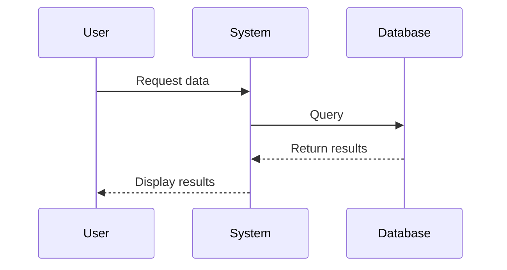
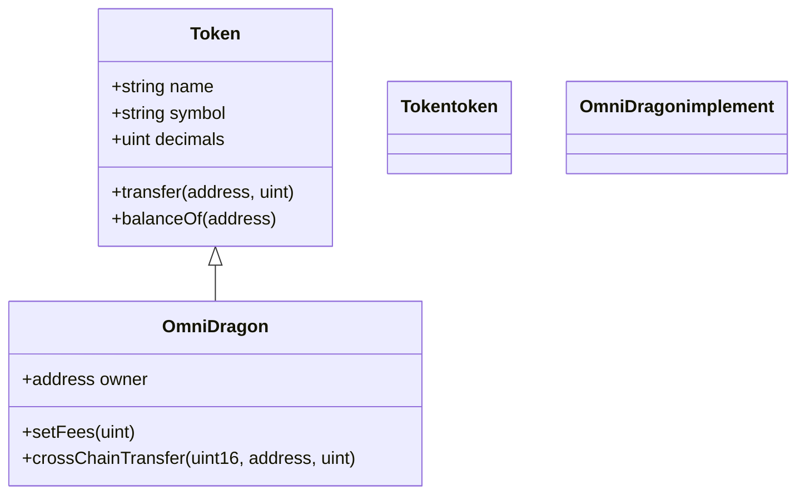

# Clean Mermaid Test

This is a test of mermaid diagrams with clean syntax.

## Basic Flowchart

```mermaid
flowchart TD
    A[Start] --> B{Is it working?}
    B -->|Yes| C[Great!]
    B -->|No| D[Debug]
    D --> A
    C --> E[Continue]
    
    classDef start fill:#e3f2fd;stroke:#2196f3;color:#0d47a1
    classDef process fill:#fff3e0;stroke:#ff9800;color:#e65100
    classDef end fill:#e8f5e9;stroke:#4caf50;color:#1b5e20
    
    class A start
    class D process
    class C,E end
```

## Simple Sequence Diagram



## Class Diagram

