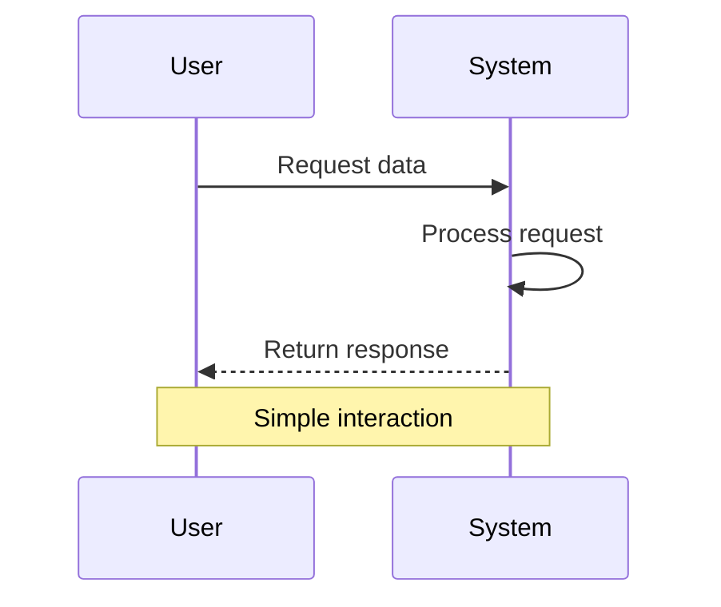
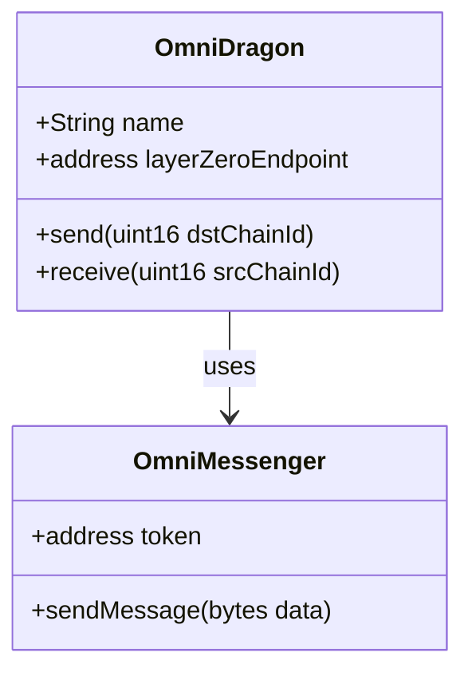

# Mermaid Direct Component Test

This page tests direct usage of the MermaidWrapper component.

## Using the MermaidWrapper Component

<MermaidWrapper chart={`
graph TD
    A[Start] --> B{Is it working?}
    B -->|Yes| C[Great!]
    B -->|No| D[Debug]
    D --> B
    C --> E[Finish]
`} />

## Using a Regular Mermaid Code Block

## Class Diagram Example

