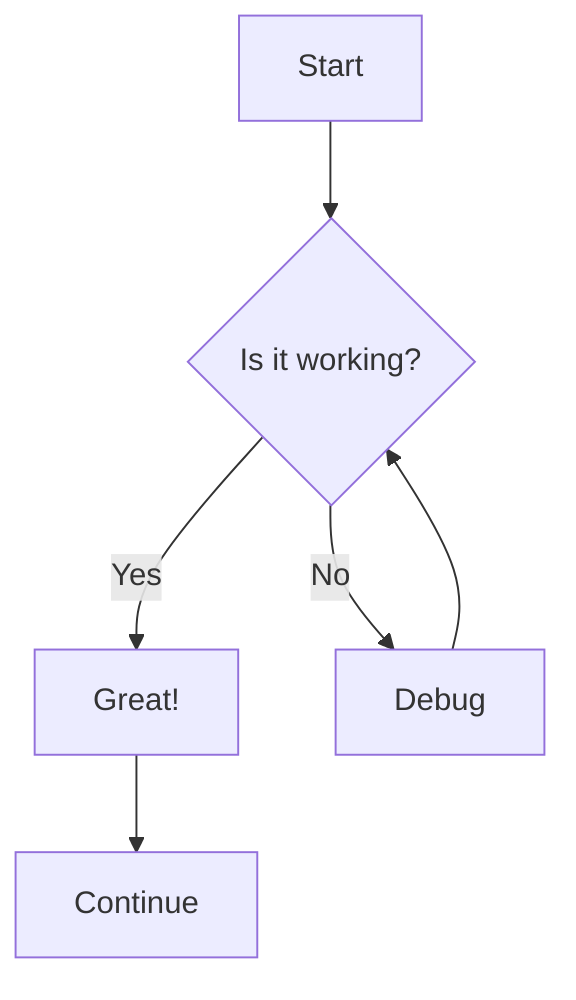
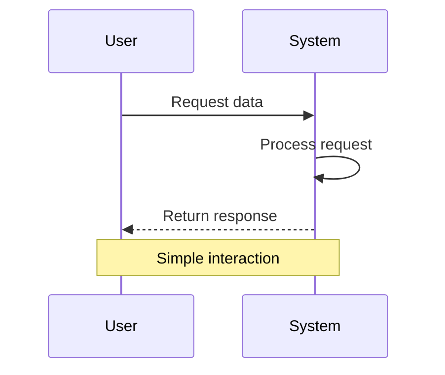
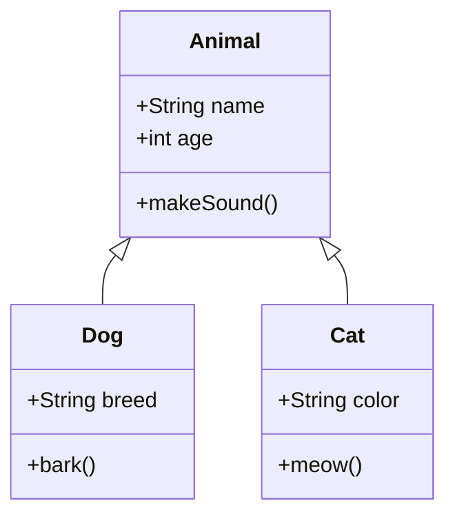
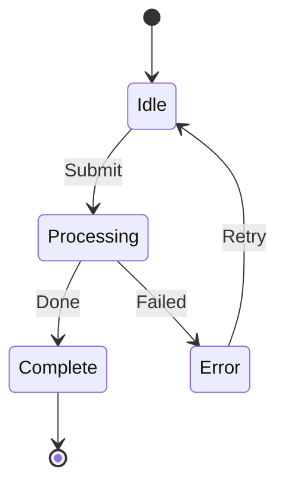
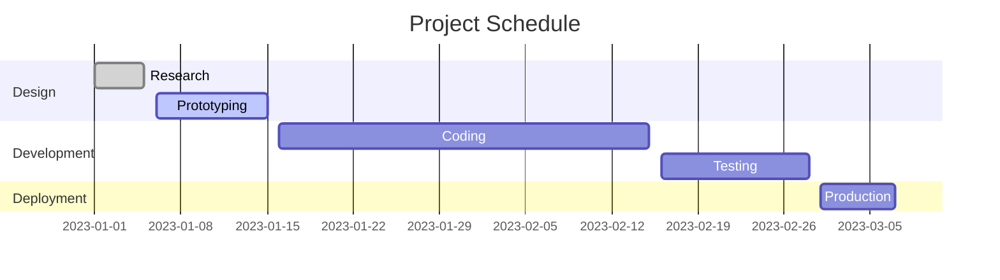
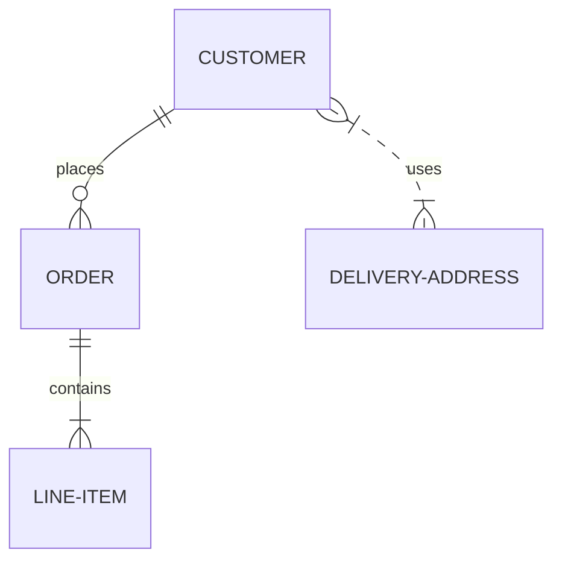

# Mermaid Diagram Test Page

This page contains test diagrams using Mermaid to ensure everything is rendering correctly.

## Simple Flowchart

## Sequence Diagram

## Class Diagram

## State Diagram 

## Gantt Chart

## Entity Relationship Diagram

