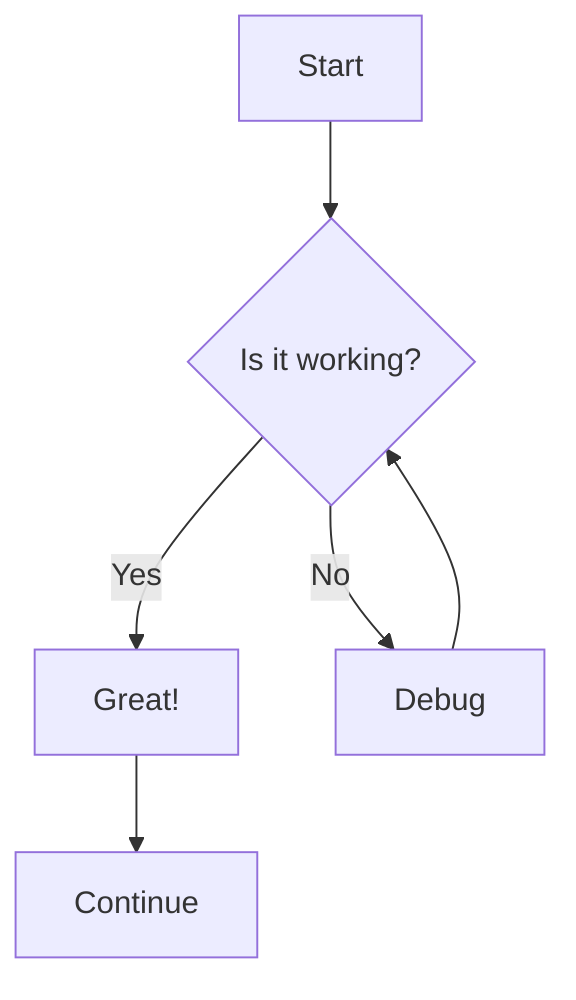
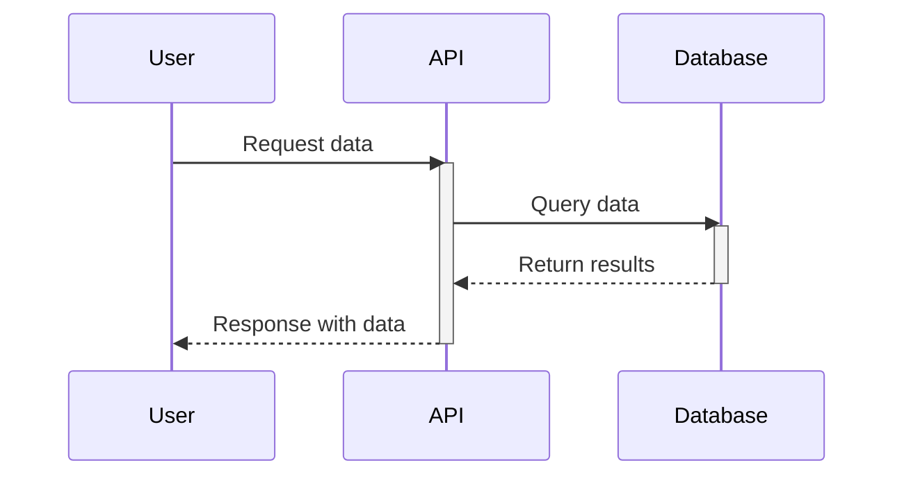
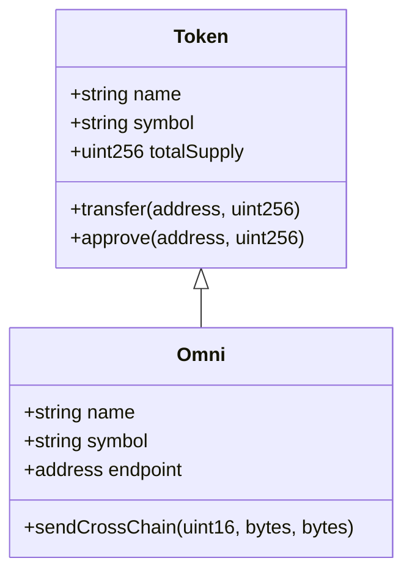
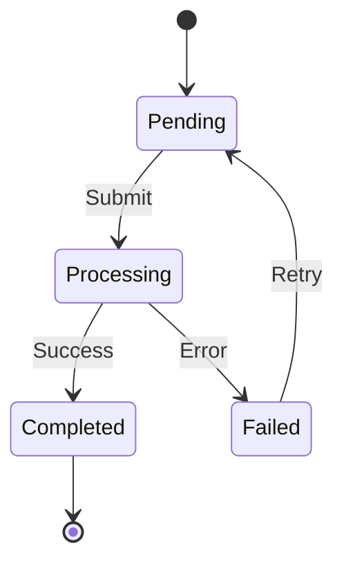
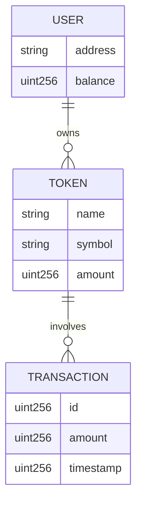
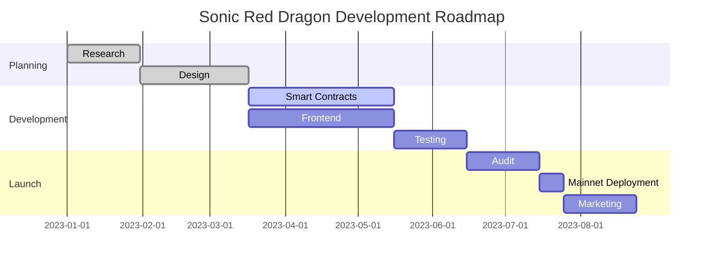
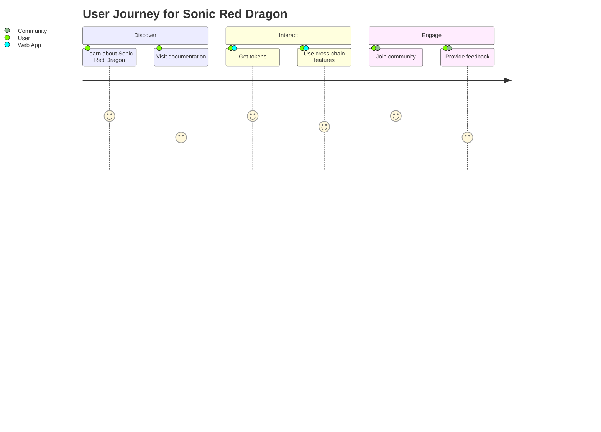
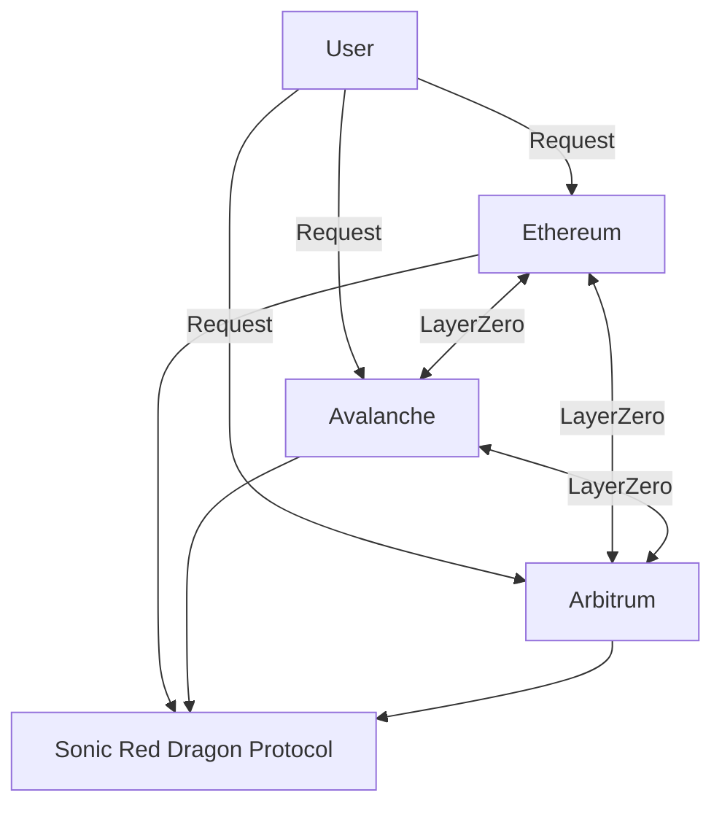

# Mermaid Diagram Test

This page contains various Mermaid diagrams to test our implementation.

## Simple Flowchart

## Sequence Diagram

## Class Diagram

## State Diagram

## Entity Relationship

## Gantt Chart

## Journey Diagram

## Using StandardMermaid Component

<StandardMermaid chart={`graph LR
    A[Component] --> B[Rendering]
    B --> C[Animation]
    C --> D[Interactive]
`} />

## Using EnhancedMermaid Component

<EnhancedMermaid
  chart={`flowchart LR
    A[Start] --> B{Decision}
    B -->|Yes| C[Process]
    B -->|No| D[End]
    C --> D
  `}
  caption="Enhanced Mermaid Diagram with Caption"
  theme="forest"
/>

## Using AnimatedCard with Mermaid

<AnimatedCard title="Cross-Chain Architecture">

Here's how our cross-chain architecture works:

</AnimatedCard> 