# Mermaid Diagram Gallery

This page demonstrates our enhanced mermaid diagrams with minimal styling and semantic color coding.

## Simple Flowchart

```mermaid
flowchart LR
    A([Begin]) --> B{Decision}
    B -->|Yes| C([Complete])
    B -->|No| D([Refine])
    D --> A
    
    classDef start fill:#e3f2fd,stroke:#2196f3,color:#0d47a1
    classDef process fill:#fff3e0,stroke:#ff9800,color:#e65100
    classDef end fill:#e8f5e9,stroke:#4caf50,color:#1b5e20
    
    class A start
    class B,D process
    class C end
```

## OmniDragon Randomness System


## Cross-Chain Token Flow

```mermaid
sequenceDiagram
    %% Define participants with roles
    participant User as 👤 User
    participant Source as 🔄 Source Chain
    participant Bridge as 🌉 Bridge
    participant Dest as 📥 Destination
    
    %% Activate participants with semantic colors
    activate User
    rect rgb(242, 242, 247)
    note over User: Initiates transaction
    end
    
    %% Request flow
    User->>+Source: Request transfer
    deactivate User
    rect rgb(235, 245, 251)
    note over Source: Locks tokens
    end
    
    %% Bridge processing
    Source->>+Bridge: Send message with proof
    deactivate Source
    rect rgb(255, 245, 230)
    note over Bridge: Validates transaction
    end
    
    %% Destination delivery
    Bridge->>+Dest: Deliver verified message
    deactivate Bridge
    rect rgb(235, 249, 242)
    note over Dest: Mints or releases tokens
    end
    
    %% Complete transaction
    Dest->>User: Credit tokens to account
    deactivate Dest
    activate User
    deactivate User
    
    %% Overall process annotation
    note over Bridge,Dest: Secure cross-chain verification
```



## Token System Architecture

