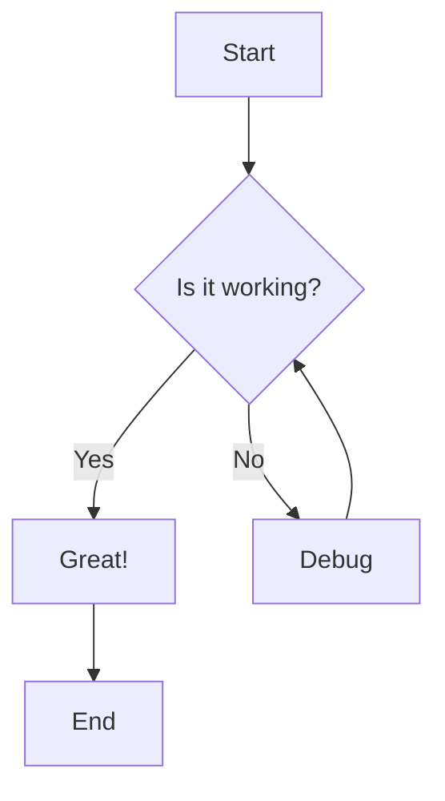
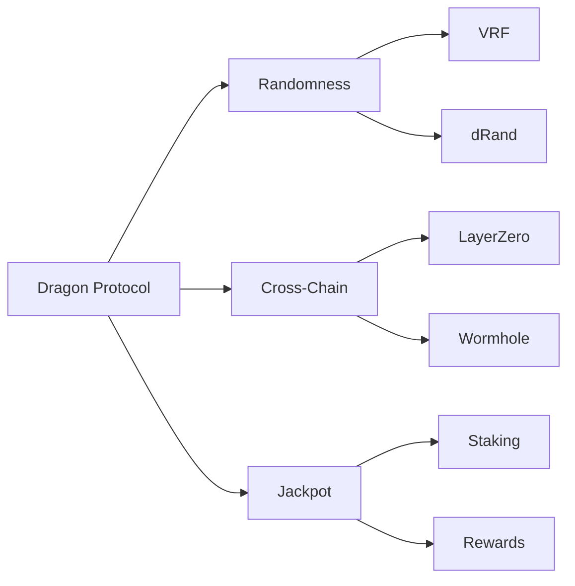
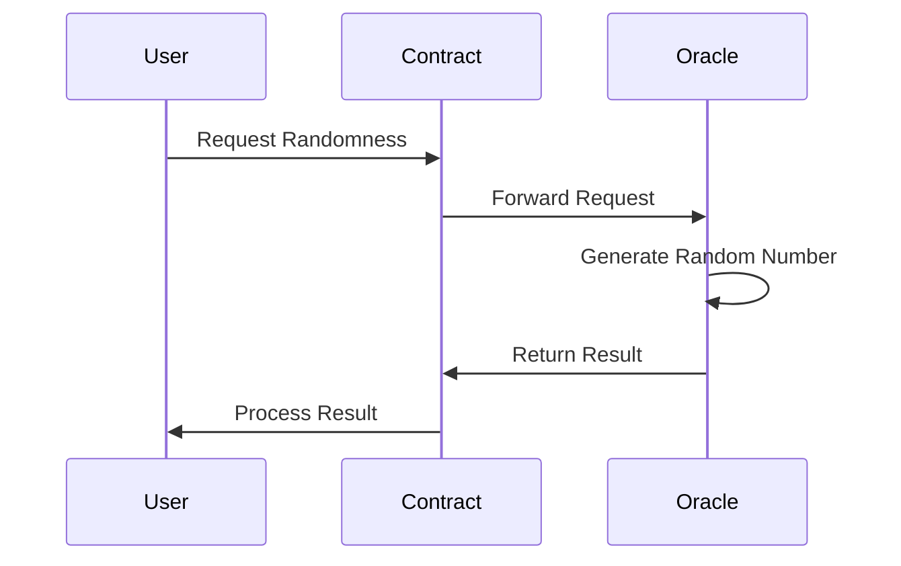
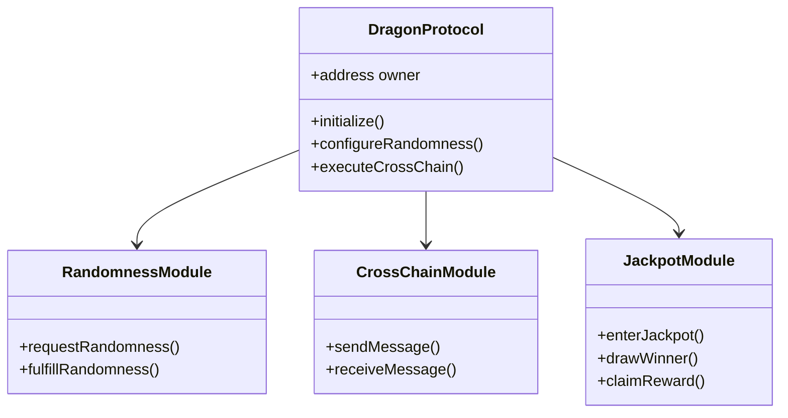
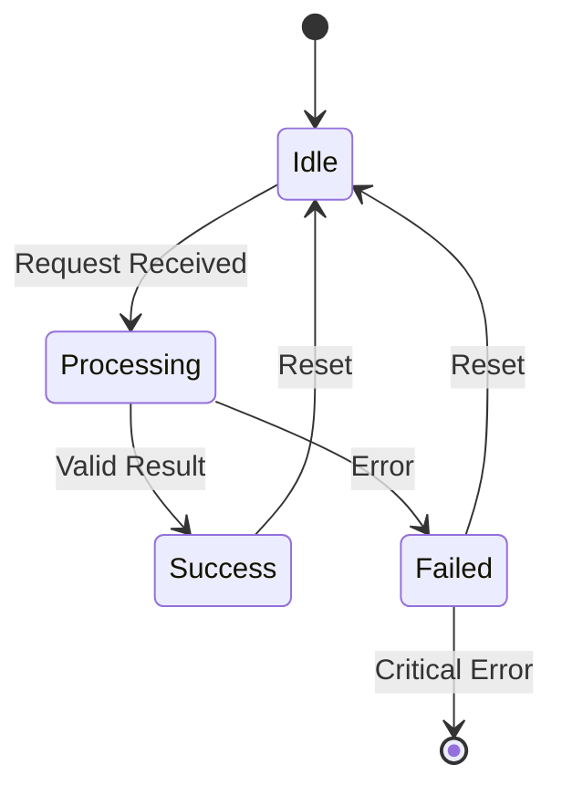
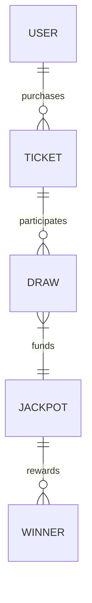
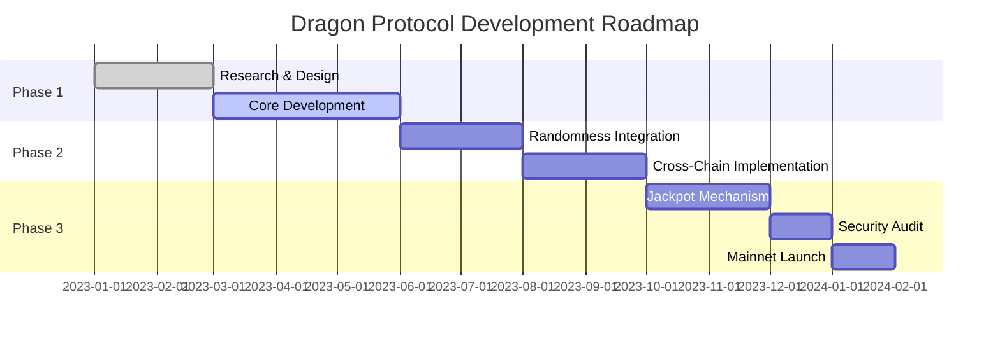

# Enhanced Mermaid Diagrams

This page demonstrates our enhanced Mermaid diagram rendering with animations and interactive features.

## Basic Mermaid Diagram

Here's a basic Mermaid diagram that uses our modern styling:



## Immersive Mermaid Diagram

For more important diagrams, you can use the immersive style by wrapping your Mermaid code block in a div with the `immersive-diagram` class:

<div className="immersive-diagram">



</div>

## Diagram with Title and Caption

You can add titles and captions to your diagrams:

<div className="immersive-diagram">
  <h3 className="diagram-title">Dragon Protocol Architecture</h3>

  ```mermaid
  flowchart TD
      A[User Interface] --> B[Smart Contract Layer]
      B --> C[Core Protocol]
      C --> D1[Randomness Module]
      C --> D2[Cross-Chain Module]
      C --> D3[Jackpot Module]
      D1 --> E1[VRF Service]
      D1 --> E2[dRand Network]
      D2 --> F1[LayerZero]
      D2 --> F2[Wormhole]
      D3 --> G1[Staking Contract]
      D3 --> G2[Rewards Distribution]
  ```

  <p className="diagram-caption">High-level architecture of the Dragon Protocol ecosystem</p>
</div>

## Sequence Diagram

Sequence diagrams are great for showing interactions between components:



## Class Diagram

Class diagrams help visualize the structure of your system:

<div className="immersive-diagram">



</div>

## State Diagram

State diagrams show the different states of a system:



## Entity Relationship Diagram

ER diagrams show the relationships between entities:

<div className="immersive-diagram">



</div>

## Gantt Chart

Gantt charts are useful for project planning:



## Interactive Features

All diagrams have interactive features:

1. **Node Highlighting**: Click on any node to highlight it and its connections
2. **Hover Effects**: Hover over nodes and edges for visual feedback
3. **Controls**: Use the controls to replay animations, toggle fullscreen, or download the diagram
4. **Responsive**: Diagrams adapt to different screen sizes

## Complex Example

Here's a more complex example showing the randomness flow:

<div className="immersive-diagram">
  <h3 className="diagram-title">Randomness Flow</h3>

  ```mermaid
  flowchart TD
      subgraph User["User Application"]
        A[User Interface]
        B[Client Logic]
      end
      
      subgraph Protocol["Dragon Protocol"]
        C[Request Handler]
        D[Verification Module]
        E[Response Processor]
      end
      
      subgraph Sources["Randomness Sources"]
        F[VRF Service]
        G[dRand Network]
        H[Chain-specific RNG]
      end
      
      subgraph Security["Security Layer"]
        I[Proof Verification]
        J[Fraud Detection]
        K[Backup Systems]
      end
      
      A --> B
      B -->|Submit Request| C
      C -->|Process Request| D
      D -->|Request Randomness| F
      D -->|Request Randomness| G
      D -->|Request Randomness| H
      F -->|Return Proof| I
      G -->|Return Proof| I
      H -->|Return Proof| I
      I -->|Verified Proof| E
      J -->|Monitor| I
      K -->|Backup| D
      E -->|Return Result| B
      B -->|Update UI| A
  ```

  <p className="diagram-caption">Detailed flow of randomness generation and verification in the Dragon Protocol</p>
</div>

## Conclusion

With our enhanced Mermaid integration, you can create beautiful, interactive diagrams that make your documentation more engaging and easier to understand. Use these features to visualize complex systems, workflows, and relationships in an elegant way.

For more information on how to create these diagrams, see the [Elegant Diagrams](/docs/guide/elegant-diagrams) guide.
