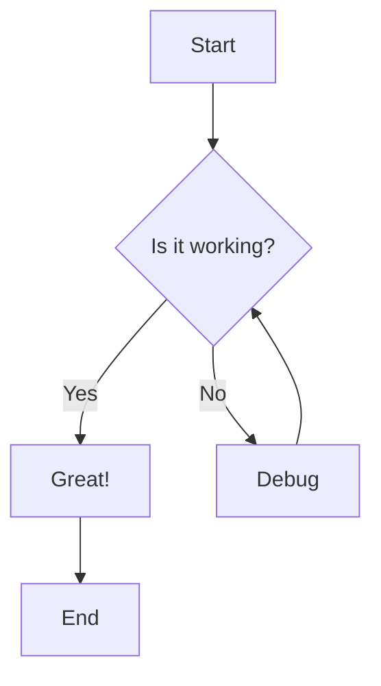

# Mermaid Diagram Test

This page contains a simple mermaid diagram to test if rendering is working correctly.

```mermaid
graph TD
    A[Start] --> B{Is it working?}
    B -->|Yes| C[Great!]
    B -->|No| D[Debug]
    D --> B
    C --> E[End]
```

If you see a flowchart diagram above, the mermaid integration is working correctly! 