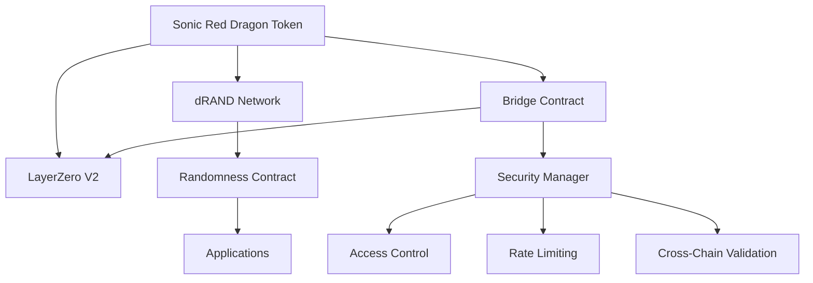
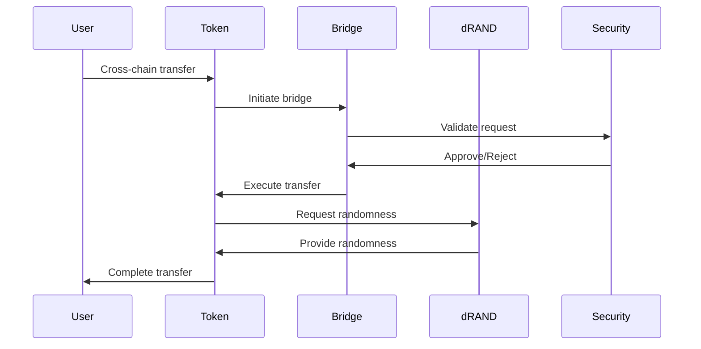
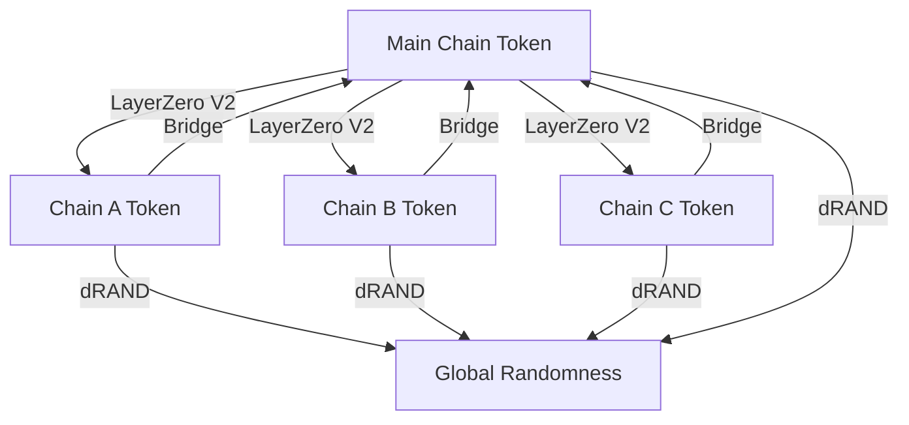

# Sonic Red Dragon Architecture Overview

This document provides a high-level overview of the Sonic Red Dragon ecosystem architecture, explaining how different components interact to enable cross-chain functionality, verifiable randomness, and secure token operations.

## System Components

## Core Components

### Sonic Red Dragon Token

The central component of the ecosystem, implementing:
- ERC-20 standard functionality
- LayerZero V2 integration for cross-chain transfers
- dRAND network integration for verifiable randomness
- Advanced security features and access controls

### LayerZero V2 Integration

Enables cross-chain functionality through:
- Secure message passing between chains
- Token bridging with enhanced security
- Consistent state management across chains
- Gas optimization for cross-chain operations

### Bridge Contract

Manages cross-chain operations:
- Secure token bridging between chains
- Message validation and verification
- State synchronization
- Gas optimization strategies

### dRAND Network Integration

Provides verifiable randomness through:
- Integration with dRAND beacon
- Randomness verification and validation
- Cross-chain randomness consistency
- Fallback mechanisms for reliability

### Security Manager

Implements comprehensive security measures:
- Role-based access control (RBAC)
- Rate limiting and circuit breakers
- Cross-chain message validation
- Emergency pause capabilities

## Data Flow

## Cross-Chain Architecture

The system maintains consistency across chains through:

## Security Architecture

Multiple security layers protect the ecosystem:

- **Access Control**: Role-based permissions for administrative functions
- **Pausability**: Emergency pause capabilities for critical functions
- **Rate Limiting**: Throttling mechanisms to prevent abuse
- **Cross-Chain Validation**: Verification of cross-chain messages
- **dRAND Integration**: Verifiable randomness for security-critical operations
- **Timelock Controls**: Delay period for sensitive parameter changes

## Future Extensibility

The architecture is designed for expansion through:

- Modular component design
- Standardized interfaces
- Upgrade mechanisms for contracts
- Plugin architecture for new features
- Cross-chain governance capabilities
- Additional randomness sources
- Enhanced bridge security features 