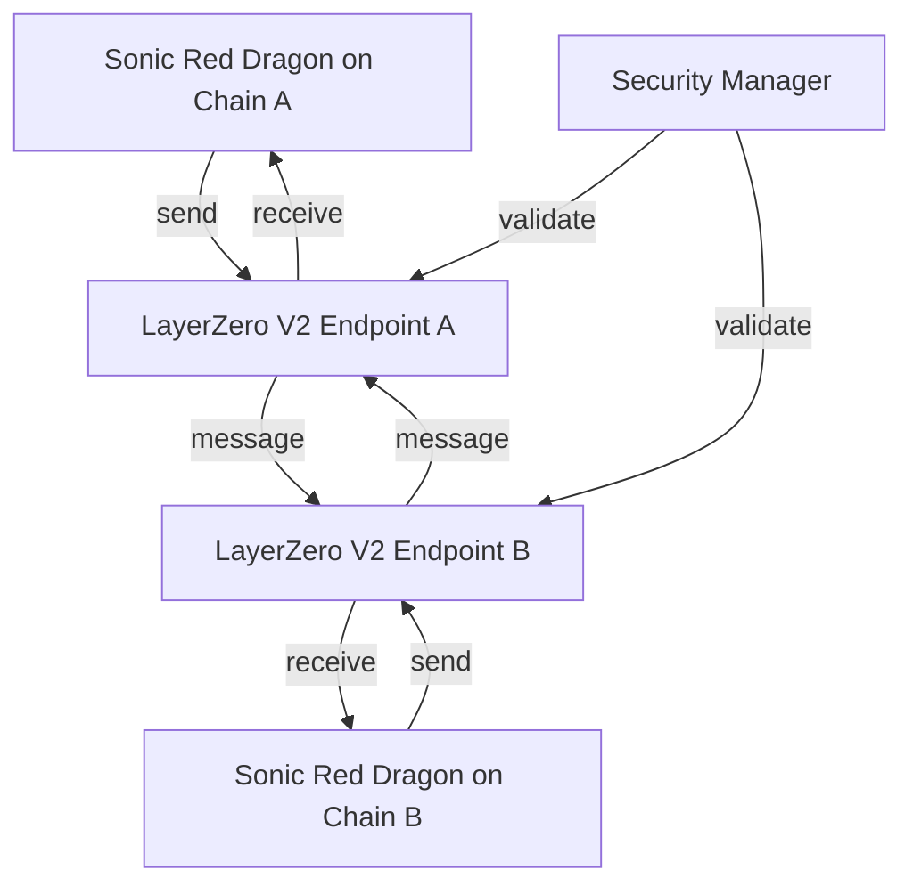
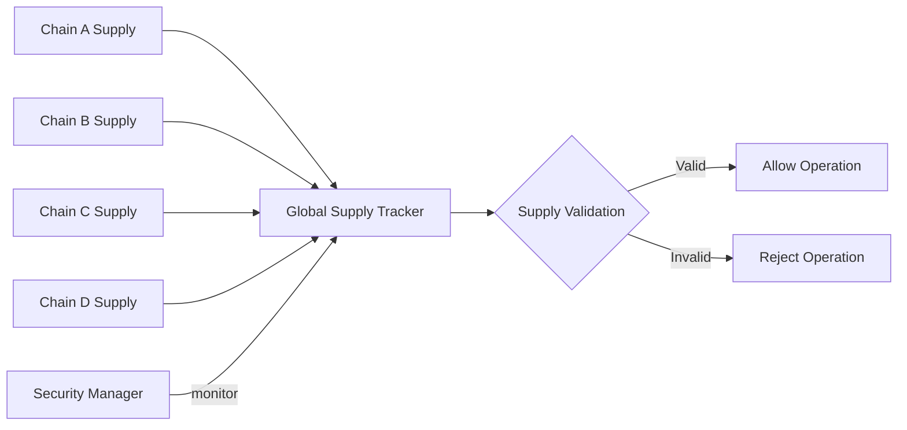

# Cross-Chain Functionality

This document details how Sonic Red Dragon implements cross-chain functionality using LayerZero V2, enabling secure and efficient token transfers between supported blockchains.

## LayerZero V2 Integration

Sonic Red Dragon leverages LayerZero V2 for cross-chain operations, providing enhanced security and gas optimization:



## How Cross-Chain Transfers Work

1. **Token Lock/Burn**: When sending tokens from Chain A to Chain B, tokens are locked (or burned) on Chain A
2. **Message Transmission**: LayerZero V2 relays a secure message to Chain B
3. **Token Mint/Release**: The corresponding amount of tokens are minted (or released) on Chain B
4. **Security Validation**: Each step is validated by the security manager
5. **Gas Optimization**: LayerZero V2 optimizes gas usage for cross-chain operations

## Cross-Chain State Management

Sonic Red Dragon maintains consistency across chains through several mechanisms:

### Global Supply Management



### Cross-Chain Security

Security measures are implemented across all chains:

- **Message Validation**: All cross-chain messages are validated
- **Trusted Remote Contracts**: Only authorized contracts can interact
- **Gas Management**: Optimized gas settings for each chain
- **Rate Limiting**: Prevents abuse of cross-chain operations

## Supported Chains

Sonic Red Dragon currently supports the following chains:

| Chain ID | Network | Status | LayerZero V2 Endpoint |
|----------|---------|--------|----------------------|
| 1 | Ethereum | Active | Coming Soon |
| 42161 | Arbitrum | Active | Coming Soon |
| 10 | Optimism | Active | Coming Soon |
| 8453 | Base | Pending | Coming Soon |
| 137 | Polygon | Pending | Coming Soon |
| 43114 | Avalanche | Pending | Coming Soon |

## Security Features

Cross-chain operations are protected by multiple security layers:

- **Message Verification**: Cryptographic verification of all messages
- **Access Control**: Role-based permissions for bridge operations
- **Rate Limiting**: Prevents spam and abuse
- **Emergency Pause**: Ability to pause specific cross-chain routes
- **dRAND Integration**: Verifiable randomness for security-critical operations

## Implementation Details

### Core Bridge Functions

```solidity
function bridgeTokens(
    uint16 _dstChainId,
    bytes calldata _destination,
    uint256 _amount,
    bytes calldata _payload
) external payable;

function receiveTokens(
    uint16 _srcChainId,
    bytes calldata _srcAddress,
    uint64 _nonce,
    bytes calldata _payload
) external;

function estimateBridgeFee(
    uint16 _dstChainId,
    bytes calldata _destination,
    uint256 _amount,
    bytes calldata _payload
) external view returns (uint256 nativeFee, uint256 zroFee);
```

### Security Extensions

Sonic Red Dragon extends the base LayerZero V2 implementation with:

- **Enhanced Validation**: Additional security checks for transfers
- **Gas Optimization**: Optimized message payloads
- **Rate Limiting**: Per-user and per-chain transfer limits
- **Emergency Controls**: Administrative controls for security

## User Experience

The bridge interface provides a seamless experience:

1. **Chain Selection**: Choose source and destination chains
2. **Amount Input**: Specify transfer amount
3. **Fee Display**: View bridge fees and gas estimates
4. **Security Check**: Review security status
5. **Transaction**: Approve and execute transfer
6. **Status**: Monitor transfer progress
7. **Completion**: Receive tokens on destination chain

## Error Handling

Robust error handling ensures reliable cross-chain operations:

- **Automatic Retries**: Failed messages are retried automatically
- **Recovery System**: Administrative recovery for stuck transactions
- **Event Monitoring**: Real-time monitoring of cross-chain events
- **User Notifications**: Status updates for transfer progress
- **Fallback Mechanisms**: Alternative routes if primary path fails 