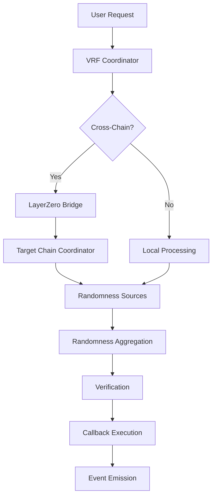

# Technical Architecture Overview

## System Architecture

OmniDragon is a sophisticated cross-chain Verifiable Random Function (VRF) system designed to provide secure, verifiable randomness across multiple blockchain networks. The architecture follows a modular design with clear separation of concerns and robust security measures.

## Core Components

### 1. VRF Coordinator

The central orchestrator that manages randomness requests and coordinates between different components.

**Key Responsibilities:**
- Request validation and queuing
- Randomness source coordination
- Cross-chain message routing
- Fee management and distribution

### 2. Randomness Sources

Multiple independent sources provide randomness to ensure security and reliability:

- **Chainlink VRF**: Industry-standard VRF implementation
- **Drand Network**: Distributed randomness beacon
- **Custom Oracle**: Proprietary randomness generation

### 3. Cross-Chain Bridge

LayerZero-based infrastructure for seamless cross-chain communication.

**Features:**
- Message verification and validation
- Gas optimization for cross-chain calls
- Retry mechanisms for failed transactions
- Multi-chain state synchronization

### 4. Security Layer

Comprehensive security measures protecting the entire system:

- **Multi-signature governance**: Critical operations require multiple approvals
- **Time-locked upgrades**: Delayed implementation of system changes
- **Circuit breakers**: Emergency pause mechanisms
- **Rate limiting**: Protection against spam and abuse

## Data Flow Architecture



## Network Topology

### Supported Chains

- **Ethereum Mainnet**: Primary deployment
- **Polygon**: High-throughput operations
- **Arbitrum**: Layer 2 scaling
- **Optimism**: Optimistic rollup integration
- **BSC**: Binance Smart Chain support
- **Avalanche**: High-performance consensus

### Chain-Specific Configurations

Each chain has optimized configurations for:
- Gas pricing strategies
- Block confirmation requirements
- Message timeout settings
- Fee structures

## Security Architecture

### Multi-Layer Security Model

1. **Protocol Level**
   - Cryptographic verification of randomness
   - Consensus mechanisms for source validation
   - Slashing conditions for malicious behavior

2. **Smart Contract Level**
   - Access control mechanisms
   - Reentrancy protection
   - Integer overflow/underflow protection
   - Emergency pause functionality

3. **Infrastructure Level**
   - Secure key management
   - Monitoring and alerting systems
   - Automated incident response
   - Regular security audits

### Threat Model

**Identified Threats:**
- Randomness manipulation attempts
- Cross-chain message tampering
- Economic attacks on fee mechanisms
- Governance attacks
- Infrastructure compromise

**Mitigation Strategies:**
- Multiple independent randomness sources
- Cryptographic verification at each step
- Economic incentives alignment
- Decentralized governance structure
- Comprehensive monitoring

## Performance Characteristics

### Latency Metrics

| Operation Type | Average Latency | 95th Percentile |
|----------------|-----------------|-----------------|
| Local VRF Request | 2-5 seconds | 10 seconds |
| Cross-Chain Request | 30-60 seconds | 120 seconds |
| Randomness Verification | less than 1 second | 2 seconds |

### Throughput Capacity

- **Requests per Second**: 100+ (per chain)
- **Cross-Chain TPS**: 50+ (aggregate)
- **Concurrent Requests**: 10,000+

### Scalability Features

- **Horizontal Scaling**: Add more randomness sources
- **Vertical Scaling**: Optimize gas usage and processing
- **Layer 2 Integration**: Leverage L2 solutions for high throughput
- **Sharding Support**: Future-ready for sharded networks

## Integration Patterns

### Consumer Integration

1. **Direct Integration**
   ```solidity
   contract MyContract is VRFConsumerBase {
       function requestRandomness() external {
           // Direct VRF request
       }
   }
   ```

2. **Proxy Pattern**
   ```solidity
   contract VRFProxy {
       // Centralized randomness management
   }
   ```

3. **Event-Driven**
   ```solidity
   // Listen for randomness events
   event RandomnessAvailable(bytes32 requestId, uint256 randomness);
   ```

### Cross-Chain Patterns

1. **Request-Response**: Simple cross-chain randomness requests
2. **Subscription**: Ongoing randomness delivery
3. **Batch Processing**: Multiple requests in single transaction
4. **Conditional Execution**: Randomness-dependent cross-chain actions

## Governance Model

### Decentralized Governance

- **Token-based voting**: Governance token holders participate
- **Proposal system**: Community-driven improvements
- **Time-locked execution**: Delayed implementation for security
- **Emergency procedures**: Fast-track for critical issues

### Governance Scope

- Protocol parameter updates
- New chain integrations
- Randomness source management
- Fee structure modifications
- Security policy changes

## Monitoring and Observability

### Key Metrics

1. **System Health**
   - Request success rate
   - Average response time
   - Cross-chain message delivery rate
   - Randomness source availability

2. **Security Metrics**
   - Failed verification attempts
   - Unusual request patterns
   - Gas price anomalies
   - Governance proposal activity

3. **Performance Metrics**
   - Transaction throughput
   - Gas efficiency
   - Network congestion impact
   - User experience metrics

### Alerting System

- **Real-time monitoring**: Continuous system observation
- **Automated alerts**: Immediate notification of issues
- **Escalation procedures**: Structured incident response
- **Performance dashboards**: Visual system status

## Future Roadmap

### Short-term Enhancements

- Additional randomness sources integration
- Gas optimization improvements
- Enhanced monitoring capabilities
- Mobile SDK development

### Medium-term Goals

- Zero-knowledge proof integration
- Advanced privacy features
- Multi-party computation support
- Quantum-resistant cryptography

### Long-term Vision

- Fully decentralized governance
- Cross-protocol interoperability
- AI-powered optimization
- Universal randomness standard

## Technical Specifications

### System Requirements

- **Minimum Node Requirements**: 4 CPU cores, 8GB RAM, 100GB storage
- **Network Requirements**: Stable internet, low latency
- **Security Requirements**: Hardware security modules (HSMs)

### API Specifications

- **REST API**: Standard HTTP endpoints
- **WebSocket**: Real-time event streaming
- **GraphQL**: Flexible data querying
- **gRPC**: High-performance communication

### Deployment Architecture

- **Containerized deployment**: Docker and Kubernetes
- **Infrastructure as Code**: Terraform and Ansible
- **CI/CD pipelines**: Automated testing and deployment
- **Multi-region deployment**: Global availability

## Conclusion

The OmniDragon technical architecture provides a robust, scalable, and secure foundation for cross-chain randomness generation. The modular design ensures flexibility for future enhancements while maintaining the highest security standards required for production blockchain applications.

For detailed implementation information, refer to the specific component documentation in the [Smart Contracts](../contracts/core/omnidragon.md) and [Integration Guides](../guides/development.md) sections. 